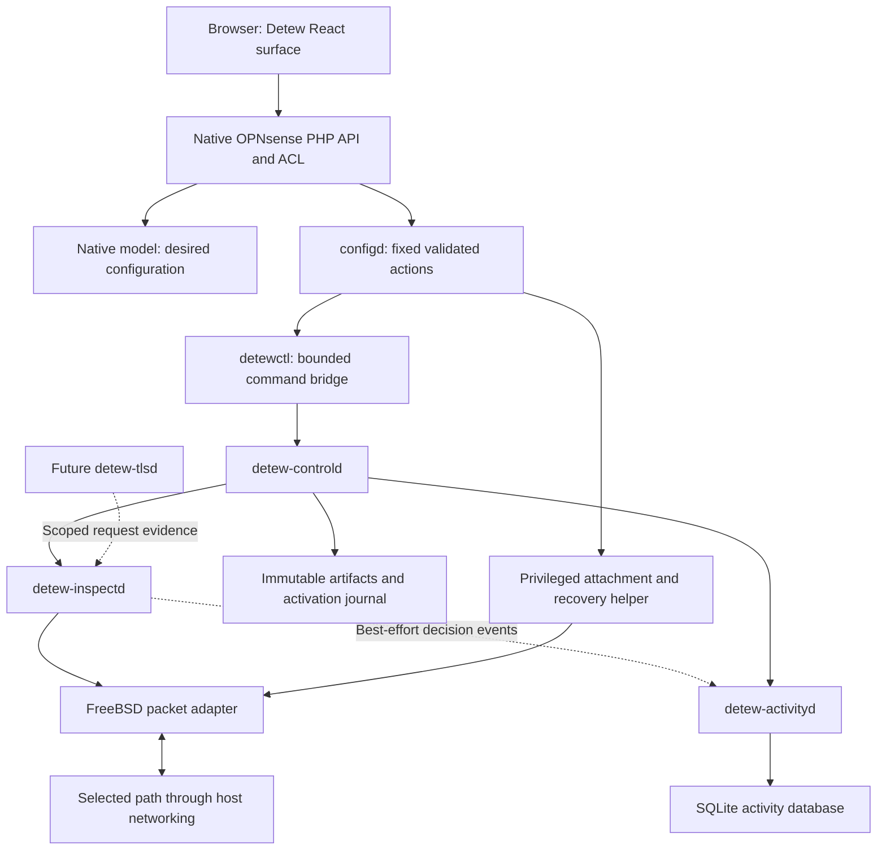
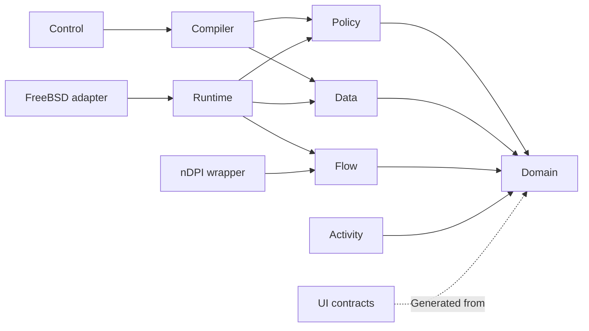

# Detew — Architecture and Stack Definition

**Version:** 0.1 · Development design baseline\
**Date:** October 2, 2026\
**Requirements:** [PRD](PRD.md)\
**Behavior and experience:** [Product definition](PRODUCT.md)\
**Delivery plan:** [Development milestones](MILESTONES.md)\
**Development guide:** [AGENTS.md](../AGENTS.md)\
**Domain language:** [CONTEXT.md](CONTEXT.md)

This is the final foundation document before detailed milestone and task planning. It selects the implementation stack, assigns ownership, specifies component boundaries and runtime mechanisms, and identifies the evidence needed to close a small set of integration decisions. It does not claim an implementation, successful prototype, measured capacity, or production support.

The PRD owns requirements and release gates. The product definition owns policy meaning, user-visible behavior, and UI/UX outcomes. This document owns technical decisions and implementation constraints. The milestone plan owns sequence, dependencies, work-package IDs, and delivery evidence. Resolve discrepancies by updating the affected documents together; a library choice cannot silently change a product contract.

Commercial product comparisons and vendor product references are excluded. References identify open source dependencies, the host platform, or standards needed to implement Detew.

## Contents

- [Architecture decisions](#1-architecture-decisions)
- [Selected stack and version policy](#2-selected-stack-and-version-policy)
- [Deployment and trust boundaries](#3-deployment-and-trust-boundaries)
- [Code organization and dependency rules](#4-code-organization-and-dependency-rules)
- [Shared schemas and evaluation](#5-shared-schemas-and-evaluation)
- [Packet adapter and inspection path](#6-packet-adapter-and-inspection-path)
- [Flow ownership and resource bounds](#7-flow-ownership-and-resource-bounds)
- [Category and classification data](#8-category-and-classification-data)
- [Control plane and activation](#9-control-plane-and-activation)
- [Storage and recovery](#10-storage-and-recovery)
- [IPC and administrative APIs](#11-ipc-and-administrative-apis)
- [Frontend architecture](#12-frontend-architecture)
- [OPNsense integration and packaging](#13-opnsense-integration-and-packaging)
- [Security and operational visibility](#14-security-and-operational-visibility)
- [Modules and future distributions](#15-modules-and-future-distributions)
- [Development, testing, and delivery](#16-development-testing-and-delivery)
- [Connection to milestone planning](#17-connection-to-milestone-planning)
- [Primary sources](#18-primary-sources)

## 1. Architecture decisions

**Selected** means the design baseline for development. It still requires ordinary build, security, and integration validation. **Gated** means a preferred implementation or external dependency must pass a specified feasibility test before it becomes a supported capability. **Deferred** means the boundary is designed but the capability is outside V1.

| ID | Decision | Status | Rationale and consequence |
|---|---|---|---|
| ARC-01 | OPNsense-first plugin with a portable Rust domain/evaluation core | Selected | Reuse appliance services while keeping filtering semantics independent from the host. Initial support is a single local site. |
| ARC-02 | One shared policy evaluator for runtime, preview, testing, and replay | Selected | Prevent divergent allow/block behavior across entry points. Optimizations must preserve its semantic fixtures. |
| ARC-03 | Separate inspection, control, and activity daemons; native host frontend | Selected | Isolate reporting/control failures from packet processing with a small process count. Features are modules/libraries unless isolation is justified. |
| ARC-04 | Bounded platform packet interface; Netmap is the preferred initial candidate, Divert is the comparison candidate | Gated at G0 | Preserve bidirectional observation and the host firewall path. Select the production adapter from measured coverage, failure behavior, and compatibility. |
| ARC-05 | nDPI as the initial protocol/application classifier, behind a narrow native shim | Gated at G0 | Reuse maintained classification work while containing native dependencies and preserving a replaceable interface. |
| ARC-06 | Immutable bundles and worker-coordinated generation activation | Selected | Each decision sees coherent configuration/data/context. Global application status follows acknowledgments and flow reconsideration. |
| ARC-07 | Local in-memory category indexes compiled from admitted sources | Selected; capacity validated at G0/G2 | No synchronous database/cloud lookup in the packet path. Preparation accounts for active and candidate memory simultaneously. |
| ARC-08 | Native OPNsense model is the source of desired configuration | Selected | No competing SQLite, YAML, or daemon-owned configuration authority. Runtime artifacts and journals are derived state. |
| ARC-09 | Versioned local Unix IPC; same-origin native administrative API | Selected | Avoid a second public server, account system, distributed broker, or TLS mesh on the appliance. |
| ARC-10 | SQLite activity storage owned by one activity daemon | Selected | Bounded local queries/retention with straightforward recovery. It has no role in packet verdicts or desired policy ownership. |
| ARC-11 | React and TypeScript application mounted in a native OPNsense page | Selected; integration validated at G0 | Support a polished component system while retaining host authentication, ACLs, CSRF, and outer navigation. |
| ARC-12 | Generated schemas/types and server-authoritative validation | Selected | Keep UI/API/runtime objects aligned without reproducing the policy algorithm in JavaScript or PHP. |
| ARC-13 | Optional TLS termination is a separate service/module | Deferred to T1 | Isolate key handling, trust enrollment, protocol implementation, and additional resource/failure behavior. |
| ARC-14 | Native FreeBSD package/service lifecycle and versioned release artifacts | Selected | Ship an appliance plugin, not containers or a separate firewall operating system. |
| ARC-15 | External extensions run outside the packet loop unless explicitly admitted as trusted engine components | Selected | Modularity needs permissions, bounded work, and compatibility contracts. A generic plugin loader is not a V1 prerequisite. |

A selected design is not an enacted software license. The PRD's proposed licensing baseline and source/data redistribution decisions must be closed before implementation contributions and binary distribution. The integration gates below concern technical support, not feature paywalls.

## 2. Selected stack and version policy

### 2.1 Runtime and core

| Layer | Selection | Use and constraints |
|---|---|---|
| Initial host | OPNsense Community Edition 26.7 series, amd64, FreeBSD 15.1 base | Development integration target. Exact patch/package/kernel/NIC combination is pinned in the G0 lab report; no supported matrix exists yet. |
| Core language | Rust, 2024 edition | Domain, evaluation, compilation, services, fixtures, and CLI. Pin an exact stable toolchain before the first implementation commit. |
| Serialization/schema | `serde`, `serde_json`, `schemars`; JSON Schema 2020-12 | Rust wire DTOs generate schemas; semantic invariants remain Rust validation. Check the generator's supported dialect/version in the lockfile. |
| Domain IDs | UUIDs for stable objects; decimal-string counters on the wire | IDs do not depend on display names. Revision/generation/count fields must not lose precision in JavaScript. |
| Hostname normalization | `idna`, standard IP parsing, a pinned public-suffix snapshot | One normalization version across imports, exceptions, tester, preview, and runtime. |
| Scheduling | `chrono` / `chrono-tz`, explicit UTC and monotonic clock abstraction | Bundled timezone rules are identified in runtime compatibility metadata. No ambient locale or timezone changes policy meaning. |
| Packet framing | `etherparse` plus owned bounded reassembly/state logic | Decode framing and IP/transport facts. Library parsing alone does not provide full TCP normalization or evasion protection. |
| Protocol/application classification | Pinned nDPI release with Detew C shim and Rust safe wrapper | Native dependency isolated behind explicit evidence/ownership contracts; FreeBSD and corpus tests are mandatory. |
| Category indexes | `fst` maps backed by preloaded immutable byte vectors and typed metadata tables | Exact and label-boundary suffix lookup. No fuzzy/regex search in the packet path. |
| Control concurrency | `tokio` with bounded queues/tasks; blocking jobs in restricted workers | Async service orchestration, IPC, updates, and status. The packet worker loop is not a Tokio task. |
| Data downloads | `reqwest` with `rustls`, reviewed provider/root configuration | Control-side only; approved URLs, bounded redirects/downloads, explicit source trust. Validate selected crypto dependencies on FreeBSD. |
| Integrity/authenticity | SHA-256 artifact digests; Ed25519 verification using maintained Rust libraries | Integrity, signature provenance, and policy correctness remain separate claims. |
| Activity storage | `rusqlite` with a pinned audited SQLite amalgamation | Activity daemon owns SQL. SQLite must contain the WAL-reset fix: baseline 3.51.3 or newer, with security review of the exact shipped version. |
| Diagnostics | `tracing` outside packet forwarding; typed counters and bounded event queues inside it | No synchronous filesystem logging from packet workers. |
| Service lifecycle | FreeBSD `rc.d` and OPNsense `configd` | Start/stop/status/owned attachment actions; no systemd assumption. |

Rust's target matrix includes `x86_64-unknown-freebsd`; that does not establish Detew's native-library or packet-adapter compatibility. OPNsense's 26.7 release documents its FreeBSD/PHP/Python platform baseline. [Rust targets](https://doc.rust-lang.org/rustc/platform-support.html), [OPNsense 26.7](https://docs.opnsense.org/releases/CE_26.7.html)

The SQLite floor is deliberate: the project's WAL documentation identifies a corruption fix in 3.51.3 and selected backports. Detew chooses the newer-version baseline rather than relying on an unidentified host backport. [SQLite WAL and fix](https://www.sqlite.org/wal.html#walresetbug)

### 2.2 Host integration and frontend

| Layer | Selection | Use and constraints |
|---|---|---|
| Host controllers/models | Host-provided PHP, Phalcon/Volt, XML models/ACL/menu, Jinja templates through `configd` | Use the platform's installed versions. Do not bundle a second PHP/Python/framework runtime. |
| Small host helpers | Host PHP/Python where the native integration requires them | Thin adapters and generated configuration; no second policy engine. Privileged operations remain narrow fixed actions. |
| UI language/contracts | TypeScript with strict compiler settings; `json-schema-to-typescript` generation | Generated domain DTOs; typed API/result/error states; no unchecked `any` at trust boundaries. Verify the generator against the chosen schema subset/dialect. |
| UI framework | React 19 major line | Locally packaged browser assets mounted in a Volt shell. Stable exact patch is pinned and security-reviewed at bootstrap. |
| Build tool | Vite, stable compatible release | Static production assets and manifest. Development server is development-only. |
| Build runtime/package manager | Node.js 24 LTS and npm | Build/test tooling only. Pin exact Node/npm versions and commit `package-lock.json`; install with `npm ci`. |
| Server-state management | TanStack Query | Queries, operation polling, invalidation and freshness. Mutation retries require idempotency and must never silently overwrite conflicts. |
| Tables | TanStack Table | Headless accessible table composition with server pagination/sorting. No giant browser-owned activity dataset. |
| Form editing | React Hook Form, Ajv's 2020-12 implementation and `ajv-formats` | Client validation aids editing; authoritative validation/preview is server-side. Additional product constraints come from server errors. |
| UI behavior primitives | Radix Primitives, wrapped in Detew-owned components | Focus, overlays, menus and dialogs; primitive use alone does not prove WCAG conformance. |
| Styling | Tailwind CSS 4 utilities plus scoped CSS/custom properties | Disable global Preflight; prefix utilities; namespace Detew styles/tokens. Portaled content remains within a Detew theme wrapper. |
| Icons | Locally bundled Lucide icons | Consistent strokes and labels; consequential actions are not unexplained icon-only buttons. |
| Localization | `i18next` UI catalogs; native gettext for host menu/controller strings | English and Brazilian Portuguese initially. Stable reason/category IDs are independent of translated labels. |
| UI verification | Vitest, Testing Library, Playwright, axe-core | Component/interaction tests plus real-browser and manual accessibility workflows. |
| Component documentation | Storybook, development-only | States, host-theme previews, long data, keyboard use and responsive fixtures. Never shipped as an appliance service. |

React's documentation maintains major-line version references; Vite documents its supported Node floor. Node 24 is an LTS build baseline, not an appliance runtime dependency. [React versions](https://react.dev/versions), [Vite requirements](https://vite.dev/guide/), [Node release policy](https://nodejs.org/en/about/previous-releases)

Tailwind's global reset must be omitted because the host shell is outside Detew's styling authority. The implementation must follow the framework's documented browser compatibility and provide a visible unsupported-browser message where necessary. Confirm the actual target set during the host UI spike. [Tailwind Preflight](https://tailwindcss.com/docs/preflight), [Tailwind compatibility](https://tailwindcss.com/docs/compatibility)

### 2.3 Dependency and version policy

Record exact versions in `rust-toolchain.toml`, `Cargo.lock`, `package-lock.json`, the native dependency/build manifest, and the supported host matrix. This document selects technologies and major baselines; it intentionally does not invent a tested exact dependency set before bootstrap.

Builds use committed locks and explicit host revisions, never a floating `latest` dependency or unpinned source branch. Native headers, classifier catalog extraction, and the shipped library must come from the same pinned release. Dependency updates are reviewed changes with schema/FFI/protocol/fixture checks and release notes where behavior changes.

Prefer stable releases, minimal feature sets, and maintained libraries. Record license, source, native code, build scripts, network behavior, target support, and transitive dependencies. UI tools execute only in the build environment. Reproduce and audit native dependency builds through the selected OPNsense build environment.

No V1 dependency on a distributed database, search cluster, service broker, Kubernetes runtime, public cloud account, external font/CDN, or remote per-flow category lookup. Future managed services consume the existing contracts rather than becoming required local infrastructure.

## 3. Deployment and trust boundaries

### 3.1 Process model



Browser/PHP is the administrative boundary. The control daemon coordinates desired/active state; the engine owns enforcement facts; the activity daemon owns reporting. The packet adapter/helper is the platform privilege boundary. Daemons do not read the host configuration XML directly.

### 3.2 Process responsibilities and accounts

| Process | Account intent | Owns | Failure effect |
|---|---|---|---|
| Native host frontend/API | Existing host web account and ACL model | Session, authorization, desired-model writes, transport to fixed actions | Filtering continues; administration may be unavailable |
| `detew-controld` | Dedicated unprivileged control account | Compile/admit/activate, operation history, status, source updates | Healthy engine continues; new changes/downloads pause |
| `detew-inspectd` | Dedicated inspection account after validated attachment | Flow/worker state, classifier, local indexes, policy decisions and actions | Adapter-proven failure behavior applies |
| `detew-activityd` | Dedicated unprivileged activity account | Decision ingestion, SQL, retention, search/export | Filtering continues; activity may be incomplete |
| Attachment/recovery helper | Narrow privileged host action; supervisor only if required | Open/attach/detach/restore host resources | Actual scope/failure impact is adapter-specific |
| `detewctl` | Caller-specific; host actions invoke constrained commands | Typed command/request bridge and console diagnostics | No independent policy authority |
| `detew-tlsd` | Separately defined T1 account/key permissions | Managed TLS/request inspection | T1's explicit inspection-required/fallback contract |

These are permission roles; final Unix account names are set in package metadata. Do not run all daemons as root to simplify integration. Opening descriptors then dropping privilege is preferred where supported. Passing descriptors and Capsicum restrictions are used only after proving required I/O works under those restrictions.

### 3.3 Operational independence

Engine workers retain the active immutable bundle, explicit context state and relevant deadlines. Controller, activity, or UI failure cannot create a hidden policy bypass. The engine independently handles schedule transitions, override/evidence expiry, and cache invalidation with the product's clock contract.

Control/reporting may restart independently. A classifier/library restart is an inspection maintenance operation because its flow-native state is not transparently transferable. Daemon liveness alone is insufficient health; status also reports attachment, worker generation, data eligibility, time health, capacity, and last observation.

## 4. Code organization and dependency rules

### 4.1 Proposed repository layout

This layout describes future source organization; no implementation folders are created by this document.

```text
README.md               # project entry point and actual development stage
AGENTS.md               # development instructions
docs/
  PRD.md
  PRODUCT.md
  ARCHITECTURE.md
  CONTEXT.md
  MILESTONES.md
crates/
  detew-domain/          # typed domain and wire contracts
  detew-policy/          # normalization, matching, evaluation, schedules
  detew-data/            # normalized datasets and lookup artifacts
  detew-compiler/        # validation, compilation and bundle manifests
  detew-flow/            # bounded transport/flow/evidence state
  detew-runtime/         # workers, decisions, activation and events
  detew-control/         # operations, reconciliation and source jobs
  detew-activity/        # ingestion, queries, retention and exports
  detew-ipc/             # framing, envelopes and platform credentials
  detew-packet-freebsd/  # packet adapter implementation and native boundary
  detew-classifier-ndpi/ # C shim, bindings and safe classifier wrapper
bins/
  detew-controld/
  detew-inspectd/
  detew-activityd/
  detewctl/
integrations/opnsense/
  plugin/               # native models/controllers/views/ACL/menu/templates
  packaging/            # plugin/backend package definitions and rc.d hooks
  helpers/              # narrow native integration helpers
ui/
  src/app/
  src/features/
  src/components/
  src/lib/host/
  src/contracts/        # generated, checked for drift
  src/locales/
contracts/
  generated/            # JSON schemas, API specification and manifests
fixtures/
  policy/
  protocols/
  datasets/
  activation/
  ui/
tools/                  # generation/build/conformance entry points
lab/                    # reproducible appliance/topology definitions
```

Use one Cargo workspace and one UI package. Crates are compilation/testing boundaries, not microservices. Thin binary entry points configure/run libraries; they must not duplicate business rules. Split a crate further only for a meaningful dependency, testability, privilege, or lifecycle reason.

### 4.2 Allowed dependency direction



Ports used by runtime orchestration are defined on the owning portable boundary; concrete adapters implement them. Wire transport lives outside domain/evaluation. Production binaries assemble the concrete implementations. The dependency diagram expresses logical direction and does not require trait-object dispatch on every packet.

`detew-domain` and `detew-policy` forbid unsafe code and have no OPNsense, SQL, network, UI, or native classifier dependency. Other portable libraries require an explicit reviewed justification for unsafe code. Native/shim/platform crates contain unavoidable unsafe operations with documented ownership, validity, and error contracts. Memory safety claims are limited to their evidence and actual boundaries.

Keep API DTOs, domain validation, and runtime compiled objects distinct where representations differ. Avoid a generic “core” crate that absorbs every feature, or a catch-all “utils” package with concealed cross-layer dependencies.

## 5. Shared schemas and evaluation

### 5.1 Contract source and generation

Rust domain/wire types define the authoritative serialized object shapes. Derive JSON Schema 2020-12 through a pinned generator and generate TypeScript DTOs from it. The native XML model is a storage/integration mapping to those objects, not a separate source of policy meaning.

Generated artifacts are committed and regenerated in CI; unexplained drift fails the check. Shared fixtures round-trip native model export, Rust deserialization, generated schema validation, and TypeScript clients. Reject unknown write/import fields. Additive response fields may be ignored by readers within the declared protocol version.

Keep generated schemas within a documented portable subset understood by the TypeScript generator and Ajv. Resolve references only within trusted generated contracts; user imports cannot add executable validation code or cause remote schema fetching. Explicitly test discriminated unions, optional/null distinctions, formats, bounds and unknown-field rejection.

Semantic rules such as assignment precedence, label-boundary matching, guardrails, and schedule behavior live in the Rust validator/evaluator. PHP performs host permission/shape/size checks; Ajv provides fast field feedback. Neither independently determines an effective policy verdict. Validation errors include stable codes and object/field locations.

### 5.2 Wire conventions

- Stable object IDs are opaque strings with validated size/format; display names are separate.
- Revisions, activation generations, event sequence numbers and potentially large counters serialize as canonical decimal strings. Rust uses checked integers internally; JavaScript uses exact string/BigInt handling where required.
- Bounded enum/schema/protocol versions and small count/page-size fields may be ordinary JSON integers. Floating-point values never determine policy precedence or time boundaries.
- Timestamps use UTC RFC 3339 with a specified precision; schedules carry an IANA timezone and wall-clock interval definitions separately.
- Monotonic deadlines are valid only within their engine boot; persisted expiry always includes UTC validity and the product's restart/time-health behavior.
- Unknown, pending, stale, invalid, and unsupported are typed states; missing evidence is not an empty string or invented default ID.

Formal schemas will distinguish IDs, revisions and context tokens even if their JSON representations are strings. API clients must not compare decimal revisions lexicographically or coerce them to unsafe JavaScript numbers.

### 5.3 Canonical compilation

Define a versioned canonical serialization for hashing: sorted map keys, explicit integer/string encoding, stable enum IDs, and stable ordering for unordered sets. Preserve semantic ordering where precedence is represented by explicit priority. Include normalization, compiler, evaluator, timezone-rule, schema, catalog, dataset, and capability versions in compatibility metadata.

A bundle ID is the digest of the defined manifest/artifact identities, excluding its own digest field and explicitly non-semantic build/audit metadata. Document those exclusions. The same explicit inputs and compiler version produce identical canonical artifacts; local paths, random build IDs, CPU discovery order, and hash-map iteration must not affect them.

Use immutable typed compiled indexes with stable mappings from compact runtime indexes to domain IDs. A hash identifies content; it is not a correctness proof. Validate references and smoke/replay fixtures before a candidate is prepared for activation.

### 5.4 Evaluation and context tokens

The evaluator consumes an immutable bundle view and a recorded context snapshot. It returns verdict, decisive controls, stable reason ordering, required reevaluation conditions, and visibility/fallback facts. It does not perform network calls, consult current SQL, or mutate external state.

Each cached decision carries a validity token covering bundle generation, evidence generation, attribution generation, effective schedule/override state, and next expiry/reconsideration deadline. On mismatch, recompute before forwarding at the defined checkpoint. A worker cannot reuse a previous allow solely because the five-tuple is unchanged.

Engine-local helpers publish coherent schedule/expiry context snapshots using the same library as preview/replay. Classification evidence and attribution validity are explicit inputs. Historical explanation reads captured facts, not today's profile/dataset lookup.

## 6. Packet adapter and inspection path

### 6.1 Preferred integration and gate

Netmap is the preferred initial candidate because it offers explicit packet access and host-stack ports. Detew's intended arrangement is a **host-stack passthrough on selected internal interfaces**, retaining OPNsense's routing/NAT/pf path. It is not a physical LAN-to-WAN bridge that bypasses the host firewall. The exact rings, flags, offload settings, and ownership are determined against the pinned FreeBSD/OPNsense release.

Netmap changes the NIC/host data path and requires application forwarding while attached. Its documentation describes returning a NIC to normal mode when its binding closes; that is not a complete watchdog, restrictive-failure, or zero-interruption guarantee. Failure semantics must be measured. [FreeBSD 15.1 Netmap source/manual](https://github.com/freebsd/freebsd-src/blob/releng/15.1/share/man/man4/netmap.4)

Divert is the comparison candidate. Its interception/reinjection follows host firewall processing and requires explicit rules and direction metadata. The spike must validate IPv4/IPv6, existing pf state, NAT order, reinjection and rule ownership, rather than assuming a different engine's support transfers to Detew. [FreeBSD 15.1 Divert source/manual](https://github.com/freebsd/freebsd-src/blob/releng/15.1/share/man/man4/divert.4), [OPNsense capture modes](https://docs.opnsense.org/manual/ips.html)

Select one production V1 adapter at G0 exit. Supporting both in production is not required. A passive capture implementation may support fixtures/diagnostics/early observation, but cannot satisfy inline enforcement or demonstrate the final adapter's behavior.

### 6.2 Adapter contract

The interface provides packet batches with capture scope, framing type, ingress/egress direction, interface identity, observed address stage and opaque reinjection metadata. It declares actual capabilities: IPv4/IPv6, supported topology, both-direction observation, holding, drop/forward confirmation, generation checkpoints, failure actions, management exclusions, and ownership detection.

Packet memory is borrowed for a defined batch lifetime. No classifier or portable flow object retains a ring/raw pointer after that lifetime. Forward/reinject is an explicit consuming action; prevent accidental double forwarding. Preserve opaque platform tags on reinjection and reject malformed/missing metadata rather than guessing.

Contract operations include preflight, attach, receive, forward/drop, report coverage/counters, begin a controlled scope change, detach, and recover. Scope changes are maintenance operations; ordinary profile/data activation must not reattach interfaces.

### 6.3 Required G0 proof

The adapter report must demonstrate:

1. A real supported LAN-to-WAN path, both directions, IPv4 and IPv6, original client attribution, and the intended VLAN/NAT arrangement.
2. Host firewall denial remains effective before/after reinjection; no loops or skipped firewall processing.
3. Existing/long-lived flows remain observable and subject to reconsideration, including flows started before Detew attaches.
4. Attachment ownership/conflicts are detected without silently detaching another capture consumer.
5. Engine death, helper death, descriptor close, overload, interface reset, reboot, stop and uninstall have observed outcomes.
6. Every advertised bypass/restrictive failure behavior and management exemption works in the stated scope; unavailable behaviors are not exposed.
7. Resource/copy/latency characteristics are compatible with the PRD reference workload, or the hardware/scope decision is explicitly revised before V1 freeze.

If Netmap fails a required contract and Divert meets it, update ARC-04 and companion references with the evidence. If neither meets the V1 requirements, redesign packet integration rather than relabeling a DNS or passive observer prototype as inline filtering.

### 6.4 Classification native boundary

Use a small versioned C shim around nDPI. Rust passes validated layer-3 packet slices and owned per-flow handles; the shim returns bounded copied observations with no native pointer in domain objects. Pair allocation/free in one wrapper and pin the library, headers, generated bindings, catalog mapping, and build features together.

Each worker owns its classifier context and per-flow native state. Do not share mutable native objects across workers without upstream-supported and independently tested synchronization. Charge native allocations to a measured admission budget; a Rust pool does not bound hidden library memory by itself.

The native classifier runs within the inspection process's failure boundary. The shim isolates API/ownership dependencies; it cannot contain a native memory fault in a separate process. Native crashes therefore invoke engine failure behavior, and parser/FFI review, fuzzing and allocator measurements remain required.

The classifier supplies protocol/application/hostname evidence with source and completion/limit status. Detew owns category lookup, exception precedence, unknown handling, and policy evaluation. Generic TLS/QUIC recognition does not become a specific application identity.

Destination evidence must distinguish usable hostname observations from a possible ECH outer/public name. ECH extension presence alone does not establish successful inner encryption: GREASE can resemble it. If true destination visibility cannot be established, record that uncertainty and use declared fallback; do not present the outer name as verified inner destination. Include ECH/GREASE, resumed/early-data handshakes and connection reuse in the classifier fixtures. [ECH and GREASE](https://www.rfc-editor.org/rfc/rfc9849.html)

The G0 classifier report includes FreeBSD builds, required TLS/HTTP/QUIC cases, segmented/malformed inputs, representative gaming/encrypted applications, memory per flow/context, native network/file behavior, FFI fuzz/sanitizer results and licenses. If unavailable evidence is not reliably representable, narrow support or replace the classifier before production.

## 7. Flow ownership and resource bounds

### 7.1 Worker model

Use a small fixed set of packet workers. A normalized bidirectional flow key, including inspection realm and connection lifetime, determines one owner. A validated adapter may supply affinity; otherwise a bounded dispatcher assigns it. Hardware RSS or queue count alone is not proof that both directions reach the same worker.

Workers own mutable flow tables, classifier state, bounded reassembly and decision caches. Avoid a global mutex on every packet. Inter-worker handoff is bounded and measured; overloaded handoff follows the site's declared resource/failure behavior. Begin with a clear safe-copy/batch implementation and optimize only from profiles and conformance evidence.

An active/candidate bundle is shared immutably using `Arc`; workers retain a coherent reference for a bounded processing checkpoint. Flow caches retain stable IDs/generation tokens, not unbounded references to old bundle graphs. Old generation references drain before another candidate exceeds the resident-generation budget.

### 7.2 State and admission

Track TCP lifecycle/sequence context, UDP expiry, fragments, missing initial handshake, late application evidence, and supported QUIC lifetime/migration. Different VLAN/realm paths cannot collapse into one flow. Midstream/unobserved-handshake traffic is an explicit visibility state.

Use idle/lifetime rules and checked capacities. Never silently evict an active blocked decision and subsequently treat the same connection as an ordinary allowed flow. Preserve bounded deny tombstones where appropriate or apply declared admission/overload behavior; report coverage loss if state cannot be maintained.

Balanced/restrictive provisional inspection follows the product contract. Reassembly/parsing/classification limits are independent from a content exception. Invalid/unsupported traffic does not get a fabricated application or category.

### 7.3 Initial budget proposals

These defaults are candidates for the PRD reference appliance, not measured support promises. G0 establishes viable limits; G2 benchmarks and freezes release defaults. Every allocation class has a global cap, not just a per-flow limit.

| Budget | Initial proposal | Required handling |
|---|---|---|
| Inspection process | 2 GiB managed allocation/RSS budget target | Account for native contexts and overhead; preserve host headroom; publish measured enforcement/admission bounds |
| Category data resident generations | Active plus one candidate; combined artifact bytes at most 1 GiB | Reject candidate preparation over peak-memory budget; previous complete artifacts remain on disk |
| Flow capacity | At least 20,000 at reference load | Bound table/native state; overload is visible |
| Shared reassembly pool | 128 MiB | Allocate on demand; exhausting it produces an explicit limit result |
| Per-flow provisional work | 64 KiB, 32 inspected packets, 1.5 seconds | Apply configured insufficient/safety behavior at the first limit |
| Packet/decision event queues | Bounded byte and item capacities; initial combined target 16 MiB | Nonblocking worker enqueue; count loss/pressure |
| Control/data job memory | 512 MiB initial process/job target | Chunked external sorting/compilation; restrict concurrency and temporary disk |
| Activity process | 256 MiB initial target | Bounded query, cache and result sizes |
| Detailed activity disk | 512 MiB and seven days by default | Delete oldest eligible detail; report collection gaps and exact retention behavior |

These allocations cannot be treated as independent promises that all fit simultaneously. Candidate preparation estimates the full peak, including active/candidate artifacts, native state, packet buffers and safety margin. Exceeding a cap returns a structured error or tested overload action, never unbounded allocation.

Counters distinguish parser limit, reassembly exhaustion, flow admission, worker queue pressure, category lookup miss, category expiry, event loss, and adapter forwarding failure. Performance results report goodput/latency/loss at the declared workload and saturation separately.

## 8. Category and classification data

### 8.1 Compilation pipeline

Approved provider metadata → bounded download/import → trust/license/schema checks → shared normalization → deterministic sort/deduplication → taxonomy/provenance mapping → compact indexes → fixture/quality checks → immutable dataset artifact → bundle preparation.

Source processing runs outside the engine. Reject archive path traversal, links, decompression bombs, malformed encodings, excessive records and unsupported taxonomy changes. Use bounded sorting chunks and temporary disk quotas for large sources. A URL/checksum alone does not authorize redistribution or establish publisher authenticity.

Provider data and signatures have separate versions. Maintain source manifests, counts, freshness/expiry, category definitions, license/attribution, normalization version and artifact digests. Data admission/quarantine rules are control-side; runtime lookup uses only admitted artifacts.

### 8.2 Index representation

Use two immutable FST indexes: exact-host matches and explicitly declared domain-plus-subdomain matches. Keys are canonical ASCII hostnames with reversed label order where needed; suffix traversal occurs only at label boundaries. Lookup values identify compact category/provenance records, not a single enforced verdict.

Stable category IDs map to dense runtime indexes and bounded label sets. Provenance tables retain provider/dataset/source/eligibility information. Private corrections are compiled into a separate precedence overlay within the same bundle, preserving original labels and administrator intent.

Load validated byte vectors before activation. V1 does not rely on lazy mmap page faults for category latency or introduce a packet-side SQL lookup. FST's ordered-key and integer-value restrictions shape the compiler/metadata split; benchmark real category data rather than assuming a compression ratio. [FST library](https://docs.rs/fst/latest/fst/)

The artifact format has a Detew format version in addition to the library version. Decoder changes require rebuild/migration checks. Validate all metadata indexes and lengths before workers load them.

### 8.3 Freshness and runtime context

Freshness is evidence eligibility, not just a UI badge. An expired source no longer contributes eligible labels; remaining admitted sources/private corrections may still classify the destination. Engine-local deadlines trigger reconsideration if the controller is down. A fetch outage does not immediately invalidate otherwise eligible installed data.

Lookup/cache keys include hostname, dataset/taxonomy/normalization identities, and relevant eligibility context. DNS enrichment retains device, observation time and TTL; a shared IP does not become a unique hostname binding.

Application catalogs identify native classifier mappings, tested capabilities and binary/catalog compatibility. Classifier binary/catalog upgrades are maintenance operations until hot compatibility is proven. Category-only changes can reuse valid recorded hostname evidence and activate a new bundle.

## 9. Control plane and activation

### 9.1 Desired-state ownership

The native Detew model is the canonical desired configuration. All Detew writers use one mutation boundary: host ACL/CSRF/method check, size/shape check, canonical Rust validation, expected-revision check under a Detew mutation lock, native model write, and generated snapshot.

The lock must cover rereading the current model/revision and the native write; checking a revision before acquiring the lock is insufficient. Integrate with the host's supported configuration-write mechanisms rather than rewriting the whole appliance XML from Rust. G0 must prove concurrent edits and backup/restore interaction.

Generated snapshots carry desired revision, content digest, schema version and actor/operation metadata. The control daemon verifies them and compiles derived runtime state. It does not keep a conflicting editable configuration database.

Revisions are monotonic within an installation lineage. The operation journal stores a high-water mark. The native writer reserves a fresh revision through a narrow control operation while holding its mutation lock, then writes the native model and emits its verified snapshot. Reservation precedes the write: a failed write may leave a harmless counter gap, but a reserved revision alone is never saved intent or active policy. Refuse the write if reservation cannot be recorded durably.

Host restore/import is a new change and must be rebased through the native writer before activation, even if the restored XML contains an older revision. A new installation or unrecoverable journal reset creates a new lineage ID so old history cannot be confused with fresh counters. Model, journal and worker transitions are coordinated recoverable steps, not one cross-store atomic transaction.

Raw/unexpected host-model changes are detected by digest/lineage/revision checks. Continue a verified active bundle while the native restore/reconciliation hook validates and assigns a fresh revision. Do not automatically activate an old-numbered or unsupported snapshot.

### 9.2 Operation lifecycle

```mermaid
sequenceDiagram
    participant UI as Browser
    participant API as Native API
    participant Model as Native model
    participant C as Control daemon
    participant W as Engine workers
    UI->>API: Validate/preview candidate
    API->>C: Typed bounded validation request
    C-->>UI: Errors or reviewed diff and dependencies
    UI->>API: Save with expected revision
    API->>Model: Locked native write and new revision
    API->>C: Generated snapshot and activation request
    C-->>UI: Operation ID; desired saved, not applied
    C->>W: Prepare bundle and capabilities
    W-->>C: All workers prepared or failure
    C->>W: Commit generation at bounded checkpoints
    W->>W: Reconsider affected tracked flows
    W-->>C: Generation and reconsideration acknowledgments
    C-->>UI: Confirmed applied or explicit degraded outcome
```

The diagram abbreviates native backend transport. Save and activate remain distinct logical operations even when the UI's reviewed Apply workflow requests both. A browser disconnect does not cancel a committed operation.

Serialize activation operations. Preparation is side-effect-free with respect to active packet decisions. Preparation failure keeps the verified active bundle. Scope/hook changes have their own maintenance path and cannot borrow the ordinary bundle-swap success claim.

### 9.3 Worker commit and reconsideration

Workers validate candidate artifacts/capabilities and report ready. On commit, each switches at a bounded checkpoint and tags evaluations with the new generation. Brief mixed worker generations are a reported transition state; a single evaluation still uses one coherent bundle/context.

A worker marks its cached flow decisions invalid for the new generation and performs a bounded eager scan of affected flows. No affected old cached allow may pass its next forwarding checkpoint without reevaluation. Idle tracked flows are also reconsidered within the published completion window; a timer-driven scan avoids waiting for traffic forever.

The control service reports applied only after every required worker has acknowledged the generation and reconsideration completion. A stuck worker or failed adapter checkpoint yields degraded activation, with actual generations and scope. The recovery policy converges or activates a compatible prior bundle; it cannot quietly declare the candidate successful.

Use per-worker immutable references and explicit acknowledgments, not a pointer swap described as a universal transaction. Packet loss/queueing under activation is measured. Packet and pf attachment state cannot be assumed transactional with filesystem writes.

### 9.4 Partial activation and restart

Persist an activation attempt before commit and the verified active result after acknowledgment. If the controller dies mid-transition, it queries live workers on return. It may finalize a fully confirmed attempt or perform a new recovery activation; it never trusts a lone saved pointer over observed generations.

If the engine also restarts, load the last durably verified compatible bundle. An unverified candidate is not selected merely because it is newest. If no usable bundle exists, invoke actual adapter failure behavior and expose missing readiness. Historical flow state is not assumed to survive engine restart.

## 10. Storage and recovery

### 10.1 Stores and ownership

| Store | Purpose / authority | Owner |
|---|---|---|
| Native Detew XML model | Desired policy intent, private corrections, names/groups/assignments/overrides | Native writer |
| Generated desired snapshot | Schema-versioned input derived from model | Native backend generation; control reads |
| Immutable datasets/bundles | Compiled, versioned runtime artifacts | Control; engine reads validated prepared artifacts |
| Activation/operation journal | Attempts, verified active lineage/generation, high-water marks, recovery facts | Control; native writer has a narrow metadata coordination contract |
| Runtime flow/evidence state | Current inspection/attribution, caches, counters and deadlines | Engine; inventory inputs supplied by host/control |
| SQLite activity database | Searchable local decisions, aggregation, retention | Activity daemon |
| Optional CA/key storage | T1 secrets and trust lifecycle | TLS module with restricted access |

Proposed owned paths are `/usr/local/etc/detew/` for generated inputs, `/var/db/detew/` for persistent artifacts/journals/activity, and `/var/run/detew/` for sockets/locks/ephemeral status. The package defines service-specific directories and modes; shared readable directories do not imply shared write authority.

### 10.2 Artifact/journal durability

Write candidate artifacts to a same-filesystem temporary location; validate complete contents; flush according to the tested durability contract; rename into an immutable identity directory and sync directory metadata where supported. Refuse artifact names/paths supplied directly by an untrusted client.

The operation journal uses versioned append records/checksums and verified checkpoints or an equivalent transactional representation. It is not an audit ledger advertised as tamper-proof. Test interrupted writes, termination between journal stages, disk full, corrupt artifacts and permissions. Do not assume rename alone supplies power-loss durability.

Retain active and previous compatible complete artifacts, plus a bounded candidate set. Config history may retain additional small revisions without every historical dataset; rollback preview then requires selecting available compatible data explicitly. Garbage collection cannot remove files still required by active/prepared workers or the recovery bundle.

### 10.3 SQLite design

Use one activity writer and bounded read workers within `detew-activityd`. Neither PHP nor packet workers opens the database. WAL lives on local storage. Use the patched SQLite baseline, transactions, bounded busy timeouts, scheduled checkpoint/retention work, and measured WAL/disk quotas.

Initial choice: `synchronous=NORMAL` for decision metadata, accepting that a sudden power loss may lose recent reporting writes. Policy activation durability uses the separate journal/native configuration contract. If the product later requires stronger activity durability, measure and explicitly change this tradeoff. Never describe this choice as zero data loss.

Start with indexed columns for time, device/profile IDs, destination/application/category selectors, verdict/outcome and bundle generation, plus bounded structured evidence detail. Prefer ordinary indexes and paginated queries; enable FTS only after a demonstrated search need and quota analysis. No SQL assembled from raw filter strings.

Use cursor-based stable ordering for activity `(time, event_id)` and limits/timeouts for export/search. Retention and checkpoint operations run through the writer, avoiding uncontrolled concurrent writers/checkpointers. Corruption stops activity collection or rebuilds a fresh store after preserving evidence according to policy; it must not disable filtering.

### 10.4 Backup/restore and secret separation

Native backups include desired Detew model fields. A supplemental export includes schema/dependency manifests and optional local history with clear size/privacy limits. Third-party datasets are included only when redistribution allows it; otherwise record their versions/source and restoration requirements.

Restoring desired intent creates a new revision/lineage-appropriate operation and never marks filtering applied without engine confirmation. Device identity references are mapped explicitly for a new site. Keys are excluded from ordinary backup/diagnostics; T1 provides a separate protected key/trust procedure.

## 11. IPC and administrative APIs

### 11.1 Local protocols

| Channel | Transport | Contract |
|---|---|---|
| Host command bridge → control | Unix stream socket; bounded length-prefixed JSON | Version, request/operation ID, method, typed payload, expected revision, authorized actor context |
| Control → engine | Unix stream socket; bounded length-prefixed JSON | Prepare/commit/query/reconsider operations; artifact IDs and manifests, not per-packet RPC |
| Control → activity | Unix stream socket; bounded queries/control | Search, retention, export, diagnostics and status |
| Engine → activity | Nonblocking Unix datagrams with bounded event envelopes | Best-effort metadata, engine boot ID and sequence numbers; loss/restart/duplicate handling explicit |
| Privileged helper | Fixed native backend actions plus descriptor handoff if supported | Attach/detach/recovery capability, fixed scope IDs; never an arbitrary command executor |

Initial framing proposals: control messages at most 4 MiB; event datagrams at most 8 KiB; paginated query responses within the control-frame limit. Bulk datasets/bundles travel as managed artifacts with verified IDs/descriptors. Measure FreeBSD socket limits, credential passing and overhead before freezing protocol limits.

Filesystem ownership/permissions plus actual FreeBSD peer credentials authorize local callers. Reject unavailable/invalid credentials; do not default them to root. Test invalid UIDs, replaced sockets, stale endpoints, oversized frames, truncated datagrams, replayed operations and reconnects. Local root is within the appliance's trusted administrative boundary and remains auditable.

### 11.2 Events and loss semantics

Workers enqueue bounded events without waiting for the activity daemon. A separate exporter sends datagrams; queue/socket pressure drops details with counters. Event IDs contain engine boot identity and sequence/worker context; receivers deduplicate within bounded history and detect gaps.

Delivery is best-effort, not exactly once or proof of durable storage. Activity collection reports completeness intervals and engine drop counters. If detail exceeds the admitted envelope, retain a bounded truthful result/primary reason and mark detail incomplete; do not claim a complete replay context for that record. Schemas and realistic event sizes must be tested before freezing the datagram limit. Global verdict counters and current runtime status remain available through the control/engine status path even if activity is offline. A dropped event cannot change the flow verdict.

### 11.3 Native HTTP API

Use `/api/detew/...` module routes for desired configuration, preview, operation status, runtime status, inventory, activity, data lifecycle and diagnostics. Publish an OpenAPI 3.1 specification with generated DTO schemas compatible with the selected JSON Schema dialect. Exact controller/action names belong to implementation design and must respect native route/ACL conventions.

Read operations have no side effects. Mutation handlers explicitly require POST or another supported protected method and enforce the expected role/revision. The host framework supplies session/API authentication and CSRF validation; use it rather than replacing it. Check read-only privileges on every mutation, not just the UI.

The UI host-transport adapter initially uses the native JavaScript request helpers to preserve host CSRF/session behavior and wraps them in typed promises. Its method semantics must distinguish reads from mutations. Replace that bridge with direct fetch only after the pinned host's supported token/bootstrap behavior has equivalent integration tests. [Native JavaScript helpers](https://docs.opnsense.org/development/frontend/view_js_helpers.html), [native API controller source](https://github.com/opnsense/core/blob/master/src/opnsense/mvc/app/controllers/OPNsense/Base/ApiControllerBase.php)

Long-running jobs return operation IDs quickly; polling has deadlines/freshness states. Idempotent activation retries reuse the operation. A stale edit returns a conflict and current changed-object summary, retaining the user's draft. Console writes pass through the same native-authorized mutation boundary; a direct engine command cannot create a second policy authority.

## 12. Frontend architecture

### 12.1 Native shell and routing

The native Volt page loads only locally packaged versioned assets through Vite's build manifest. It mounts React under a dedicated Detew root and supplies validated host context: locale, theme, permissions, route/base path and request transport. Escape serialized bootstrap data and keep executable scripts separate; never interpolate untrusted names/hostnames into HTML.

Use the existing host sidebar/navigation and Detew-local Overview, Profiles, Devices, Activity and Settings navigation. Initial client routing uses hash routes to avoid unverified host rewrite requirements. Deep links preserve filter/device/profile context without introducing a separate domain or login.

No server-side React rendering, Node service, service worker cache of sensitive administrative data, external CDN or font service. Browser assets run in the native origin under its supported CSP/security behavior. Test CSP and theme interaction on the pinned release.

### 12.2 UI state ownership

TanStack Query owns server reads, operation polling, stale timestamps and invalidation. React local state/reducers own drafts, temporary navigation and editor interaction. Form state remains within the profile/device workflow. Do not add a global store until a demonstrated cross-route state requirement justifies it.

Model the Apply flow explicitly: editing → validating → reviewing → saving → preparing/activating → confirmed or failed/degraded. Editing a category does not optimistically change an active protection indicator. A change may update desired-state UI after save while active-state UI continues to show the verified prior revision.

An operation's stage and engine status come from the server. Reconnection resumes by operation ID and reloads desired/active identities. Query errors preserve content only with stale labels; no cached green health state persists as present-tense truth.

### 12.3 Components and styling

Build a small Detew component layer over selected primitives: buttons/inputs, category rows, assignment rows, status labels, evidence summaries, tables, drawers, review diffs and recovery panels. Product components express tasks and states; primitives express consistent controls/behavior.

Tailwind utilities are prefixed and Preflight is omitted. Local reset/typography rules apply only to Detew-owned roots. Namespaced CSS custom properties define semantic tokens; host light/dark preference selects tested token sets. Overlay portals target a dedicated Detew wrapper so they inherit tokens without leaking styles across the host.

Adopt the product definition's restrained visual direction, spacing/type hierarchy and motion rules. No prebuilt admin-dashboard template or UI kit dictates the information architecture. Radix supplies useful interaction primitives; Detew still owns accessible labeling, keyboard task flows, table semantics, contrast and responsive layouts. [Radix introduction](https://www.radix-ui.com/primitives/docs/overview/introduction)

### 12.4 Types, localization and data scale

Generated DTOs are imported through a single contracts entry point. Ajv validates drafts against wire schemas; server validation provides semantic errors. Do not implement category precedence or a separate hostname-policy tester in TypeScript.

Keep UI messages keyed by stable reason IDs and use local English/Portuguese catalogs. Native host strings remain in gettext. Maintain shared terminology review across both catalogs; category labels/definitions come from versioned taxonomy translations. Use locale-aware display formatting without altering IDs, UTC deadlines or matching rules.

Devices/activity use server pagination and filters; request cancellation prevents obsolete filter responses replacing current results. Preserve stable sorting and focus during refresh. Virtualization is introduced only where measured list sizes require it and accessibility is retained. Narrow layouts use the same task data in stacked rows/drawers, as defined in PRODUCT.md.

### 12.5 Frontend quality contract

Strict TypeScript, lint/format checks, generated-contract drift checks, component interaction tests, Playwright journeys and accessibility tooling are required. Storybook covers empty/loading/stale/conflict/degraded/read-only states, long hostnames, IPv6, multiple labels and translations.

Test real host integration as well as the standalone UI harness: session expiry, viewer/admin ACLs, CSRF, asset cache/version mismatch, CSP, theme, native navigation and operation reconnects. Keep polling/query keys scoped to site/installation and relevant revisions. Never store admin credentials in browser local storage.

## 13. OPNsense integration and packaging

### 13.1 Package split

Plan a plugin package `os-detew` containing native models/controllers/views/assets/templates/actions and a backend runtime package containing Rust daemons, CLI, native shim, service definitions and required libraries. Dataset packs have their own version/licensing manifests and may be separate packages/artifacts. This avoids coupling every data update to a daemon rebuild.

All packages are built against the selected OPNsense tools/ports/base environment and distributed with verifiable package metadata/signatures. Do not install generic FreeBSD packages over appliance-managed dependencies or require users to compile on the firewall. Upstream plugin inclusion is a separate review process, not an assumed outcome.

Native models use `OPNsense\Detew` naming/ACL/menu conventions. Backend services consume generated configuration and use fixed `configd` actions; this follows the platform integration boundary. [Plugin example](https://docs.opnsense.org/development/examples/helloworld.html), [configd](https://docs.opnsense.org/development/backend/configd.html), [OPNsense build tools](https://github.com/opnsense/tools)

### 13.2 Lifecycle ownership

Install disabled. Register only Detew-owned files/actions/services and create least-privilege accounts/directories. First enablement validates host/driver/offload/capture ownership, usable data, selected scope, failure behavior and recovery access.

Service order respects native interfaces and generated configuration. Activity/control availability can aid administration but cannot be an unconditional prerequisite for a verified engine to enforce its last bundle. Engine readiness requires compatible artifacts and validated attachment. Watchdogs follow the selected failure action, rather than blindly deleting hooks to restore connectivity.

Record ownership of any adapter-related host setting; preview changes, preserve original values where appropriate, and detect external changes before restoration. Scope changes require a separate maintenance transaction with observed restoration/reattachment. Do not overwrite unrelated tuning or another inspection consumer's configuration.

Upgrade validates binary/library/catalog/schema/host compatibility, migrates a copy, prepares recovery artifacts, and declares expected interruption. Package rollback restores compatible components together. Uninstall detaches/releases only owned hooks and retains/deletes local data according to the chosen removal workflow.

### 13.3 Initial support boundaries

Initial target is amd64 routed deployment on a single site. G0 publishes exact supported patch, NIC/driver, physical/virtual attachment and VLAN/NAT arrangement. IPv4 and IPv6 are V1 requirements. Bridges, multi-WAN/asymmetric paths, VPN inner-traffic capture, additional architectures and redundant appliances remain unclaimed until tested.

The portable evaluator can be developed/tested on other supported operating systems. That is not proof of appliance distribution support. Host CARP/pfsync does not replicate Detew's classifier, flow, bundle, time-context or optional TLS state automatically.

## 14. Security and operational visibility

### 14.1 Trust model

Treat network packets, datasets, source URLs, imported configuration, frontend strings, local IPC messages and module manifests as untrusted. Trust administrative authorization only through native host checks or verified local privileged operations. Define the trusted-host/root boundary explicitly; Detew cannot protect secrets from an already privileged appliance compromise by naming its logs immutable.

Review every unsafe/native region, privileged action, parser allocation and exported secret. Forbid arbitrary shell interpolation; helper operations accept bounded typed IDs/envelopes. Source fetching uses reviewed URL/redirect/egress policy, TLS validation and explicit custom-root handling where needed.

Release artifacts verify provenance/digests and ship an SBOM/license manifest. No dependency or dataset is admitted just because it is publicly downloadable. Classifier/data build features and optional native crypto libraries are part of the audit and target matrix.

### 14.2 Runtime facts and observability

Status has independent dimensions: desired/active configuration, worker convergence, scope attachment, evidence/data eligibility, clock health, capacity/queues and collection completeness. Include engine/control boot identities, timestamps and last successful checks. A healthy PID or a matching digest alone cannot produce a protection claim.

Expose bounded counters for flows/classification, verdicts/actions, provisional forwarded bytes, parser/queue/admission limits, data expiry, event loss and adapter failure. Structured logs outside workers use stable codes and redact sensitive names/URLs by default.

No public unauthenticated metrics/control port. V1 uses native status/API/console access; external metric/event exporters are opt-in modules with permission/redaction/backpressure contracts. Tracing packet payloads is an explicit limited diagnostic action, not ordinary logging.

### 14.3 Failure isolation

Control/download failures retain the active bundle subject to engine-enforced evidence/time expiry. Activity/storage failure degrades reporting with visible loss intervals. Engine/classifier failure invokes the adapter-proven action. Disk full must not make a control journal claim a successful durable activation that was not recorded.

Exhaustion or malformed traffic must be visible and bounded. Configure capacity limits with enough headroom for native allocations and bundle overlap. Absence of a confirmed Detew drop means “no confirmed Detew block,” not application success or an invented host-firewall diagnosis.

## 15. Modules and future distributions

### 15.1 Extension contracts

Category providers produce admitted artifacts; identity connectors produce expiring attribution evidence; exporters consume asynchronous redacted records; platform adapters implement packet/coverage/failure contracts. Administrative integrations submit desired configuration through the same validation/authorization path.

Module manifests declare version/schema compatibility, capabilities, permissions, resource limits, required dependencies, health, migration/rollback and licenses. Enabling a profile that requires a missing capability fails admission. Module disable/upgrade identifies dependent settings and follows maintenance/activation contracts.

There is no unreviewed hot-loaded native code or generic Wasm execution inside the V1 packet loop. Future execution sandboxes need independent accounting, cancellation, privilege and crash tests. Registry/fleet services are optional and do not own local policy truth by default.

### 15.2 T1 architecture boundary

Reserve a typed request-evidence/action contract and separate TLS service. It will need a reviewed cryptographic/proxy implementation, managed-device trust, supported request protocols, key storage and explicit exclusion/failure behavior. Do not select a TLS proxy library now without the T1 protocol/FreeBSD/maintenance spike.

T1 cannot submit an application-level allow that bypasses site guardrails. Request-level decisions use the same evaluator's defined request context and record the same versions/reasons; connection/request action semantics remain distinct. Coalesced/multiplexed request enforcement and upstream certificate validation require separate conformance.

### 15.3 Portability

Portable domain/policy/compiler contracts remain free of host services. A future Linux/other-platform adapter replaces packet/lifecycle/auth/config integration while reusing the semantics and fixtures. Other distributions may choose a different desired-state store behind the same typed writer contract, with a single authority per deployment.

Future fleet operation requires explicit site/installation identity, authorization, version compatibility, offline operation and conflict rules. HA requires a separate design for configuration/data/trust/flow state and observed failover behavior; a second appliance or a consensus library alone does not satisfy it.

## 16. Development, testing, and delivery

### 16.1 Contributor and build environments

Portable Rust libraries and UI work on ordinary supported Linux/macOS/FreeBSD development machines. Packet integration, native packaging and final host tests require a pinned FreeBSD/OPNsense environment. A Linux container cannot validate a FreeBSD kernel capture path.

Provide reproducible lab definitions using isolated client/gateway/server segments and a native or virtual appliance. Include IPv4/IPv6, NAT/VLAN fixtures, ordinary permitted traffic, required category/application cases, hidden/unknown metadata and failure injection. Keep real household traffic and secrets out of public fixtures.

CI orchestration is provider-independent and executes version-controlled build/check scripts. Use Linux/portable workers for quick Rust/UI checks and FreeBSD/native workers or controlled appliance VMs for integration/package tests. No hosted CI service becomes a product/runtime dependency.

### 16.2 Build and release profile

Rust builds use the pinned toolchain/locks and a generic supported amd64 CPU target. Do not ship `target-cpu=native` binaries built on a contributor's workstation. Native library optimization/features are recorded and tested on the supported hardware baseline.

Use optimized release builds with retained diagnostic symbols/artifacts. Explicitly define panic/FFI behavior; unwinding must never cross the C boundary, and a fatal engine invariant failure invokes the same observed failure/recovery contract as a crash. Tune LTO/codegen and worker counts from profiles, not universal speed claims.

UI builds use pinned Node/npm and `npm ci`; package only static production assets. Native package builds record host tools/base/ports revisions, compiler/native dependency versions, checksums, licenses and the output manifest. Release verification detects missing assets, stale generated contracts and mismatched classifier ABI/catalog.

### 16.3 Required checks

| Check | Evidence / ownership |
|---|---|
| Rust formatting/lints/build | Workspace checks; unsafe regions reviewed separately |
| Policy semantic fixtures and replay | Independent expected outcomes for precedence, normalization, schedules, overrides and context expiry |
| Property/fuzz tests | Bounds, hostile input, stable compilation/reasons, native shim/packet/reassembly failures |
| Native platform conformance | Exact FreeBSD adapter path, pf interaction, IPv6, ownership, failure and recovery matrix |
| Schema/model/API consistency | Rust/schema/TypeScript/native-model round-trips, expected revisions and permission/method checks |
| UI interaction/accessibility | Core journeys plus stale/conflict/degraded/read-only/translation/responsive states |
| Data and classifier quality | Required categories and tested applications with explicit precision/recall/coverage denominators |
| Activation and storage failure | Worker stalls, process restart, interrupted writes, disk full, artifact corruption, restore/rollback |
| Capacity and reliability | PRD reference workload, saturation, activation under load and 72-hour soak |
| Release integrity/licenses | Reproducible inputs, signed outputs, SBOM/data provenance, upgrade/removal checks |

Use `cargo test`/targeted property tests, `cargo-fuzz`/native sanitizers where supported, and Criterion for focused benchmarks. UI uses the selected Vitest/Playwright/accessibility tools. A fuzz test on another OS supplies useful parser evidence but does not replace a FreeBSD fixture replay/integration test.

End-to-end outcomes come from client/server traffic observation and adapter/runtime facts, not merely a log entry. Compare against bypass-mode baselines on identical hardware/configuration. Re-run broad checks only when the change or an unresolved failure justifies them; each release publishes a requirement-to-evidence matrix.

### 16.4 Compatibility and maintenance

Define schema, IPC, artifact, native ABI/catalog, host and frontend-asset compatibility explicitly. Core binary/package changes may require a maintenance restart; dataset/config updates use compatible bundle activation. Refuse unknown required capabilities and unsupported combinations.

Publish supported versions, deprecation/migration instructions, security reporting and update ownership. Review dependency updates for behavioral shifts as well as vulnerabilities. Keep public fixtures usable without subscriptions, secrets or unsafe browsing.

## 17. Connection to milestone planning

### 17.1 Decisions ready to plan against

The implementation plan can now use the selected Rust core, canonical evaluator, three-daemon topology, native model authority, versioned local IPC, immutable bundle mechanism, FST category indexes, SQLite reporting and React/TypeScript UI stack. Those are concrete development baselines, not open-ended framework research.

The [milestone plan](MILESTONES.md#2-milestone-sequence-and-dependencies) derives deliverables from PRD requirement IDs, product contracts, and ARC decisions. M00/M01 establish the environment and canonical reference; M02/M03/M04 produce feasibility evidence; M05 creates the inline alpha; M06–M11 complete and validate V1. Keep architecture work distinct from implementation proof: building scaffolding or a polished UI does not close a packet/data gate.

### 17.2 Remaining evidence gates

| Gate | Exact unanswered question | Exit artifact | Blocks |
|---|---|---|---|
| ARCH-G01 | Which packet adapter meets the supported path, pf, IPv6, ownership and failure contracts? | Pinned lab, packet traces, failure matrix, measured adapter comparison and ARC-04 decision | Production attachment/enforcement |
| ARCH-G02 | Does the pinned nDPI build provide required evidence safely within FreeBSD/memory limits? | Build/native dependency manifest, shim/corpus report, catalog and measured allocation profile | Classifier support claims |
| ARCH-G03 | Which sources/taxonomy can be redistributed and meet category quality? | Approved licenses/provenance, normalized artifacts, independent three-category corpus report | Category-data launch |
| ARCH-G04 | Does the native model/API/React shell preserve authentication, CSRF, ACLs, concurrent writes and restore semantics? | Host integration prototype and permission/revision/UI test report | Plugin administration readiness |
| ARCH-G05 | Do artifact/flow budgets, activation timing and local reporting fit the reference appliance? | Peak-memory/capacity/activation/storage benchmarks and frozen defaults | V1 capacity claims |
| ARCH-G06 | Which cryptographic/proxy implementation can satisfy optional T1's scope/trust/protocol contracts? | Separate T1 design and trust/protocol/performance report | Optional full TLS module only |

ARCH-G01–04 are the architecture/data/UI feasibility work inside PRD G0; their outputs constrain G1/G2. ARCH-G05 supplies G2/G3 performance evidence. ARCH-G06 belongs to G4. Software-license selection remains the PRD's governance prerequisite before implementation contributions/distribution.

Delivery owners and task dependencies are linked in the [milestone gate register](MILESTONES.md#51-gate-ownership): M02 owns ARCH-G01/02, M03 owns ARCH-G03, M04 owns ARCH-G04, M09 owns ARCH-G05, and M12 owns ARCH-G06. Their reports preserve exact code/host/fixture identities; gate acceptance updates relevant decisions and downstream tasks together.

When a gate changes a selected decision, update this document, the product stack summary and affected PRD scope/criteria together. Record the reason, measured consequence and migration impact. Do not silently lower a correctness requirement to keep a favored dependency.

### 17.3 Traceability

| Architecture area | Principal PRD requirements |
|---|---|
| Evaluator, schemas, context and compiled bundles | POL-01–14, DAT-03–04 |
| Packet/classifier/flow ownership | INS-01–10, OPS-03–06, QLT-01–04, QLT-08 |
| Data admission/indexes/freshness | DAT-01–10, QLT-07, OSS-02 |
| Native model/API/packaging/recovery | OPS-01–10, SEC-01–04, POL-07–14 |
| UI/host integration and diagnostics | UX-01–13, QLT-05, QLT-09, PRI-01–03 |
| Activity/privacy and artifact storage | OPS-07–08, PRI-01–04, SEC-04–05 |
| Optional TLS/extension boundaries | INS-11–14, UX-13, SEC-05, QLT-10, OSS-03–04 |

This document stops at the architecture foundation. [MILESTONES.md](MILESTONES.md) owns detailed delivery sequencing, work packages, task refinement, and evidence ownership. Exact estimates and implementation tickets are created from that plan after their inputs and unknowns are understood; no implementation or completed gate is implied by either document.

## 18. Primary sources

Checked October 2, 2026. Sources support upstream capabilities and constraints; they do not establish Detew compatibility or conformance. Exact dependency/host revisions are pinned and rechecked at bootstrap and release.

| Source | Purpose |
|---|---|
| [OPNsense architecture](https://docs.opnsense.org/development/architecture.html) | Native host boundaries |
| [OPNsense 26.7](https://docs.opnsense.org/releases/CE_26.7.html) | Initial host/base toolchain target |
| [Native plugin example](https://docs.opnsense.org/development/examples/helloworld.html) | Model, API, assets, template and service integration |
| [configd](https://docs.opnsense.org/development/backend/configd.html) | Constrained backend actions |
| [Native JavaScript helpers](https://docs.opnsense.org/development/frontend/view_js_helpers.html) and [API controller source](https://github.com/opnsense/core/blob/master/src/opnsense/mvc/app/controllers/OPNsense/Base/ApiControllerBase.php) | Session/CSRF/method integration to test on a pinned revision |
| [OPNsense build tools](https://github.com/opnsense/tools) | Appliance build/release environment |
| [OPNsense capture modes](https://docs.opnsense.org/manual/ips.html) | Host packet-integration options |
| [FreeBSD 15.1 Netmap](https://github.com/freebsd/freebsd-src/blob/releng/15.1/share/man/man4/netmap.4) and [Divert](https://github.com/freebsd/freebsd-src/blob/releng/15.1/share/man/man4/divert.4) | Adapter semantics and feasibility constraints |
| [Rust target matrix](https://doc.rust-lang.org/rustc/platform-support.html) | Compiler target baseline |
| [nDPI source](https://github.com/ntop/nDPI) and [copying terms](https://github.com/ntop/nDPI/blob/dev/COPYING) | Classifier API/build/catalog/license review |
| [etherparse](https://docs.rs/etherparse/latest/etherparse/) | Packet framing parser |
| [FST](https://docs.rs/fst/latest/fst/) | Immutable compressed lookup representation |
| [SQLite WAL](https://www.sqlite.org/wal.html) | Local concurrency, durability and fixed-version constraints |
| [React versions](https://react.dev/versions), [Vite](https://vite.dev/guide/), [Node releases](https://nodejs.org/en/about/previous-releases) | Frontend/build compatibility baseline |
| [Radix Primitives](https://www.radix-ui.com/primitives/docs/overview/introduction) | Headless interaction primitives |
| [Tailwind Preflight](https://tailwindcss.com/docs/preflight) and [compatibility](https://tailwindcss.com/docs/compatibility) | Scoped host-safe styling |
| [JSON Schema 2020-12](https://json-schema.org/draft/2020-12) | Shared wire-schema dialect |
| [JSON Schema to TypeScript](https://github.com/bcherny/json-schema-to-typescript) | Generated UI contract types and supported-schema-subset verification |
| [OpenAPI 3.1.2](https://spec.openapis.org/oas/v3.1.2.html) | Administrative API specification baseline |
| [WCAG 2.2](https://www.w3.org/TR/WCAG22/) | Detew surface accessibility requirements |

Product protocol constraints remain grounded in the standards linked from PRODUCT.md. Open source dependency names identify actual implementation components, not external product positioning or inspiration.
