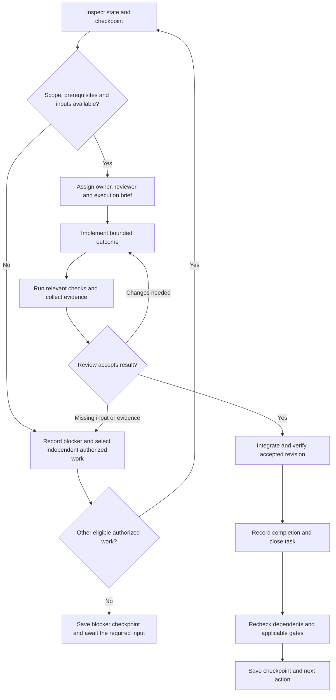

# Detew — Development Orchestration

**Version:** 0.1 · Execution playbook\
**Date:** October 2, 2026\
**Repository:** [JoseLArantes/detew](https://github.com/JoseLArantes/detew)\
**Contributor instructions:** [AGENTS.md](../AGENTS.md)\
**Delivery plan:** [MILESTONES.md](MILESTONES.md)\
**Work specifications:** [Task backlog](tasks/README.md)

Use this playbook to turn the development foundation and backlog into accepted increments. It defines how a coordinator selects work, assigns ownership, coordinates contributors or agents, verifies results, advances gates, and leaves a usable handoff. The default active scope is V1.

For each authorized development run: inspect the current state, select eligible work, write a short execution brief, implement and validate it, review and integrate the result, then update the task and its dependents. Keep the active queue small enough to review and finish. The product and architecture contracts continue to define what the result must do.

## Contents

- [Start a development run](#1-start-a-development-run)
- [Document and state ownership](#2-document-and-state-ownership)
- [Roles and decisions](#3-roles-and-decisions)
- [Select and execute work](#4-select-and-execute-work)
- [Task workflow and blockers](#5-task-workflow-and-blockers)
- [Parallel work and handoffs](#6-parallel-work-and-handoffs)
- [Validation and review](#7-validation-and-review)
- [Milestone and gate advancement](#8-milestone-and-gate-advancement)
- [Changes and backlog synchronization](#9-changes-and-backlog-synchronization)
- [Checkpoints and resumption](#10-checkpoints-and-resumption)

## 1. Start a development run

Read [AGENTS](../AGENTS.md), this playbook, the selected task, and its linked foundation sections. Inspect the working tree and live issue state before allocating work. Existing uncommitted and untracked files belong to the shared workspace and must be preserved.

These commands inspect the starting state from the repository root:

```sh
git status --short
gh issue list --repo JoseLArantes/detew --state open --label status:in-progress --limit 100
gh issue list --repo JoseLArantes/detew --state open --label status:in-review --limit 100
gh issue list --repo JoseLArantes/detew --state open --label status:ready --limit 100
python3 docs/tasks/manage.py validate
```

Read the latest execution checkpoint, active task discussions, accepted predecessor evidence, and any recorded lab reservation. Resume unfinished authorized work before pulling another implementation task. An interrupted task with a blocker may have `status:blocked`; inspect the latest checkpoint and owned open issues as well as the active-label queries.

### 1.1 Initial development entry

At this document's October 2, 2026 baseline, product implementation is unstarted. The backlog contains 157 issues, with four initially eligible tasks. Owners and reviewers remain unassigned. Recheck live state when starting; this table is a dated entry snapshot.

| Task | Starting outcome | Scheduling guidance |
|---|---|---|
| [M00-W01-T01](tasks/m00/M00-W01-T01.md) · [#1](https://github.com/JoseLArantes/detew/issues/1) | Software-license and dependency-admission decision | First primary task; the accepted license decision enables implementation contributions. |
| [M00-W03-T01](tasks/m00/M00-W03-T01.md) · [#7](https://github.com/JoseLArantes/detew/issues/7) | Isolated dual-stack lab and console recovery plan | Independent planning can run alongside the license decision. |
| [M00-W05-T01](tasks/m00/M00-W05-T01.md) · [#11](https://github.com/JoseLArantes/detew/issues/11) | Threat model and privilege/trust inventory | Independent planning can run alongside the license decision. |
| [M10-W01-T01](tasks/m10/M10-W01-T01.md) · [#118](https://github.com/JoseLArantes/detew/issues/118) | Interview and independent-pilot protocol | Early research planning when capacity permits; installations still require M09 readiness. |

After accepting these outputs, recompute eligibility from the [task dependencies](tasks/DEPENDENCIES.md). Complete M00's bootstrap, lab, governance, and check contracts before M01 acceptance. M01 establishes the canonical reference used by the M02/M03/M04 feasibility branches. Follow the [delivery map](MILESTONES.md#21-delivery-map) for subsequent completion boundaries.

The license proposal needs the maintainer's recorded decision. Packet and host experiments need the isolated lab and tested console recovery. Investigations must retain unfavorable results so the subsequent decisions use actual evidence.

## 2. Document and state ownership

| Record | Owns | Coordinator's use |
|---|---|---|
| [PRD](PRD.md) | Scope, requirement IDs, acceptance targets, release gates | Check the intended outcome and release obligations. |
| [PRODUCT](PRODUCT.md) | Policy, lifecycle, privacy, and UI/UX behavior | Resolve the observable meaning of a task's acceptance criteria. |
| [ARCHITECTURE](ARCHITECTURE.md) | Mechanisms, component/privilege boundaries, ARC decisions, evidence gates | Establish interfaces and relevant technical constraints. |
| [CONTEXT](CONTEXT.md) | Domain vocabulary | Keep names consistent across implementation and explanation. |
| [MILESTONES](MILESTONES.md) | Delivery order, work packages, gate ownership, evidence contract | Check completion dependencies and record milestone/gate decisions. |
| [Task catalogs and views](tasks/README.md#sources-rendering-and-publication) | Stable task specifications, direct prerequisites, acceptance, required tests | Refine the selected task and preserve its identity. |
| [GitHub issues](https://github.com/JoseLArantes/detew/issues) | Live ownership, workflow, blockers, review discussion, completion links | Coordinate current work and make its disposition visible. |
| This playbook and execution checkpoints | Work-selection process, coordination rules, active-run handoff | Decide how to proceed and resume without losing context. |
| Evidence reports and requirement ledger, once created in M00 | Executed results at exact revisions and reviewer acceptance | Establish whether an outcome or gate has actually been satisfied. |

The [publication record](tasks/PUBLICATION.md), [task index](tasks/INDEX.md), and local task cards contain initial workflow snapshots. GitHub holds current task progress. Issue bodies and the source catalogs must agree on the task contract; comments and completion records carry execution history. A run checkpoint points to those records rather than creating a competing task board.

Resolve a disagreement in the owning document, then update affected contracts and work. An issue comment cannot silently change PRODUCT semantics, an ARC decision, a PRD target, or a release boundary.

## 3. Roles and decisions

| Role | Responsibility |
|---|---|
| Coordinator | Inspect state, prioritize eligible work, assign bounded execution briefs, coordinate shared files/lab resources, track blockers, assemble review, and leave the checkpoint. |
| Task owner | Deliver the selected outcome, preserve contracts, run required checks, record evidence and limitations, and prepare the handoff. |
| Reviewer | Compare the result with independent expected outcomes, inspect relevant failure boundaries and evidence, and record acceptance or requested changes. |
| Maintainer / gate owner | Decide consequential scope/license/architecture changes, record gate acceptance with the required reviewers, and own the release/support claims. |

A small team can combine coordination and implementation roles. Preserve independent review wherever the task or gate requires it. Agent review can supplement technical review; independent administrator/pilot evidence still requires the people and environments defined by the PRD and task.

Routine implementation choices belong to the owner within the accepted contract. Escalate a choice when it changes scope, normative behavior, license/source admission, privilege boundaries, supported topology, acceptance targets, or a gated technical decision. Present the concrete options, evidence, affected IDs, and downstream consequences to the responsible decision owner.

Work within the human's authorized task and session scope. This playbook describes execution and does not itself start implementation, authorize external publication/contact, select optional scope, or grant access to a live gateway. Existing authorization remains valid; routine reversible work within it does not require repeated confirmation. When a required input or decision is missing, continue eligible independent work and record the precise decision needed.

## 4. Select and execute work

Declare the run's boundary in its brief: one task by default, or an explicitly authorized batch/milestone. For a batch, repeatedly select eligible work within that boundary after each accepted result. Stop when the requested outcome is achieved; if all remaining work needs an external input, leave the blocker checkpoint and identify what permits resumption. Preserve missing evidence and unfinished work in the reported outcome.

### 4.1 Selection rule

1. Resume the current authorized task or complete pending review before selecting fresh implementation work.
2. Filter to the selected scope. V1 is the default; T1/E remain deferred until their own scope and entry conditions are accepted.
3. Check direct prerequisites individually: accepted outcome, completion disposition, evidence, and compatibility with the intended integration baseline. A closed issue by itself is insufficient.
4. Check relevant gate decisions and actual inputs: schemas, datasets/rights, toolchains, lab access, and available review. A gate listed as the task's output is an obligation to produce evidence, rather than an already-accepted entry condition.
5. Among eligible tasks, prefer work that removes the next milestone/gate blocker, then priority, review capacity, and available ownership. Use the [index](tasks/INDEX.md) as a topological guide; it is not a mandatory serial schedule.
6. Assign an owner and reviewer, refine the result into a reviewable increment, and record the execution brief before implementation.

Use a default limit of one active implementation task per owner. Finish or unblock review before expanding the queue. Parallel work needs available reviewers and independent resources; the number of created issues does not determine execution concurrency. Split a task before starting when its outcome cannot be reviewed or validated as one bounded change, following [section 9](#9-changes-and-backlog-synchronization).

Completion dependencies allow declared early research, fixture planning, and UI design where the task graph and entry conditions permit them. A prototype's findings can inform later refinement; support and gate claims still require the accepted integrated result.

### 4.2 Execution loop



At each transition:

1. **Brief:** name the task ID/issue, authorized outcome, baseline, owned files/components, accepted input/evidence versions, reviewer, required checks, and exit condition. Record a meaningful investigation timebox when scheduling a spike; it bounds the experiment and still requires findings.
2. **Prepare:** inspect applicable instructions and existing changes; choose the branch/workspace and agree shared interfaces. Agent-created branches use `codex/`, for example `codex/m00-w01-t01-license-policy`. Separate unrelated work.
3. **Implement:** use the canonical core and established component boundaries. Keep UI behavior and API/runtime semantics connected. Refine uncertainty through evidence rather than quietly weakening acceptance.
4. **Validate:** run the checks required by the task on the appropriate environment. Retain positive, negative, failure, and relevant resource/privacy outcomes. Record unavailable checks explicitly.
5. **Review:** provide the actual diff, revision, evidence, and limitations to the reviewer. Resolve requested changes and rerun the checks affected by those changes.
6. **Integrate:** use the established contribution workflow. Reconcile overlapping changes, check the integrated contracts/generated outputs, and run checks affected by integration. Evidence must remain applicable to the accepted revision; material behavior/dependency changes require updated evidence and renewed review before closure.
7. **Record:** link the result and review disposition, close only the accepted task, recheck direct dependents and any gate review now possible, and save the checkpoint. Continue the next task only within the authorized work scope.

M00 establishes exact product build/check commands. Until then, the backlog validator checks planning documents; it provides no runtime, native compatibility, or product-test evidence.

## 5. Task workflow and blockers

Use GitHub issue state plus the existing workflow labels. Maintain one workflow label on each open task and keep the scope/type/area/priority/size classifications.

| State | Entry condition | Next action |
|---|---|---|
| `status:deferred` | Scope is outside the current selection | Retain the task and activate only after scope and prerequisites are accepted. |
| `status:blocked` | An input, accepted prerequisite, decision, environment, or required reviewer is missing | Record the blocker, its owner, impact, and observable resolution condition. |
| `status:ready` | Scope, accepted prerequisites/gates, and refinement inputs permit scheduling | Confirm owner/reviewer and prepare the execution brief. |
| `status:in-progress` | An owner is actively implementing or investigating the brief | Deliver the bounded outcome and evidence; communicate new blockers promptly. |
| `status:in-review` | The outcome and required evidence are available for review | Obtain the recorded review, resolve changes, and integrate the accepted result. |
| Closed with accepted completion | Task acceptance and review hold at the integrated/accepted revision | Link evidence and remove the open-workflow label; retain the five classification labels. |

Readiness is recalculated whenever prerequisites, scope, gates, interfaces, or environment availability change. GitHub's native dependency relationships expose the hard graph; the coordinator also checks semantic gate acceptance. A task closed as superseded, duplicate, or not planned is not an accepted predecessor.

For a blocker, record: task/branch and retained work; missing input or failed check; affected dependents/gates; who can resolve it; the evidence needed to resume; and the next eligible independent action. Preserve failures and useful partial output. Resume after the resolution condition holds, with a refreshed brief and label.

A spike may complete with evidence that the preferred candidate fails. Accept its investigation result if the task's criteria are met; keep the selection/integration gate blocked or rejected until a viable path is accepted. Recheck dependent labels even if closing the spike clears a native GitHub blocking edge.

Reopen an accepted task when its stated outcome is no longer valid at the claimed revision. Distinguish a regression from newly requested capability: add a linked follow-up for genuinely new scope. Evidence previously used by a gate must be reassessed if the supporting outcome changes.

## 6. Parallel work and handoffs

The coordinator can allocate independent tasks to contributors or agents when delegation is authorized. Use the [milestone parallelism rules](MILESTONES.md#21-delivery-map) and the task DAG to choose branches that can actually proceed independently.

Each worker receives one bounded brief with its task ID, input revision, owned paths, interface assumptions, checks, and handoff destination. Assign a single writer for shared schemas, generated contracts, foundation documents, and each overlapping file set. Agree the owner before edits; interface changes go through that owner and affected consumers.

Use separate branches/worktrees when concurrent edits would interfere. In a shared checkout, partition paths and serialize edits to shared files. The coordinator integrates workers' outputs in prerequisite order and owns cross-component reconciliation. A worker's completion message starts review; it does not close the issue or gate automatically.

Reserve the native gateway/lab for a named task and revision, with topology, console recovery, fixture/workload, and expected teardown state recorded. Serialize tests that alter attachment, pf rules, interfaces, failure settings, or reference benchmarks. Release the reservation after restoring and recording the lab state; retain any failed recovery as a blocker.

Use this brief/handoff structure in the task discussion or execution record:

```markdown
Task / issue:
Owner / reviewer / coordinator:
Authorized outcome and scope:
Baseline revision and existing local changes:
Accepted prerequisites, gates, schemas/data/input versions:
Owned files/components and shared-interface owner:
Branch/workspace; lab reservation if applicable:
Deliverables and independent acceptance procedure:
Required checks/environment; unavailable inputs:

Handoff revision and diff/artifact links:
Checks executed; expected/observed results and evidence IDs:
Contract/document/generated-output changes:
Remaining failures, limits, conflicts, or missing review:
Next action and owner:
```

## 7. Validation and review

Apply the selected task's validation requirements and the [development guide's verification table](../AGENTS.md#verification-and-evidence). The following review questions help the coordinator route evidence; they supplement the owning contracts.

| Change | Evidence/review focus |
|---|---|
| Documentation/planning | Accurate links/IDs, preserved requirement meanings, scope and dependency consistency, and generated task parity. |
| Core/schema/policy | Independent fixtures, canonical evaluator parity, serialization/large-counter correctness, schedule/evidence validity, and generated-contract drift. |
| Packet/classifier/FFI | Exact native host/NIC/topology, IPv4/IPv6 actual outcomes, pf/reinjection/ownership, unsafe lifetime and allocation bounds, hostile input, and recovery. |
| Control/data/activity | Concurrent desired-state edits, worker acknowledgments, corrupt/stale/incompatible inputs, expiry/restart/interruption/disk pressure, privacy, and rollback. |
| UI/host integration | Complete interactions in the native shell; draft/conflict/stale/error/permission states; honest applied/coverage status; accessibility, English/pt-BR, themes, responsive and visual review. |
| Capacity/package/release | Comparable reference workload, saturation/soak/activation, install/upgrade/remove, signed artifacts/notices, supported matrix, and independent pilot evidence where required. |

Write expected outcomes independently of the implementation. Assert actual enforcement and user-visible state for relevant failure tests. Portable/mocked evidence and native/independent-user evidence have distinct roles; retain the environment and limits in every report.

For UI changes, review simplicity alongside functional correctness: can the administrator understand scope, the reason for a decision, and confirmed change status without internal implementation knowledge? Visual review checks hierarchy, typography, spacing, alignment, focus, and consequential states in complete workflows. Screenshots support interaction and accessibility evidence.

Store real reports according to the [milestone evidence contract](MILESTONES.md#52-evidence-artifacts-and-measurement-rules). The proposed evidence directories and requirement ledger are created by their M00 tasks. Use exact revisions and input/artifact identities; private pilot data needs an appropriately redacted public report.

The reviewer records one disposition: accepted, changes requested, or blocked by missing evidence/input. Identify the acceptance criteria checked, relevant failures, limitations, and evidence links. For acceptance, confirm that the [task definition of done](MILESTONES.md#73-definition-of-done-for-tasks) holds. Missing mandatory evidence keeps the task open.

## 8. Milestone and gate advancement

The coordinator assembles the packet of evidence; the [designated maintainer and reviewers](MILESTONES.md#51-gate-ownership) record the decision. Task completion can enable a gate review without accepting the gate itself.

| Boundary | Required coordination outcome |
|---|---|
| M00 / M01 | Accepted bootstrap/governance/lab/check foundations, then canonical contracts/reference/replay evidence. |
| G0 at M04 exit | Accepted ARCH-G01–04 from packet/classifier, category data, and native host/UI work; resolved decisions and justified alpha scope. |
| G1 at M05 exit | Repeatable real inline category/application outcomes and integrated activation/activity/failure evidence. |
| G2 at M10 exit | Completed V1 policy/lifecycle/workflows, M09 technical readiness, independent pilot and usability evidence. |
| G3 at M11 exit | All 73 V1 requirements evidenced at the release revision, supported artifacts/docs/matrix, and actual maintenance ownership. |
| G4 at M12 exit | Selected optional TLS scope, ARCH-G06, all seven T1 requirements, separate trust/protocol/privacy/capacity evidence. |
| G5 for selected M13 work | Independent acceptance per selected extension/child milestone; unselected candidates remain deferred. |

Before advancing a milestone:

1. Confirm accepted outputs for every in-scope work package and its completion dependencies.
2. Review the milestone's exit criteria and required gate evidence at the applicable revision; reconcile limitations and unresolved blockers.
3. Record the gate state using MILESTONES' `planned`, `in_progress`, `blocked`, `accepted`, or `rejected` vocabulary, with the owner/reviewers, date, evidence, revision/input versions, decision rationale, and supported envelope.
4. Update the requirement ledger when available, the milestone completion record, and the root README's actual project stage. Keep planned, implemented, tested, and supported claims distinct.
5. Reassess the next milestone's tasks, estimates, interfaces, lab needs, and review capacity before scheduling them.

When evidence rejects a candidate, preserve the experiment and update the owning ARC/scope decision before dependent replacement work. Other eligible authorized branches can continue. Release publication and optional-scope activation follow the applicable task/session authorization and maintainer responsibilities.

## 9. Changes and backlog synchronization

Use the [foundation synchronization table](MILESTONES.md#81-ownership-and-update-triggers) for product, behavior, technology, terminology, support, and sequencing changes. Execution-process changes update this playbook, AGENTS, and the backlog workflow guide together; update milestone rules if their completion meaning changes.

For a changed or split task, retain stable IDs and record the reason, affected requirements/contracts, deliverables, tests, dependencies, review, and evidence consequences. Append IDs for newly required tasks; retain the disposition of superseded tasks and reroute dependencies explicitly. Preserve unfavorable evidence. Match local and remote acceptance criteria before downstream execution.

Edit the three source catalogs for task-definition changes, then regenerate and validate the views:

```sh
python3 docs/tasks/manage.py render
python3 docs/tasks/manage.py validate
```

Reconcile the corresponding existing GitHub issue, labels, milestone, and native dependencies deliberately when the external write is authorized. The creation helper guards against silent definition changes and does not update existing bodies or remove obsolete dependency edges. Use the [publication crosswalk](tasks/github.json) to preserve identities and verify the final remote result after reconciliation.

### 9.1 Planning tools and live execution

`manage.py publish` creates/resumes backlog publication. It is outside the routine task-selection loop. `manage.py verify` audits remote bodies, labels, milestones, and dependencies against the saved publication snapshot; intentional live workflow/ownership changes need to be interpreted and checked separately. Do not reset active issues to their creation labels to make that audit pass.

The JSON crosswalk and Markdown initial statuses are publication records, not a live scheduler. No helper automatically assigns owners, accepts evidence, advances gates, or updates readiness when an issue closes. The coordinator performs those steps using current evidence and records the disposition in GitHub. Keep definition changes separate from ordinary progress/history updates.

## 10. Checkpoints and resumption

Leave a concise checkpoint at each completed task, blocker, milestone/gate decision, and contributor/agent handoff. During longer runs, communicate what has changed, what remains uncertain, and the next step at useful intervals. Record substantive decisions and blockers in the task discussion when authorized.

Use the primary issue or linked run record for the durable checkpoint. If a local run record is needed, create it when execution starts under `docs/development/runs/` and link it from the primary issue when publication is authorized. This is a proposed record location; no execution record is implied by this playbook.

```markdown
# Development run checkpoint

Date / coordinator / authorized scope:
Primary issue and milestone:
Integration baseline; branch/workspace and retained local changes:
Accepted gate/evidence references:

Completed and accepted this run:
Active tasks, owners, reviewers, and their issue/branch links:
Waiting review or blocked tasks; exact resume conditions:
Shared-interface ownership and current lab reservation/state:
Checks executed and evidence links; missing/failing checks:
Decisions made; pending decisions and responsible owner:
Foundation/task/GitHub changes and any outstanding reconciliation:

Next eligible task and why:
Next concrete action, required input, and responsible owner:
```

On resumption, read the checkpoint and linked evidence, inspect the actual repository and live issues, and confirm that inputs, ownership, and lab state still match. Revalidate any changed prerequisite or contract before continuing. Start from the recorded next action; preserve unfinished work and its limitations.
