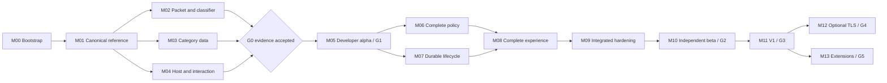

# Detew — Development Milestones

**Version:** 0.1 · Planning baseline\
**Date:** October 2, 2026\
**Requirements and release gates:** [PRD](PRD.md)\
**Behavior and experience:** [Product definition](PRODUCT.md)\
**Implementation decisions:** [Architecture and stack](ARCHITECTURE.md)\
**Vocabulary:** [Domain language](CONTEXT.md)\
**Development instructions:** [AGENTS.md](../AGENTS.md)

This document sequences development from repository bootstrap to a supported V1 release, then separately gated TLS and ecosystem work. It defines milestones and work packages from which implementation tasks can be created. It does not create issue-tracker tickets, assign people, approve a license, or claim that any implementation or gate has been completed. All milestones and work packages are **planned** at this baseline.

The PRD owns requirements, scope, acceptance targets, and release gates. PRODUCT owns behavioral and experience contracts. ARCHITECTURE owns implementation decisions and evidence gates. This document owns sequencing, dependencies, work-package IDs, and delivery evidence. A task cannot relax an upstream contract to fit its milestone. [Section 8](#8-document-synchronization-and-change-control) defines how changes remain connected.

## Contents

- [Planning rules](#1-planning-rules)
- [Milestone sequence and dependencies](#2-milestone-sequence-and-dependencies)
- [V1 milestones](#3-v1-milestones)
- [Later milestones](#4-later-milestones)
- [Gate and evidence register](#5-gate-and-evidence-register)
- [Requirement ownership](#6-requirement-ownership)
- [Task creation and completion](#7-task-creation-and-completion)
- [Document synchronization](#8-document-synchronization-and-change-control)
- [Initial backlog creation order](#9-initial-backlog-creation-order)

## 1. Planning rules

### 1.1 Scope and sequence

V1 is a flow-aware web and application filtering plugin for OPNsense. Adult content, Games, and AI services, consistent policy behavior, and an understandable interface are required outcomes. Native OPNsense remains responsible for firewall, routing, NAT, authentication, and package lifecycle. The first proving environment is a household; product concepts and feature availability serve other sites equally.

Implement a canonical policy reference before connecting live classification to enforcement. Investigate packet integration, classification/data quality, and host/UI integration early enough to change the design before investing in a complete product. Build the first end-to-end alpha as a thin slice through the selected production boundaries. Extend that slice rather than maintaining a disposable second evaluator or configuration authority.

Optional TLS termination belongs to M12 after V1. Later providers, additional platforms, fleet operations, and high availability belong to independently scoped M13 work. V1 defines extension boundaries and rejects unavailable capabilities; it does not implement every future module.

### 1.2 What completion means

A milestone is complete when its work packages have accepted evidence, its dependencies have been satisfied, and its exit criteria hold at a recorded revision. Code merged, a screenshot, a running process, or a successful build alone does not close a product or integration gate.

Work-package IDs use `Mxx-Wyy`; later task IDs use `Mxx-Wyy-Tzz`. Keep IDs stable if names change. One work package normally produces several reviewable tasks. Requirement IDs remain owned by the PRD. Release gates `G0`–`G5`, architecture evidence gates `ARCH-G01`–`ARCH-G06`, and architecture decisions `ARC-01`–`ARC-15` retain their existing meanings.

No delivery dates or elapsed-time estimates are asserted here. Estimate tasks after the environment, contract, and unknowns are identified. Reestimate downstream work from feasibility evidence. Track an implementation task separately from a time-bounded investigation; the investigation must produce a decision and evidence even when its preferred candidate fails.

### 1.3 Cross-cutting obligations

- Keep runtime, preview, category testing, and replay on shared Rust normalization/evaluation code. UI and PHP perform their own boundary checks without creating policy semantics.
- Test IPv4 and IPv6, negative cases, active sessions, visibility limits, and actual client/server outcomes wherever a packet-path change is involved.
- Bound native and Rust allocations, queues, storage, downloads, and expensive administrative operations. No packet decision waits for reporting, SQL, controller RPC, or a remote provider.
- Preserve native desired-state ownership, exact wire counters, immutable bundles, worker acknowledgments, and truthful desired/active/attachment status.
- Build privacy, least privilege, localization, accessibility, and exceptional UI states into each relevant slice. M09 validates the integrated result; it is not the first security or UX pass.
- Use licensed, synthetic or safely curated public fixtures. Real browsing records, appliance secrets, and CA keys do not enter the public test corpus.
- Keep software licenses and data permissions separate. The proposed software license is resolved in M00; category-source admission is resolved in M03. Public availability does not establish redistribution rights.

## 2. Milestone sequence and dependencies

### 2.1 Delivery map

| Milestone | Outcome | Completion dependencies | Release relationship |
|---|---|---|---|
| [M00](#m00-project-bootstrap-and-governance) | Reproducible repository, contribution rules, lab, and licensing decision | Planning baseline | Enables implementation |
| [M01](#m01-shared-contracts-and-canonical-policy-reference) | Portable domain/contracts, normalization, evaluator, and replay foundation | M00 | Foundation for G0 work |
| [M02](#m02-packet-and-classifier-feasibility) | Selected packet adapter and validated native classifier boundary | M01 | ARCH-G01, ARCH-G02; part of G0 |
| [M03](#m03-category-data-feasibility-and-baseline-artifacts) | Admitted category sources, taxonomy, indexes, and independent corpus | M01 | ARCH-G03; part of G0 |
| [M04](#m04-native-host-integration-and-interaction-prototype) | Validated host/model/API/UI seam and tested interaction prototype | M01 | ARCH-G04; completes G0 with M02/M03 |
| [M05](#m05-inline-developer-alpha) | Repeatable category/application filtering through the real plugin/runtime | M02, M03, M04 and accepted G0 | G1 developer alpha |
| [M06](#m06-complete-policy-time-and-device-behavior) | Complete V1 assignments, identity validity, schedules, overrides, and supporting controls | M05 | Required for G2 |
| [M07](#m07-durable-activation-and-data-operations) | Complete desired/active lifecycle, updates, expiry, restore, and recovery | M05 | Required for G2 |
| [M08](#m08-complete-user-workflows-and-local-activity) | Complete simple UI, activity/privacy, diagnostics, and administration workflows | M06, M07 | Required for G2 |
| [M09](#m09-integrated-hardening-and-pilot-readiness) | Tested packages, security, quality, capacity, recovery, and support envelope | M06, M07, M08 | ARCH-G05; technical readiness for G2 |
| [M10](#m10-independent-pilots-and-beta-acceptance) | Independent installations and evidence-led beta acceptance | M09 | G2 pilot beta |
| [M11](#m11-v1-release-and-maintenance-readiness) | Supported, documented, signed open source V1 release | M10 | G3 general availability |
| [M12](#m12-optional-managed-tls-module) | Separately validated managed TLS/request inspection | M11 and a T1 scope/design decision | ARCH-G06, G4; outside V1 |
| [M13](#m13-ecosystem-expansion-by-demonstrated-demand) | Selected modules or distribution extensions | M11; M12 only for TLS-dependent extensions | G5; outside V1 |

Dependencies specify **completion**, not a ban on useful early work. M02/M03/M04 can proceed alongside one another after M01. Once M05 exists, M06 and M07 can proceed independently against agreed contracts. M08 design/component work can begin during M04 and UI implementation during M05–M07; its exit requires the completed policy and lifecycle behavior. M09 test tooling begins at bootstrap and grows with each slice. M10 recruitment and research begin before pilot installation readiness.



### 2.2 Critical uncertainties and stop conditions

The early delivery path depends on a packet adapter that retains pf behavior, a usable bounded classifier on FreeBSD, redistributable category data, and a native host seam that preserves administration protections. M04's UI success cannot compensate for M02/M03 failure.

If a preferred dependency fails, record the result and update the architecture decision before replacement implementation. If no supported packet path meets V1, redesign that boundary before alpha acceptance. If the three required categories cannot be lawfully distributed and maintained to the quality contract, retain the launch blocker. Hardware/topology support can be narrowed transparently with evidence; IPv6, policy correctness, privacy, and truthful status cannot be silently dropped. Revisit proposed numerical targets only through the PRD's explicit change process.

### 2.3 Work-package refinement order

Use this order when defining task dependencies inside each milestone. Preparation and fixture/design work can start earlier, but integration tasks name the exact predecessor task or accepted contract they require. Completion dependencies in §2.1 still apply.

| Milestone | Internal dependency order |
|---|---|
| M00 | W01's license decision precedes implementation contributions. W03 lab and W05 threat/ownership planning can proceed during that decision; W02 locked bootstrap feeds W04 build/check execution. Complete all before M01. |
| M01 | W01 types → W02 normalization → W03 evaluator → W04 compiled identity → W05 integrated replay. W05's independent expected fixtures are written alongside contract definition, before using runtime output as evidence. |
| M02 | W01 packet comparison → W02 packet failure matrix. W03 classifier shim → W04 classifier corpus. Those two branches join at W05's decision/report. |
| M03 | W01 taxonomy and W02 source review establish W03's compiler inputs. W04 independent labels can begin immediately; its artifact-quality run uses W03 output. W05 packages the reviewed W01–W04 results. |
| M04 | W01 writer and W02 API/IPC agree their contracts before integration. W03 native mount/transport uses W02; W04 interactions combine W01–W03; W05 studies the working prototype. |
| M05 | W01 flow/adapter and W02 evaluator integration establish worker/action contracts for W03 activation and W04 events/activity. Those service implementations may overlap after interfaces are agreed; W05 requires all four integrated. |
| M06 | W01 attribution and W02 complete policy selectors can overlap. W03 uses W02's time/override definitions; W04 integrates W01–W03 reconsideration. W05 supporting controls can proceed against the accepted M02 capability catalog. |
| M07 | W01 writer/operation contracts feed W02 durable activation. W03 source admission can develop independently; W04 eligibility/corrections and W05 restore/maintenance integrate with W01–W03. Engine deadline behavior uses M06's agreed time contract. |
| M08 | W01 shell/components precede integrated W02 editors and W03 activity/explanations. W04 privacy/export uses the completed M07 lifecycle and M05 activity seam. W05 validates the complete W01–W04 workflows. |
| M09 | W01 packages pins the integrated candidate. W02 failure, W03 security, W04 capacity, and W05 category/app quality validate that same candidate and can run independently where lab resources permit. W06 consolidates their accepted reports. |
| M10 | W01 recruitment precedes W02 independent installation and W03 usability sessions. Findings feed W04 fixes/affected reruns; W05 accepts the final candidate and reports. |
| M11 | W01 evidence audit begins on the frozen beta candidate; W02 distributable artifacts, W03 docs, and W04 real maintenance ownership supply its final closure. W05 release acceptance requires W01–W04 at the final revision. |
| M12 | W01 design/implementation selection precedes W02 key/trust, W03 protocol/failure, and W04 request/UI integration; W05 validates the combined module. |
| M13 | W01 chooses and specifies a child milestone. Only its selected W02/W03/W04 capability branches are scheduled; W05 validates that child module's complete claimed behavior. |

No milestone ID or package ID above is an estimate. The task graph records concrete dependencies rather than introducing a cycle between a broad audit and the artifacts it reviews. Freeze shared time/evidence/operation interfaces before M06/M07 integration tasks; neither milestone requires the other's complete exit merely to start.

## 3. V1 milestones

### M00: Project bootstrap and governance

**Outcome:** contributors can build and validate a small portable/native/UI change through documented entry points. The license and contribution boundary are explicit before implementation contributions are accepted.

**Entry:** the current foundation documents and this plan. **Responsible roles:** maintainer, build/platform developer, security reviewer. One person may hold several roles, but acceptance still requires a recorded review.

**Foundations:** [PRD §14](PRD.md#14-open-source-sustainability-and-governance), [architecture §2](ARCHITECTURE.md#2-selected-stack-and-version-policy), [§4](ARCHITECTURE.md#4-code-organization-and-dependency-rules), and [§16](ARCHITECTURE.md#16-development-testing-and-delivery); ARC-01, ARC-14, ARC-15.

| Work package | Deliverable and acceptance | Requirement inputs |
|---|---|---|
| M00-W01 | Record the software-license decision and dependency admission rules; add the enacted license only after that decision. Publish contributor/reviewer responsibilities and a private vulnerability-reporting route without inventing contact details. | OSS-01–03, SEC-04 |
| M00-W02 | Bootstrap the Cargo workspace, thin binaries, UI package, contract generation entry point, formatter/lint configuration, and exact version locks. Instantiate planned crates as responsibilities are implemented; empty directories do not count as component delivery. A clean checkout reproduces portable builds. | POL-01, OSS-03 |
| M00-W03 | Define an isolated client/gateway/server lab, exact host/kernel/NIC/tool revisions, IPv4/IPv6 and VLAN/NAT paths, traffic generators, and console recovery. Record the bypass baseline and lab teardown procedure. | INS-07, OPS-03, OPS-09, QLT-01–02 |
| M00-W04 | Establish provider-independent check scripts, portable versus native check jobs, fixture licensing/redaction rules, and the evidence manifest format. Failed/missing native checks cannot be reported as passing through a portable job. | SEC-02, OSS-02–03 |
| M00-W05 | Establish the threat model, trust/privilege inventory, requirement coverage ledger, and bug/feature/category-correction templates. Create no public endpoint, telemetry, or contribution upload as a bootstrap shortcut. | SEC-01–04, PRI-01, PRI-03 |

**Exit:** a license decision is recorded; locked portable builds run; the native lab is reproducible; recovery access is verified; checks and evidence can be reproduced by another contributor. Unresolved contacts or ownership are recorded as blockers to the corresponding public process rather than silently marked complete. No support claim or release gate closes here.

### M01: Shared contracts and canonical policy reference

**Outcome:** one portable source of policy meaning exists before live enforcement and frontend integration.

**Entry:** M00. **Responsible roles:** core developer, product/domain reviewer. **Foundations:** [PRODUCT §§3–4](PRODUCT.md#3-domain-objects-and-ownership), [§5.3](PRODUCT.md#53-normalization-and-canonical-matching), [architecture §5](ARCHITECTURE.md#5-shared-schemas-and-evaluation); ARC-02, ARC-06–08, ARC-12.

| Work package | Deliverable and acceptance | Requirement inputs |
|---|---|---|
| M01-W01 | Define typed IDs, profiles, selectors, evidence/completion states, decision/outcome types, capability manifests, revisions, and structured errors. Generate JSON schemas and TypeScript DTOs; test unknown write fields, unions/nulls, and decimal-string round trips beyond JavaScript's safe integer range. | POL-01, POL-06, INS-05, INS-10 |
| M01-W02 | Implement canonical hostname/IDNA/IP handling and explicit exact/subdomain matching, with pinned public-suffix rules. Independent fixtures reject deceptive suffixes and broad public-suffix exceptions. | DAT-03 |
| M01-W03 | Implement assignment and exception precedence, site guardrails, multi-label category/application denies, insufficient-evidence dimensions, defaults, and stable reasons. Test guardrails against exceptions and temporary-context inputs; record time/attribution as supplied context, never ambient state. | POL-02–03, POL-06, DAT-04, POL-13 |
| M01-W04 | Define canonical artifact/bundle identity and compatibility metadata; implement deterministic compilation for the initial policy subset. Reordered unordered inputs produce identical artifacts and replay results; semantically ordered priorities remain preserved. | POL-08, DAT-02, POL-06 |
| M01-W05 | Provide a CLI reference/replay and preview harness with independent expected decisions, contextual assumptions, and incomplete-record rejection. Run without a firewall, SQL, native classifier, or network access. | POL-01, POL-06, POL-11, DAT-09 |

**Exit:** schemas regenerate without drift; the semantic corpus passes; domain/policy dependencies respect the portable boundary and forbid unsafe code; identical explicit inputs reproduce verdict/reason ordering. Time and attribution interfaces are fixed here; their full lifecycle implementation is M06. Initial bundle compilation does not imply live activation readiness.

### M02: Packet and classifier feasibility

**Outcome:** measured FreeBSD evidence selects one inline adapter and establishes whether the preferred classifier can supply required evidence within the engine's native boundary.

**Entry:** M01 and the M00 lab. **Responsible roles:** packet/platform developer, classifier developer, security reviewer. **Foundations:** [PRODUCT §9](PRODUCT.md#9-opnsense-attachment-and-failure-behavior), [architecture §§6–7](ARCHITECTURE.md#6-packet-adapter-and-inspection-path); ARC-04, ARC-05; ARCH-G01, ARCH-G02.

| Work package | Deliverable and acceptance | Requirement inputs |
|---|---|---|
| M02-W01 | Implement an adapter conformance harness and minimal Netmap/Divert comparison. Record framing, ownership, original-client address stage, bidirectional capture, pf/NAT/VLAN order, IPv4/IPv6, reinjection, offloads, and physical/virtual NIC results. | INS-01, INS-07, OPS-03–04 |
| M02-W02 | Measure engine/helper death, close, overload, interface reset, reboot, stop, and removal. Demonstrate each available bypass/restrictive action and scoped management recovery; record unavailable capabilities and conflicts. | OPS-06, OPS-09, SEC-01 |
| M02-W03 | Build the pinned nDPI library/header/catalog set on FreeBSD; implement the bounded C shim and ownership-safe Rust wrapper. Measure native allocations and context/flow limits; test lengths, lifetime errors, panic boundaries, and supported sanitizers/fuzzing. | INS-04–06, SEC-02, OSS-02 |
| M02-W04 | Replay HTTP host, segmented TLS, supported QUIC Initial, ECH/GREASE, absent SNI, resumed/early-data and reused connections, gaming/encrypted apps, direct IP, and malformed fixtures. Return typed insufficient/unsupported facts when evidence is unavailable. | INS-02–05, INS-08, INS-10, QLT-08 |
| M02-W05 | Publish the adapter comparison, classifier/catalog report, exact lab matrix, measured cost envelope, and selected capability set. Update ARC-04/05 and companions if candidates change. | OPS-03, QLT-01–03, OSS-02 |

**Exit:** ARCH-G01 and ARCH-G02 each have reviewed pass/fail evidence and a recorded decision. The selected path retains pf denials, does not loop/reinject twice, sees both directions for the required supported IPv4/IPv6 topology, and has tested ownership/failure/recovery behavior. Classifier observations, native allocation bounds, catalog limits, and licensing are explicit. The prototype remains lab-only; its output is the production integration decision, not a general support claim.

### M03: Category-data feasibility and baseline artifacts

**Outcome:** category filtering has lawful, maintainable inputs and a measurable quality model independent from the imported lists.

**Entry:** M01. **Responsible roles:** data maintainer, core/data developer, independent corpus reviewer. **Foundations:** [PRD §6](PRD.md#6-category-and-application-data-requirements), [PRODUCT §7](PRODUCT.md#7-category-data-product-and-lifecycle), [architecture §8](ARCHITECTURE.md#8-category-and-classification-data); ARC-07; ARCH-G03.

| Work package | Deliverable and acceptance | Requirement inputs |
|---|---|---|
| M03-W01 | Establish stable `adult`, `games`, and `ai_services` IDs, definitions, English/Portuguese labels, positive/negative boundaries, and mixed-purpose examples. Define provider mappings without inheriting undocumented subdomain semantics. | DAT-01, DAT-03–04, UX-10 |
| M03-W02 | Audit candidate sources, exact terms, attribution, redistribution, trust, freshness, update cadence, and maintenance ownership. Admit sources through reviewed manifests; record rejected/inadequate sources and local-curation obligations. | DAT-01, DAT-08, OSS-02 |
| M03-W03 | Implement bounded import/normalization/sort/deduplication and FST artifact compilation. Verify lengths/metadata indexes, provenance, label unions, exact/subdomain boundaries, and deterministic output; measure active-plus-candidate memory. | DAT-02–05, QLT-03, SEC-02 |
| M03-W04 | Build an independently labeled corpus with Portuguese/English, IDNs, regional/new services, benign health/education, shared-hosting, and mixed-purpose cases. Publish precision/recall, sample counts, uncertainty, uncategorized share, and all-attempted-traffic visibility separately. | DAT-01, QLT-07 |
| M03-W05 | Produce a candidate baseline dataset pack, source/license manifest, artifact verifier, and correction workflow specification. Keep evaluation labels separate from imported lists; do not redistribute unapproved material. | DAT-01–02, DAT-07, OSS-02–03, PRI-03 |

**Exit:** ARCH-G03 has approved source/taxonomy/provenance decisions, usable normalized artifacts for all three required categories, initial independent quality evidence, and a credible update path. Numerical launch quality remains a blocker until measured on the frozen M09/M10 release candidate corpus. Low initial coverage is a recorded gap with remediation, not a claim that G0 establishes GA accuracy.

### M04: Native host integration and interaction prototype

**Outcome:** the administration seam preserves native protections and the intended simple journeys can be tested in the host shell before the complete engine/UI is built.

**Entry:** M01. **Responsible roles:** host/API developer, frontend/UX developer, security reviewer. **Foundations:** [PRODUCT §§12 and 14](PRODUCT.md#12-administration-api-and-shared-validation), [architecture §§9, 11–13](ARCHITECTURE.md#9-control-plane-and-activation); ARC-08–09, ARC-11–12, ARC-14; ARCH-G04.

| Work package | Deliverable and acceptance | Requirement inputs |
|---|---|---|
| M04-W01 | Implement the native model/schema mapping and generated snapshot seam. Prototype the locked expected-revision writer, durable high-water reservation, native save, and restore/import rebasing. Inject concurrent edits and interruption between reservation/save/snapshot; gaps must not count as saved or applied state. | POL-01, POL-07, POL-10, OPS-08 |
| M04-W02 | Implement minimal permission-checked native endpoints, fixed configd bridge, Unix framing/peer validation, and OpenAPI contracts. Test admin/viewer, session expiry, CSRF/method violations, oversized input, and untrusted actor claims. | OPS-02, SEC-01, SEC-03 |
| M04-W03 | Mount locally built React assets in Volt with typed native transport, hash routes, scoped styles/portals, no Preflight, and host locale/theme context. Verify CSP, navigation, cache/version errors, and no style leakage. | UX-07–11, OPS-02 |
| M04-W04 | Build interactive setup, category profile/review/apply, device assignment, decision/exception, and failure-recovery prototypes. Use explicit simulated/live data labels; present draft/active, observe/enforce, bypass, and visibility as different facts. | UX-01–06, UX-08, UX-12 |
| M04-W05 | Conduct the G0 setup/block/explain study with representative non-developer users; record task completion, mistakes, assistance, and comprehension. Check keyboard/zoom, host themes, Portuguese, narrow screens, and 5/100/1,000-entry fixtures. Revise contracts/components from findings. | UX-01–12, QLT-05 |

**Exit:** ARCH-G04 has host integration/security/revision evidence and prototype findings. The native seam has one writer, protected mutation methods, working read-only restrictions, and safe React mounting. G0's interaction study is recorded; full PRD timed usability acceptance occurs on the integrated product at M10. Backend simulation is visibly labeled and does not prove packet enforcement. G0 closes only with M02/M03 evidence as well.

### M05: Inline developer alpha

**Outcome:** a developer can install a disabled alpha, set up a test scope, and demonstrate category/application filtering with exact explanations and confirmed activation through the selected path.

**Entry:** M02/M03/M04 and accepted G0. **Responsible roles:** runtime, control, host/API, frontend developers. **Foundations:** [PRODUCT §§5–6](PRODUCT.md#5-flow-inspection-and-evidence-contracts), [§13](PRODUCT.md#13-decision-explanations-activity-and-privacy), [architecture §§3, 6–11](ARCHITECTURE.md#3-deployment-and-trust-boundaries); ARC-02–10, ARC-12, ARC-14.

| Work package | Deliverable and acceptance | Requirement inputs |
|---|---|---|
| M05-W01 | Implement selected-adapter attachment/preflight and bounded worker-affine flow tracking, framing/reassembly, classification, local category lookup, decision caching, and forward/drop actions. Test both directions, realm/tuple reuse, midstream traffic, and native admission limits. | INS-01–07, QLT-02–03 |
| M05-W02 | Connect profiles/default and explicit test-device or network assignment to the canonical evaluator. Implement observe/enforce, balanced provisional exchange, capability-gated restrictive holding, late blocking, and truthful visibility/fallback. | INS-08, INS-10, POL-02–03, POL-13, OPS-05 |
| M05-W03 | Assemble the control daemon, validated immutable bundles, serial operations, prepare/commit, worker generation acknowledgments, and eager reconsideration. Establish minimal durable last-verified recovery now; no newest-candidate shortcut while M07 expands the lifecycle. | POL-07–10, POL-12, QLT-04 |
| M05-W04 | Assemble the activity daemon with nonblocking event export, IDs/gap counters, bounded SQLite ingestion, and a basic historical explanation/API/drawer. Keep packet decisions independent from SQL and display incomplete detail honestly. | POL-11, PRI-01–02, QLT-09 |
| M05-W05 | Package a disabled developer alpha and wire real host/UI setup, category edit/review/apply, status, and recovery. Demonstrate each required category and tested applications with resolver-independent observable flows and an underlying pf denial. | OPS-01–05, OPS-09, UX-01–06 |

**Exit / G1:** repeated end-to-end IPv4/IPv6 tests confirm real forward/drop outcomes, required category and representative application decisions, immutable bundle activation, bounded malformed/provisional handling, and decision provenance. UI/controller/activity loss cannot silently stop a healthy active engine. Partial worker activation does not display success. Publish alpha limitations; unfinished V1 workflows remain visible backlog items, not silently missing settings.

### M06: Complete policy, time, and device behavior

**Outcome:** the V1 policy model works consistently across existing flows, changing identity evidence, and time transitions.

**Entry:** M05. **Responsible roles:** core/runtime developer, host inventory developer, domain reviewer. **Foundations:** [PRODUCT §4](PRODUCT.md#4-policy-semantics-the-consistency-contract), [§8](PRODUCT.md#8-device-attribution-and-assignment-behavior), [architecture §§5 and 7](ARCHITECTURE.md#5-shared-schemas-and-evaluation); ARC-02, ARC-06–07, ARC-15.

| Work package | Deliverable and acceptance | Requirement inputs |
|---|---|---|
| M06-W01 | Complete groups, supported network selectors, assignment precedence, host inventory evidence/expiry, trusted bindings, and conflicts. Test IP reuse, IPv6 privacy addresses, randomized/scoped MAC observations, unknown attribution, and default fallback. | POL-02, POL-09, UX-03 |
| M06-W02 | Complete exceptions, mandatory guardrails, multi-label decisions, scheduled block overlays, and narrow temporary overrides. Reject ambiguous priorities/overlapping active overrides; preview the winning controls. | POL-03–05, DAT-04 |
| M06-W03 | Implement engine-local schedule/expiry helpers with site timezone, DST/overnight rules, clock health, wall/monotonic deadlines, and restart semantics. Reevaluate at transitions while the controller is unavailable; uncertain time cannot extend expiring allows. | POL-04–05, POL-12 |
| M06-W04 | Complete invalidation/reconsideration for stronger evidence, assignments/groups/attribution, schedules, overrides, and expired source eligibility. Test an active blocked flow under state pressure and an idle tracked flow during a change. | INS-08, POL-09, DAT-08, QLT-04 |
| M06-W05 | Complete separate insufficient-classification/provisional/safety settings and optional resolver/known encrypted-DNS or tunnel controls. Supporting controls derive from the same intent, remain inactive in observe mode, and carry actual coverage limits. | INS-09–10, POL-13, OPS-05 |

**Exit:** runtime, preview, and replay agree on the complete V1 policy corpus. Address reuse cannot inherit another device's exact assignment; active flows follow all effective changes; clock/DST/reboot tests meet PRODUCT's expiry contract. Transport/app recognition and resolver support do not claim universal circumvention prevention. Reconnect requirements and already forwarded provisional bytes are observable.

### M07: Durable activation and data operations

**Outcome:** policy/data changes, interruptions, restore, and rollback have a complete durable lifecycle and reliable user-visible outcomes.

**Entry:** M05; shared time/eligibility interfaces from M01/M06. **Responsible roles:** control/data developer, host integration developer, reliability reviewer. **Foundations:** [PRODUCT §§6–7](PRODUCT.md#6-configuration-activation-and-recovery), [§12](PRODUCT.md#12-administration-api-and-shared-validation), [architecture §§8–11](ARCHITECTURE.md#8-category-and-classification-data); ARC-06–09, ARC-12, ARC-14.

| Work package | Deliverable and acceptance | Requirement inputs |
|---|---|---|
| M07-W01 | Complete validation/preview/save/activate/status/idempotency and structured conflicts. Enforce native mutation lock and durable revision reservation across all writers; restore/import rebases old revisions and unrecoverable lineage resets are explicit. | POL-01, POL-07, POL-10, OPS-07–08 |
| M07-W02 | Complete journal/artifact writes, interrupted-stage recovery, prepare/commit/ack progress, worker stalls, controller/engine restart, and compatible rollback. Test disk full/corruption/permissions; never promote an unverified candidate. | POL-08, POL-12, POL-14, SEC-02 |
| M07-W03 | Complete bounded source downloads/imports, signature/trust/schema checks, quarantine diffs, deterministic compilation, and category-only bundle activation. Test malicious archives/redirects, mass deletion, oversized artifacts, and incompatible taxonomy/catalog versions. | DAT-05–06, OSS-02, SEC-02 |
| M07-W04 | Complete freshness/warning/expiry/offline lifecycle and private correction overlays/custom lists. Ensure engine-local eligibility expires independently from downloads/controller; export corrections and preserve provenance. | DAT-07–08, POL-09, POL-12, PRI-03 |
| M07-W05 | Complete explicit dependency-aware restore/rollback preview, active/previous/candidate retention, safe artifact garbage collection, and scoped maintenance for hook or classifier binary/catalog changes. Ordinary policy/data changes do not reattach interfaces. | POL-14, DAT-02, DAT-06, OPS-04, OPS-08 |

**Exit:** injected failures at every durable stage produce a documented recoverable state. Concurrent writers cannot lose accepted intent; a reserved counter alone is not a saved revision; acknowledgments/reconsideration govern applied status. Invalid updates retain eligible known-good artifacts. Rollback selects compatible available versions explicitly and becomes a new activation. Quarantine/freshness thresholds have recorded rationale; M09 freezes defaults from measured evidence.

### M08: Complete user workflows and local activity

**Outcome:** the integrated product makes category control, assignment, explanation, and recovery simple without concealing state or scope.

**Entry:** M06/M07 for completion; component work starts earlier as described in §2. **Responsible roles:** frontend/UX developer, activity/API developer, accessibility/localization reviewer. **Foundations:** [PRD §9](PRD.md#9-ui-and-experience-requirements), [PRODUCT §§12–14](PRODUCT.md#12-administration-api-and-shared-validation), [architecture §12](ARCHITECTURE.md#12-frontend-architecture); ARC-09–12.

| Work package | Deliverable and acceptance | Requirement inputs |
|---|---|---|
| M08-W01 | Complete Overview/Profiles/Devices/Activity/Settings and resumable readiness→scope→profile→test→observe→review→enforce setup. Build a Detew-owned component/state catalog with scoped tokens, host themes, progressive disclosure, and clear category definitions/coverage. | UX-01–03, UX-06–07 |
| M08-W02 | Complete category/app/exception/schedule/assignment/override editing, server preview, diff/review, apply progress, conflict preservation, reconnect, and rollback. No optimistic active/protection state; all consequential defaults appear in review. | UX-03–04, UX-08, POL-07, POL-10 |
| M08-W03 | Complete paginated activity/search and decision drawer with captured historical evidence, narrow exception creation, canonical category/context tester, and HTTPS failure guidance. Confirm multi-label and unavailable evidence/outcome states with real runtime records. | DAT-09, UX-05–06, UX-12, QLT-09 |
| M08-W04 | Complete bounded local retention/deletion/collection-disabled mode, export/import mappings, redacted diagnostics preview, privacy disclosure, and explicit correction-contribution preparation. No upload is performed by preparing a correction or export. | OPS-07, PRI-01–03, OSS-03 |
| M08-W05 | Complete English/pt-BR, keyboard/screen-reader, 200% zoom/reflow, narrow triage, long values, permission/session failure, stale/offline data, large lists, and partial activation. Capture automated/manual and visual review evidence on the native host. | UX-08–11, QLT-05 |

**Exit:** S-01–S-08 run against real services, with complete common and failure states. The component inventory and reviewed host screenshots demonstrate consistent type/spacing/color, but interaction/accessibility evidence is also required. Five/100/1,000-entry fixtures remain responsive through pagination. Metadata visibility, actual enforcement, and collection completeness are distinct. M10 independently validates usability; internal review alone does not satisfy its participant gate.

### M09: Integrated hardening and pilot readiness

**Outcome:** an installable candidate has a tested support envelope, quantified capacity/quality, and complete operational recovery suitable for independent pilot use.

**Entry:** M06/M07/M08. **Responsible roles:** platform/release developer, security reviewer, performance/data/UX reviewers. **Foundations:** [PRD §§11–13](PRD.md#11-quality-targets-and-workload-definition), [PRODUCT §§9 and 15–16](PRODUCT.md#9-opnsense-attachment-and-failure-behavior), [architecture §§13–16](ARCHITECTURE.md#13-opnsense-integration-and-packaging); ARC-03–10, ARC-14; ARCH-G05.

| Work package | Deliverable and acceptance | Requirement inputs |
|---|---|---|
| M09-W01 | Complete native plugin/runtime/data package builds, service accounts/order, install-disabled preflight, drift/ownership tracking, stop/disable/scope maintenance/removal, migrations, reboot, and compatible package rollback. Preserve unrelated host configuration. | OPS-01, OPS-03–04, OPS-08–09, SEC-01 |
| M09-W02 | Execute packet/platform and failure matrices under normal/adversarial load: pf denials, NAT/VLAN/IPv6, conflicts, active preattachment flows, death/reset/overload, offline data, clock loss, partial apply, full/corrupt storage, and reporting loss. Confirm claimed actions using traffic and adapter observations. | INS-01–10, OPS-05–06, POL-08–14, QLT-09 |
| M09-W03 | Audit privilege/IPC/API/import/feed/FFI boundaries and privacy/diagnostics; run targeted fuzz/property/sanitizer campaigns with reproducible seeds/time budgets. Resolve exploitable and correctness blockers, including unauthorized mutations, guardrail bypass, and sensitive export leakage. | SEC-01–03, PRI-01–03 |
| M09-W04 | Benchmark the frozen reference workload, bypass goodput/RTT, 20,000 flows/500 new flows per second, lookup/queue limits, activation tails, UI/API responsiveness, peak bundle/native memory, activity WAL/disk, and a 72-hour soak. Publish saturation and failures; freeze measured quotas/defaults. | QLT-01–06, QLT-09 |
| M09-W05 | Validate each required category and the exact supported application catalog on independent corpus/traffic, including lookalike negatives, late classification, and visibility exclusions. Publish per-category precision/recall with denominators and per-app outcomes; revise data/catalog through normal admission. | DAT-01–02, QLT-07–08 |
| M09-W06 | Produce pilot installation/recovery/limitations guides, the support matrix, SBOM/software/data manifests, release-candidate verification, and the complete requirement evidence ledger. Verify privacy defaults and UI/accessibility claims on the packaged build. | OPS-03, OPS-07–09, SEC-04, OSS-01–03, UX-01–12 |

**Exit:** ARCH-G05 is accepted and candidate defaults/support matrix are frozen. All technical V1 acceptance targets have linked evidence or an explicitly approved PRD revision before pilot beta acceptance. The 72-hour soak and failure/recovery matrices pass on the supported reference configuration. Independent pilots do not become the first place adapter failure, upgrade rollback, or recovery access is tested. A discrepancy that can silently disable enforcement, misreport active state, bypass guardrails, leak secrets, or corrupt accepted configuration remains a blocker.

### M10: Independent pilots and beta acceptance

**Outcome:** independent administrators can install, use, understand, and recover the integrated product; their results determine beta acceptance and any final scope changes.

**Entry:** M09 for pilot installations. Recruitment/interviews may begin at M00. **Responsible roles:** product/UX researcher, pilot support maintainer, implementation owners for observed defects. **Foundations:** [PRD §2.4](PRD.md#24-validation-and-stop-conditions), [§9.3](PRD.md#93-usability-gates), [§12](PRD.md#12-release-plan-and-gates), [PRODUCT §14.12](PRODUCT.md#1412-design-acceptance).

| Work package | Deliverable and acceptance | Requirement inputs |
|---|---|---|
| M10-W01 | Complete at least 10 administrator interviews across household/small-organization settings and recruit at least five independent pilot sites after the founder's environment. Record category needs, host/topology constraints, setup friction, and keep/remove reasons. | PRD §2.4, UX-01–03 |
| M10-W02 | Run documented pilot install/observe/enforce, update, offline operation, backup/restore, disable/removal, and recovery exercises. Track local data corrections/false blocks and actual support combinations without collecting browsing records automatically. | S-01–S-08, OPS-01–09, PRI-01–03 |
| M10-W03 | Run timed studies with at least five non-developer participants. At least four independently create/assign a category profile within ten minutes after installation readiness; at least four find a reason/add a narrow exception within three minutes. Separately record install/download time, assistance, mistakes, and state/visibility comprehension. | UX-01–12, PRD §9.3 |
| M10-W04 | Triage findings against requirement IDs, fix false blocks/UX/reliability defects, and rerun affected suites/studies. Confirm final capacity/data/activation reports on the candidate revision when relevant fixes change those results. | QLT-01–09, POL-01–14 |
| M10-W05 | Publish a redacted beta report with pilot counts/environments, usability results, quality/limitations, open defects, and the G2 decision. Reassess the direction if licensing, attachment reliability, sustained category maintenance, or repeated-use value fail the PRD stop conditions. | G2, OSS-03, PRD §2.4 |

**Exit / G2:** all V1 workflows are complete; independent installation/recovery results, measured technical acceptance, and timed usability/comprehension evidence pass. Repeat use is recorded over a pilot period declared in advance; this plan invents no fixed retention threshold. Remaining GA work is release/maintenance readiness and final evidence closure, not missing essential product behavior.

### M11: V1 release and maintenance readiness

**Outcome:** a supported open source release is distributable, understandable, and maintainable with explicit ownership and evidence.

**Entry:** M10/G2. **Responsible roles:** release maintainer, security maintainer, data maintainer, final reviewers. **Foundations:** [PRD §12.1](PRD.md#121-v1-definition-of-done), [§14](PRD.md#14-open-source-sustainability-and-governance), [architecture §16](ARCHITECTURE.md#16-development-testing-and-delivery); ARC-14–15.

| Work package | Deliverable and acceptance | Requirement inputs |
|---|---|---|
| M11-W01 | Audit all 73 V1 requirements against the final revision, package, data/catalog versions, support matrix, and evidence. Close security/correctness/privacy/UX blockers; disclose narrower supported variants and approved target changes in the release report. | All V1 requirements, G3 |
| M11-W02 | Build/verifiably sign the plugin/runtime/data artifacts with published checksums, build inputs, SBOM, license notices, and source. Verify a clean install and supported upgrade/removal from the actual release artifacts. | OSS-01–02, SEC-04, OPS-01, OPS-08 |
| M11-W03 | Publish user/admin/contributor/API/data-correction docs, encrypted-visibility limits, capacity, setup and recovery, compatibility, migration, and release-verification instructions. No hosted account is needed to read the required docs or administer local filtering. | OSS-03, OPS-03, OPS-09, UX-12 |
| M11-W04 | Assign real maintainers for supported branches, security response, signing-key access/rotation, dependency updates, source freshness, taxonomy review, and support channels. Define support/deprecation cadence without promising an unstaffed service level. | SEC-04, OSS-02–03 |
| M11-W05 | Publish the G3 decision and final requirement-to-evidence report, known limitations, release notes, and public backlog. Preserve compatible recovery artifacts and verify the published verification instructions. | G3, OSS-01–03 |

**Exit / G3:** every V1 requirement has an implementation owner and accepted final evidence, packages/source/data permissions are valid, maintainer/security/update ownership is real, and no release blocker remains. V1 claims only the published support/capability envelope. This milestone is not closed merely by tagging a version.

## 4. Later milestones

### M12: Optional managed TLS module

**Outcome:** managed devices gain explicitly scoped request inspection with a separate trust, privacy, capacity, and failure contract.

**Entry:** M11 and an approved T1 scope/design. **Responsible roles:** TLS/protocol developer, security/key-management reviewer, frontend/UX developer. **Foundations:** [PRODUCT §10](PRODUCT.md#10-optional-managed-tls-module), [architecture §15.2](ARCHITECTURE.md#152-t1-architecture-boundary); ARC-13; ARCH-G06.

| Work package | Deliverable and acceptance | Requirement inputs |
|---|---|---|
| M12-W01 | Compare suitable maintained crypto/proxy implementations on FreeBSD and decide supported TLS/HTTP/proxy modes, request/action contract, privileges, and failure behavior. Publish the independent design/prototype report before selecting the implementation. | INS-11–13, QLT-10, ARCH-G06 |
| M12-W02 | Implement protected CA/key storage, exact enrollment scope, device test verification, rotation/revocation, secure explicit key backup, and client trust-removal instructions. Ordinary diagnostics/export never includes CA keys. | INS-11, UX-13, SEC-05 |
| M12-W03 | Implement upstream certificate validation, no-decrypt/sensitive-service exclusions, pinning/mTLS errors, strict versus declared metadata handling, QUIC/ECH policy, and unsupported-protocol states. Do not promise successful fallback. | INS-12, PRI-04 |
| M12-W04 | Implement canonical URL/request matching through the shared evaluator, independent multiplexed/coalesced request actions, enrollment/inspection UI, and privacy-preserving metadata. Full-body analysis is not implied by TLS termination. | INS-13, UX-13, PRI-04 |
| M12-W05 | Run independent trust/protocol/security/privacy/recovery and separate capacity/latency/pilot tests; publish T1 evidence and G4 acceptance. Validate module disable/upgrade and client trust cleanup separately. | INS-11–13, UX-13, SEC-05, PRI-04, QLT-10 |

**Exit / G4:** all seven T1 requirements and ARCH-G06 are evidenced on an exact managed-device/protocol matrix, with independent module review. Optional installation is off by default; V1 metadata filtering remains independently usable. V1 throughput and quality reports do not stand in for TLS-module evidence.

### M13: Ecosystem expansion by demonstrated demand

**Outcome:** selected extensions reuse stable contracts without making local V1 depend on a hosted service or redefining existing semantics.

**Entry:** M11; M12 is required only where an extension depends on TLS. **Responsible roles:** module/platform maintainer, product/domain reviewer, security/release reviewer. **Foundations:** [PRODUCT §11](PRODUCT.md#11-extensibility-and-module-contracts), [architecture §15](ARCHITECTURE.md#15-modules-and-future-distributions); ARC-01, ARC-15.

| Work package | Deliverable and acceptance | Requirement inputs |
|---|---|---|
| M13-W01 | Select one demonstrated integration need and specify capabilities, versions, permissions, quotas, lifecycle, offline behavior, migration, and independent conformance. Create a child milestone per accepted module; this umbrella is not an obligation to ship all candidates. | INS-14, OSS-04 |
| M13-W02 | Implement selected data/identity/threat/export connectors outside the packet loop. Optional remote categorization declares disclosure, timeout/cache/availability/terms and cannot become a synchronous per-packet prerequisite. | INS-14, DAT-10, OSS-04 |
| M13-W03 | If an additional platform is selected, provide its single desired-state authority, packet/auth/lifecycle adapter, packaging, and full conformance/support report. Portable tests alone do not establish distribution support. | INS-14, OSS-04 |
| M13-W04 | If redundant appliances/fleet operation is selected, design and test configuration/data/trust/runtime/flow compatibility, conflicts, authorization, and observed failover. CARP/pfsync availability is not Detew state replication evidence. | OPS-10, OSS-04 |
| M13-W05 | Publish module-specific G5 decisions, permissions, docs, compatibility windows, support owners, and release evidence. Preserve local administration/export and the complete required open capability set. | INS-14, DAT-10, OPS-10, OSS-04 |

**Exit / G5:** acceptance is per selected child milestone/module. Unselected candidates remain deferred. No extension silently changes V1 policy precedence or activates unreviewed code in the packet loop.

## 5. Gate and evidence register

### 5.1 Gate ownership

| Gate | Delivery owner | Evidence required before acceptance |
|---|---|---|
| ARCH-G01 | M02-W01/W02/W05 | Pinned packet lab, adapter comparison, pf/reinjection/IPv6/path traces, ownership and failure/recovery matrix, ARC-04 decision |
| ARCH-G02 | M02-W03/W04/W05 | FreeBSD build/native manifest, bounded shim/native allocation and hostile-input results, versioned tested catalog/evidence limits, ARC-05 decision |
| ARCH-G03 | M03-W01–W05 | Approved license/provenance/taxonomy, deterministic normalized artifacts, independent three-category initial quality corpus/report |
| ARCH-G04 | M04-W01–W05 | Native model/writer/restore/API permission results, mounted UI/transport/theme checks, interaction prototype study |
| G0 | M04 exit review with M02/M03 owners | ARCH-G01–04 accepted; software-license/topology/classifier/data/failure decisions resolved; scoped alpha plan justified |
| G1 | M05 exit review | Repeatable real inline IPv4/IPv6 category/application outcomes, activation/records, bounds and failure independence |
| ARCH-G05 | M09-W04 with W01/W02/W05 | Frozen peak memory/storage/flow capacity/activation defaults, reference and saturation benchmarks, integrated data/application evidence |
| G2 | M10 exit review | Complete V1 behavior/UI, technical evidence, independent pilots/updates/recovery, timed usability and comprehension results |
| G3 | M11 exit review | All 73 V1 requirements evidenced at final release revision, blockers closed, supported matrix/docs/owners, signed artifacts/source/licenses |
| ARCH-G06 | M12-W01 and final W05 review | Separate selected TLS/proxy design, trust/protocol/FreeBSD/security/capacity evidence |
| G4 | M12 exit review | All seven T1 requirements, independent module review, trust/enrollment/failure/recovery and request-level evidence |
| G5 | M13 child milestone review | Demand and versioned capability contracts, independent implementation/conformance, docs/support for each claimed extension |

The owner assembles evidence; the responsible maintainer records the decision with relevant reviewers. Use `planned`, `in_progress`, `blocked`, `accepted`, or `rejected` for gate tracking. All are `planned` now. Partial results do not change a gate to accepted. A failed preferred-candidate test can complete an investigation package while the gate remains blocked or rejected.

### 5.2 Evidence artifacts and measurement rules

Store reviewed reports under a proposed `docs/evidence/` structure, created when real evidence exists. Each report identifies its evidence ID, milestone/package, requirement/ARC/gate IDs, exact code revision, host/NIC/topology/toolchain, dataset/catalog/schema versions, workload/corpus/fixture digests, commands/procedure, expected versus observed result, limits/failures, artifact location/digest, reviewer, and date. Reports containing private pilot context require a redacted public counterpart; do not publish sensitive raw captures.

Maintain a proposed `docs/evidence/requirements.csv` with one row per requirement and fields `requirement_id,scope,primary_milestone,task_ids,implementation_revision,evidence_ids,status,owner,limitations`. It starts with all requirements unverified when created in M00. This plan's ownership table is a planning map, not that implemented evidence ledger. Reports link to immutable evidence identities rather than a floating successful CI badge. Missing or stale evidence is explicit.

For reference acceptance, retain the PRD's exact starting targets: at least 80% bypass goodput; p95 added RTT at most 5 ms; at least 20,000 flows and 500 new flows/second; ordinary activation/reconsideration within five seconds with p50/p95/p99; local interactive acknowledgment within 200 ms and common views within one second; a 72-hour soak; at least 98% precision and 90% recall per required category among eligible visible labeled destinations. Report category coverage across all attempted traffic separately and per-application results individually. These remain targets until measured. Use identical hardware/configuration for bypass and filtering comparisons; report overload/saturation separately from normal-load results.

Freeze the independent corpus identity and acceptance procedure before release-candidate evaluation. Keep previously unseen holdout cases and record corrections to labels; do not remove difficult cases merely to raise reported accuracy. Reproduce actual traffic outcomes on the selected path. A policy simulation, an event emitted by the engine, and an observed network block provide different evidence.

## 6. Requirement ownership

The following assigns every current PRD requirement exactly one primary delivery milestone. The primary owner coordinates its end-to-end closure, including work in other milestones. It does not mean an early library or prototype alone satisfies the complete requirement. M11 verifies all V1 rows again; M12 verifies T1; M13 acceptance is per selected extension. Scope counts are **73 V1, seven T1, and four E requirements**; update the table and counts together if the PRD changes.

| Requirement IDs | Scope | Primary milestone | Evidence follow-through |
|---|---|---|---|
| INS-01, INS-07 | V1 | M05 | M02 path/IPv6 proof; M09 integrated packet matrix; M11 supported scope |
| INS-02–06, INS-08, INS-10 | V1 | M05 | M02 classifier/limits; M06 context/late reconsideration; M09 hostile/quality tests |
| INS-09 | V1 | M06 | Observe/enforce supporting-control tests, exact resolver/tunnel coverage |
| INS-11–13 | T1 | M12 | Separate request/trust/protocol and failure corpus |
| INS-14 | E | M13 | Selected provider/module contracts and conformance |
| DAT-01–02 | V1 | M03 | M09 final category/catalog quality; M11 release data/license manifest |
| DAT-03–04 | V1 | M01 | M03 imports/indexes; M05 runtime; M08 tester/exception parity |
| DAT-05–08 | V1 | M07 | M06 engine expiry; M09 adversarial update/offline/restore cases |
| DAT-09 | V1 | M08 | M01 canonical tester/replay; M08 assumed-context/provenance UX |
| DAT-10 | E | M13 | Optional provider disclosure/cache/timeout/offline tests |
| POL-01–03, POL-06 | V1 | M01 | M04 model/schema seam; M05 runtime; M06 full contexts; M08 client parity |
| POL-04–05, POL-09, POL-13 | V1 | M06 | M07 lifecycle; M08 editing/explanation; M09 expiry/clock/active-flow matrix |
| POL-07–08, POL-10, POL-12, POL-14 | V1 | M07 | M05 minimal safe lifecycle; M08 truthful states; M09 concurrent/failure/recovery matrix |
| POL-11 | V1 | M05 | M01 reason trace; M08 historical drawer; M09 actual enforcement/failure evidence |
| OPS-01, OPS-03–04, OPS-06, OPS-08–09 | V1 | M09 | M02 adapter/management proof; M07 migration/restore; M10 independent lifecycle |
| OPS-02 | V1 | M04 | M08 viewer/session UI; M09 API/ACL/CSRF regression on package |
| OPS-05 | V1 | M05 | M06 supporting-control observe semantics; M08 readiness UI; M09 actual attachment |
| OPS-07 | V1 | M08 | M07 backup/restore; M09 privacy/quota/export/diagnostic recovery |
| OPS-10 | E | M13 | Independent state/failover matrix before HA claims |
| UX-01–12 | V1 | M08 | M04 prototype; M09 packaged visual/accessibility checks; M10 independent timed/comprehension gate |
| UX-13 | T1 | M12 | Managed-device enrollment/trust/inspection UX and independent study |
| SEC-01–02 | V1 | M09 | M00 threat model; M02 FFI/privileges; M04 host protections; M07 import/update hardening |
| SEC-03 | V1 | M04 | M05 daemon IPC; M09 final peer/socket/API permission review |
| SEC-04 | V1 | M11 | M00 reporting plan; M09 SBOM/candidate provenance; M11 actual ownership/signed release |
| SEC-05 | T1 | M12 | Separate secret/key lifecycle and trust-removal evidence |
| PRI-01–03 | V1 | M08 | M00 fixture rules; M05 metadata only; M09 defaults/deletion/export/no-automatic-upload checks |
| PRI-04 | T1 | M12 | Sensitive exclusion/redaction and absence of decrypted routine payload logs |
| OSS-01, OSS-03 | V1 | M11 | M00 enacted license/contribution workflow; M08 correction prep; final public source/docs/build |
| OSS-02 | V1 | M03 | M00 software inventory; M02 classifier terms; M09/M11 complete source/data notices |
| OSS-04 | E | M13 | Local autonomy/open capability/provider and export conformance |
| QLT-01–02, QLT-04, QLT-06–08 | V1 | M09 | Exact normal/saturation/activation/soak/data/application reports; M10 affected candidate reruns |
| QLT-03 | V1 | M05 | M03 local index; M09 pressure/failure counters and no remote lookup waits |
| QLT-05, QLT-09 | V1 | M08 | M09 reference UI/storage/completeness benchmarks; M10 field comprehension |
| QLT-10 | T1 | M12 | Independent TLS workload/capacity/trust/failure report |

Requirement additions/removals or scope changes are never performed only in this table. Update the PRD first and make the behavior, technical, milestone, task, and evidence consequences explicit. Stable IDs survive name changes; retired IDs retain a recorded disposition rather than being reused.

## 7. Task creation and completion

### 7.1 Task-ready conditions

A task is ready when its milestone/work package, observable outcome, upstream requirement/contract, required inputs, dependency IDs, owner, review boundary, and acceptance procedure are clear. Feasibility tasks may begin with an unknown implementation; their acceptance is a report/decision backed by an experiment, not a predetermined pass.

Split at a reviewable result such as a normalization contract/corpus, an adapter experiment, a schema round trip, a single activation failure boundary, or a complete UI interaction/state. Avoid tickets named only “backend,” “frontend,” or “implement all filtering.” Prefer a usable vertical slice where appropriate; keep native API, generated DTOs, UI state, and acceptance fixtures connected through linked tasks.

Do not copy a work-package table row verbatim and treat it as a small coding task. Break it into implementation, independent acceptance evidence, and integration tasks as needed. Define the shared input/output contract before separate contributors implement both ends. Independent work can overlap once these contracts are agreed; dependent support claims must wait for gate acceptance.

### 7.2 Task template

```markdown
# Mxx-Wyy-Tzz — Concrete outcome

Status: planned | ready | in_progress | blocked | in_review | done | deferred
Scope: V1 | T1 | E
Milestone / work package: Mxx / Mxx-Wyy
Owner / reviewer: named when scheduled
Estimate / confidence: supplied after task refinement

## Outcome
User or engineering result, including the observable before/after behavior.

## Foundations
- PRD IDs and scenario/quality gate, with links.
- PRODUCT section anchors that define behavior and UI states.
- ARCHITECTURE section/ARC decisions and relevant ARCH-G gates.
- MILESTONES work package and shared domain terms.

## Inputs and dependencies
Task IDs, accepted gate/evidence IDs, schemas/fixtures and exact lab/tool versions.
State which inputs are available and which still block dependent work.

## Scope and interface
Components/contracts touched, input/output shape, owned state, and bounded scope.
List deferred neighboring behavior so a partial slice is not misreported as V1.

## Acceptance
- Independent expected outcomes and relevant negative/failure cases.
- Resource, privacy, permissions, compatibility, and recovery constraints.
- For UI: loading/empty/stale/error/conflict/permission states, locales and focus.
- For packet behavior: IPv4/IPv6/path and observed enforcement evidence.

## Validation and evidence
Exact commands/procedure, environment, expected results, report/artifact IDs.
Distinguish simulated, portable, native-lab, and independent-user evidence.

## Documentation impact
PRD / PRODUCT / ARCHITECTURE / CONTEXT / MILESTONES changes or reason none apply.
Generated contract/API/migration/user-doc and evidence-ledger updates.

## Completion record
Implementation revision, executed checks/results, limitations, evidence links,
review outcome, and any dependent gate that remains open.
```

These IDs are planning conventions; no issue tracker, automation, or public message is created by this document. Use the selected tracker when the maintainer chooses one, without making a vendor service part of the product baseline.

### 7.3 Definition of done for tasks

- The stated outcome works and the acceptance procedure has been executed on the appropriate environment. Record skipped/unavailable checks as missing evidence; do not present them as passing.
- Shared contracts and generated artifacts are aligned; semantic expectations were not weakened to match the implementation.
- Relevant bounds, permissions, visibility, failure/recovery, and compatibility cases are reviewed. Native/unsafe code has explicit ownership/lifetime/error review.
- User-facing changes have tested interaction/state, localization, and accessibility appropriate to their scope; screenshots supplement functional evidence.
- Documentation and the requirement evidence ledger link to the implemented revision/results, with unresolved dependencies or limitations explicit.
- The task's reviewer accepts the result. A completed component task does not automatically accept its milestone or release gate.

Run checks proportionate to the change and mandatory contracts. Documentation-only edits require link/ID/consistency checks, not invented runtime tests. A packet/FFI/lifecycle change needs the native and failure checks affected by it; portable unit tests alone do not prove those contracts.

## 8. Document synchronization and change control

### 8.1 Ownership and update triggers

| Change | Documents and evidence to update together |
|---|---|
| New behavior, scope, acceptance target, or gate | PRD IDs/gates; PRODUCT behavior/UX; ARCHITECTURE constraints; affected milestones/tasks and coverage ledger |
| Policy semantics or user state | PRODUCT normative contract; affected PRD acceptance; canonical fixtures/schemas; architecture/runtime consequences; milestone/task acceptance |
| Technology, adapter, topology, native ABI, or privilege choice | ARCHITECTURE ARC decision/status and evidence; PRODUCT stack/integration summary; PRD support/scope if affected; dependent work packages/tasks |
| Canonical domain term | CONTEXT glossary; matching product/API/schema/UI names and translations; linked task descriptions |
| Gate evidence or milestone sequence | MILESTONES dependency/status record; evidence register and affected task dependencies; upstream docs only when the contract/decision changes |
| Implemented support, quality, or release claim | Versioned evidence/release report; requirement ledger; README status and published support docs. A planned target cannot become a claim without evidence. |
| File move or renamed section | Root README and all affected relative links/section anchors, AGENTS reading path, task/evidence links |

Keep substantive contract changes separate from routine status entries. Record the reason, evidence, affected IDs, user impact, migration/recovery consequences, and changed dependencies. Change IDs in tasks only to add accurate traceability; never reassign a stable requirement to a different meaning.

### 8.2 Baseline and status maintenance

The root [README](../README.md) is the entry point, [AGENTS.md](../AGENTS.md) is the development guide, and the linked PRD/PRODUCT/ARCHITECTURE/CONTEXT/MILESTONES documents define the development foundation. Commercial product comparisons/names/links are excluded from product/development definitions; actual open source dependencies, platform documentation, and standards remain valid references.

At task creation, record dependency IDs and initial status in the selected tracker. At milestone exit, add a dated completion record here linking the accepted evidence and exact revision, and update the root README's project stage. Until then, the plan remains a planning baseline. Do not mark readiness from the presence of generated files or a merged scaffold.

Check local links and anchors, unique milestone/package IDs, acyclic dependencies, all requirement IDs/scopes, all architecture gate mappings, and consistent release boundaries when editing this plan. A failed gate pauses its dependent work/support claims while unrelated authorized work can continue. Revised plans retain failed evidence and explain the change rather than erasing the experiment.

## 9. Initial backlog creation order

Create/refine M00 tasks first: the license/ownership decision, exact portable/native build environment, isolated lab/recovery, and check/evidence interfaces. Then refine M01 contracts, normalization and precedence fixtures, compiler identity, and replay tasks.

Once those contracts are stable, refine M02/M03/M04 tasks together so packet/classifier evidence, category artifacts, and native model/UI prototypes use compatible schemas and expected outcomes. Name the G0 decision evidence in the dependencies of M05 tasks. Do not populate a detailed long-term backlog with guessed APIs, packet capabilities, or category-source rights before those investigations conclude.

After G0, create M05 vertical-slice tasks followed by the complete policy, durable lifecycle, and UI/activity tasks for M06–M08. Carry every uncovered V1 requirement into a task before M09; include its evidence/review task and its failure-state acceptance. Refine M09–M11 from measured alpha findings and pilot needs. Keep M12/M13 as deferred milestone definitions until their own scope and dependencies are accepted.
