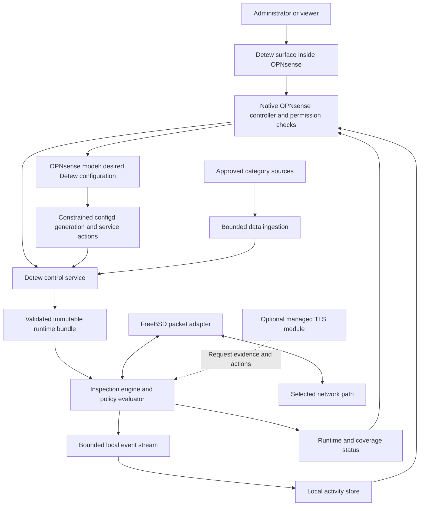
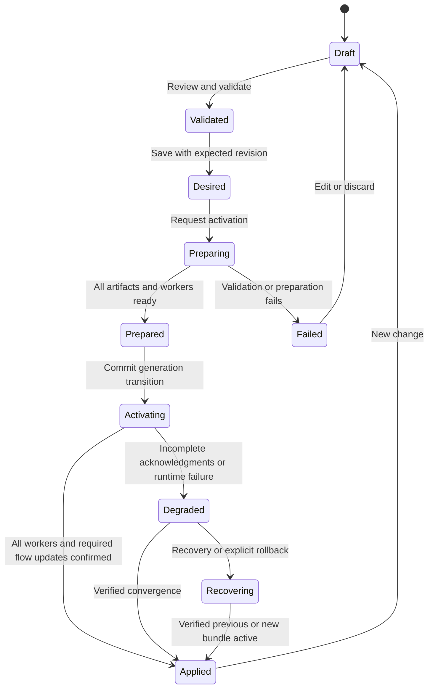
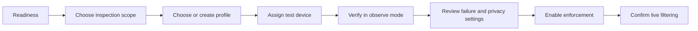

# Detew — Product Definition and Engineering Contracts

**Version:** 0.1 · Proposed development baseline  
**Date:** October 2, 2026  
**Requirements:** [PRD](PRD.md)  
**Technical baseline:** [Architecture and stack](ARCHITECTURE.md)\
**Delivery plan:** [Development milestones](MILESTONES.md)\
**Task backlog:** [Detailed tasks and issue tracking](tasks/README.md)\
**Execution playbook:** [Development orchestration](DEVELOPMENT.md)\
**Development guide:** [AGENTS.md](../AGENTS.md)\
**Shared language:** [CONTEXT.md](CONTEXT.md)

This document turns the PRD into coherent product, runtime, integration, and interface contracts. It is a specification for development, not a description of existing software. Proposed implementation choices are identified separately from required behavior.

## Contents

- [Positioning and operating context](#1-positioning-and-operating-context)
- [Architecture](#2-system-boundary-and-proposed-architecture)
- [Domain objects](#3-domain-objects-and-ownership)
- [Policy semantics](#4-policy-semantics-the-consistency-contract)
- [Flow inspection and evidence](#5-flow-inspection-and-evidence-contracts)
- [Activation and recovery](#6-configuration-activation-and-recovery)
- [Category-data lifecycle](#7-category-data-product-and-lifecycle)
- [Device attribution](#8-device-attribution-and-assignment-behavior)
- [OPNsense and failure behavior](#9-opnsense-attachment-and-failure-behavior)
- [Optional managed TLS](#10-optional-managed-tls-module)
- [Extensibility](#11-extensibility-and-module-contracts)
- [API contracts](#12-administration-api-and-shared-validation)
- [Explanations, activity, and privacy](#13-decision-explanations-activity-and-privacy)
- [UI/UX specification](#14-uiux-definition)
- [Security and reliability](#15-security-and-reliability-design-obligations)
- [Development and conformance](#16-development-sequence-and-conformance)
- [Decisions and sources](#17-decisions-and-source-register)

## 1. Positioning and operating context

Detew is an open source web and application filtering platform. Its initial distribution is a local OPNsense plugin. It adds an inspection and content-policy layer while OPNsense remains responsible for the underlying packet firewall, routing, NAT, administration, and appliance lifecycle.

The core serves a site, its devices, and its filtering profiles. A site can be a household, business, school, or organizational network. This language avoids encoding a customer segment into the engine or creating different editions for different users.

The initial experience must solve: **select categories and applications, assign the controls, verify enforcement, and explain decisions**. The initiating environment is a household already running OPNsense; the required categories are Adult content, Games, and AI services. Wider demand, classification quality, and operational suitability remain hypotheses to validate.

### 1.1 Product principles

- Policy meaning comes from one canonical evaluator and explicit inputs.
- Every state transition has an observable result and a recovery path.
- A policy decision, an enforcement action, and end-to-end connection success are different facts.
- Modules extend capability without changing existing policy meaning implicitly.
- The packet path uses bounded local work and does not depend on the UI, a cloud service, or a distributed control plane.
- Simplicity removes unnecessary choices; it does not hide enforcement gaps or consequential defaults.
- Open source includes the capabilities necessary for the product promise, with independently licensed data made available on lawful terms.

### 1.2 Evidence on hand

The user need comes from the project discussion. Current primary documentation establishes the OPNsense integration model, protocol visibility constraints, existing open source DNS and IPS components, and available classification/data projects. It does not establish Detew's feasibility or accuracy. Consult the [PRD evidence section](PRD.md#2-problem-evidence-and-relevant-gaps) and the source register below when changing the scope.

## 2. System boundary and proposed architecture



This is a responsibility diagram, not a promise that every box is an independent service. Packet ordering relative to pf depends on the validated adapter and must be documented at G0.

### 2.1 Responsibilities

| Component | Owns | Must not own |
|---|---|---|
| OPNsense host | L3/L4 firewall, NAT/routing, administrator identity, packages, native backup mechanisms | Detew classification semantics or an assumed Detew flow-state replication mechanism |
| Native plugin adapter | Models/controllers, permissions, generated desired configuration, narrow service actions, host integration | A separate policy evaluator or arbitrary privileged shell execution from UI inputs |
| Control service | Validation, compilation, bundle preparation/activation, reconciliation, data lifecycle, status aggregation | Packet-by-packet cloud queries or direct unsupervised edits to host configuration |
| Inspection engine | Bounded flow tracking, parsing/classification, local evaluation, enforcement, runtime facts | Downloading feeds, complex reporting queries, frontend rendering, remote administrative authentication |
| Packet adapter | Capture/reinjection ownership, privilege boundary, coverage and failure mechanics | Platform-independent content policy meaning |
| Activity service/store | Bounded event ingestion, search, retention, export | Blocking the packet loop on disk I/O |
| Optional TLS module | Scoped TLS termination, request evidence, trust/key lifecycle, request enforcement | Silent enrollment or unrestricted payload collection |

### 2.2 Initial process topology

Use a small appliance-friendly topology: native OPNsense frontend/controllers; a control daemon; an inspection daemon; and data/reporting tasks isolated from the packet loop. A minimal privileged helper may be required by the chosen adapter. Optional TLS termination belongs in a separate service because its privileges, resource demands, and failure surface differ.

A module is a capability boundary, not necessarily a process. Category lookup and policy evaluation belong locally in the engine. Schedules and assignments do not need their own daemons. A control daemon restart must not stop a healthy engine using an already active bundle.

Kubernetes is a reference for desired/observed state and reconciliation, rather than a runtime dependency or an instruction to distribute the packet path. [Kubernetes controller model](https://kubernetes.io/docs/concepts/architecture/controller/)

### 2.3 Technology baseline and integration gates

The [architecture document](ARCHITECTURE.md) selects the development stack and owns its detailed component, schema, runtime, packaging, and version contracts. The summary below reflects those selections; selected technologies still require build/integration evidence and do not imply production support.

| Area | Proposed baseline | Decision status |
|---|---|---|
| Domain types, normalization, evaluator, compiler | Rust 2024 shared libraries and a standalone replay harness | Selected baseline; FreeBSD/dependency validation at G0 |
| Initial classifier | nDPI through a bounded native shim and versioned evidence interface | Preferred initial implementation; ARCH-G02 gates build, catalog, FFI, resource and licensing evidence |
| Packet integration | Portable packet contract; Netmap preferred initial candidate, Divert comparison candidate | ARCH-G01 selects one supported production adapter at G0 |
| Native host integration | OPNsense PHP/XML/Volt/configd conventions and same-origin APIs | Selected; ARCH-G04 validates permissions, revisions, restore and frontend integration |
| UI implementation | React 19, strict TypeScript, Vite, scoped Tailwind/Radix components inside a native page | Selected baseline; host compatibility and usability still require prototype evidence |
| Activity storage | Patched, pinned SQLite via rusqlite in a separate activity daemon | Selected; ARCH-G05 validates retention/write-rate/capacity |
| Bundle storage | Immutable local artifacts and a versioned activation/operation journal | Selected mechanism; durability and recovery tested before release |
| Initial software license | GPL-3.0-or-later for Detew-owned code | Proposal; confirm before accepting/distributing implementation |

nDPI is a classification library and its upstream copying file specifies LGPL v3 terms. Dependency and combined-work obligations still need a release-specific audit. Detew is not “100% safe Rust” if its selected classifier or packet interfaces use native code or unsafe bindings. [nDPI source](https://github.com/ntop/nDPI), [nDPI copying terms](https://github.com/ntop/nDPI/blob/dev/COPYING)

### 2.4 Runtime invariants

The implementation must preserve these invariants across all adapters and modules:

1. One evaluation uses one bundle and one captured context; decision-cache reuse has the same validity requirements.
2. No profile exception or temporary override changes a site guardrail or host firewall result.
3. No local packet decision requires a synchronous UI, database-write, control-service, or remote-provider response.
4. A prepared candidate is not active; a partly activated generation is not fully applied.
5. Missing evidence and missing enforcement have different fallback states.
6. Privileged integration artifacts have a named owner, bounded scope, and tested removal/recovery procedure.
7. All untrusted work and storage have global bounds as well as per-flow/request bounds.
8. Reported coverage and action reflect observed runtime facts, including stale status and telemetry gaps.

### 2.5 Core dependency direction

Keep the domain/evaluator portable and independently testable. The following boundaries are a proposed implementation decomposition, not a requirement for separate processes or exact package names:

| Boundary | Contains | Dependency restriction |
|---|---|---|
| Domain | IDs, schemas, evidence/context types, profile and decision types | No OPNsense, packet I/O, database, UI, or classifier-native dependency |
| Policy | Canonical normalization/matching, assignment selection, ordered evaluation, schedule semantics, reason trace | Depends on domain and supplied context; no network or mutable external lookup during evaluation |
| Compiler/data | Dataset adapters, validated lookup artifacts, configuration compilation, capability validation | Produces artifacts consumed by the evaluator/runtime; does not own live packet attachment |
| Runtime | Flow lifetimes, bounded parser/classifier orchestration, decision reuse, forwarding checkpoints | Calls policy with explicit snapshots; accesses adapters through bounded contracts |
| Platform/classifier adapters | FreeBSD hook implementation, host lifecycle, classifier FFI | Platform/native dependencies terminate here rather than leaking into domain objects |
| Control/reporting | Desired/active lifecycle, data jobs, event persistence, status/API orchestration | No independent policy algorithm; cannot block the packet loop on storage or downloads |
| UI | Typed clients, rendering, draft editing, interaction state | Uses server validation/preview; local helpers cannot become the authoritative evaluator |

Supply time, attribution, data lookup results, and runtime capability facts explicitly. The replay harness should evaluate captured inputs without an appliance or live network. Any optimized evaluator/compiled lookup path must pass the same semantic fixtures as the reference behavior.

## 3. Domain objects and ownership

Use stable opaque IDs internally. Human names are editable display fields; renaming a category, device, or profile must not break references. APIs and exports carry an explicit schema version. A site is a single local appliance administration boundary in V1, not a multi-tenant claim.

| Object | Required meaning and fields | Owner / lifecycle |
|---|---|---|
| Site settings | Site ID/name, default profile, timezone, inspection mode/scopes, failure policy, privacy/retention settings | Desired configuration |
| Inspection scope | Adapter/interface/path identity, address visibility, supported protocols/topology, verified attachment state | Desired selection plus observed runtime status |
| Device | Stable local ID where evidence supports it; display name; current/historical addresses and attribution evidence | Discovered inventory with explicit administrator edits |
| Device group | Named explicit device memberships in V1 | Desired configuration |
| Profile | Category/application blocks, exceptions, scheduled block overlays, insufficient-classification policy, provisional-inspection mode, default content action | Desired configuration |
| Assignment | Profile reference, typed selector, explicit priority, enabled flag | Desired configuration |
| Site guardrail | Mandatory deny predicate for destination/application/category or transport restrictions, with reason | Desired configuration |
| Exception | Typed selector, allow/block action, priority, optional schedule and expiry, explanation | Part of a profile |
| Temporary override | Exact device scope, profile replacement or narrow exception, actor/reason, creation time, UTC expiry | Desired configuration with automatic effective expiry |
| Category definition | Stable ID, display label/translations, definition, inclusions/exclusions, reviewed examples | Versioned taxonomy |
| Category dataset | Provider/source/license manifest, taxonomy mapping, normalized entries, version/digest, freshness and expiry rules | Data lifecycle |
| Application definition | Stable Detew ID, classifier mappings/version, evidence types, tested limitations | Versioned application catalog |
| Runtime bundle | Configuration revision, dataset/catalog versions, capability contract, compiled artifacts, content digests | Prepared/activated runtime lifecycle |
| Decision record | Context, bundle identity, evidence summary, selected profile, decisive controls, verdict, outcome, timestamp | Bounded activity history |

One canonical desired configuration lives in the native plugin model. The engine consumes generated, schema-versioned input; it must not independently read or rewrite OPNsense `config.xml`. Local category corrections, assignments, and overrides are configuration and follow the same writer/activation path.

Do not persist every learned address observation into OPNsense configuration. Inventory evidence is runtime state; administrator names, trusted bindings, and explicit group membership are desired configuration. Backups distinguish those roles.

## 4. Policy semantics: the consistency contract

### 4.1 Evaluation input

A decision evaluates a coherent snapshot of:

- The runtime bundle and supported capability set.
- The flow/inspection scope, endpoints, direction, and supported transport facts.
- Time-valid device attribution and applicable network selectors.
- Classification evidence, its authority, version, freshness, and uncertainty.
- The effective assignment, active schedule intervals, temporary overrides, and evaluation time.
- Any recorded parser/resource/visibility limitation relevant to fallback.

The same complete input must produce the same content verdict and reason ordering. The same packet headers alone are not enough: classification evolves, time advances, and address attribution can change. Runtime facts used for a recorded decision must not be reconstructed from today's database when explaining yesterday's event.

### 4.2 Profile selection

1. Apply a valid temporary profile override for the exact attributed device, if present.
2. Otherwise evaluate enabled assignments against the attribution/network snapshot.
3. The matching assignment with the **lowest numeric priority** wins; smaller means higher precedence.
4. Fall back to the site's default profile if no assignment matches.

Assignment selectors are typed: an exact device ID, an explicit device group, or a network scope (interface/segment and optional CIDR). There is no hidden preference for device selectors over group/network selectors. The UI shows precedence and can reorder assignments without exposing numeric editing in the common workflow.

V1 requires unique enabled assignment priorities. Validation rejects duplicates, missing references, and selectors whose network interpretation cannot be supported by the adapter. An unknown or conflicting device attribution cannot satisfy an exact-device selector; supported network selectors and the site default still work.

### 4.3 Ordered content evaluation

The order below is normative. Every evaluation uses one bundle and one context snapshot throughout.

| Order | Step | Result |
|---|---|---|
| 1 | Verify scope, parser/provisional state, and applicable transport restrictions | Apply the declared runtime/fallback behavior; an unobserved path is outside scope, never a policy allow |
| 2 | Select effective profile and active schedule overlays | Capture profile context for evaluation/explanation; selection cannot relax site guardrails |
| 3 | Evaluate all matching site guardrail denies | Any match blocks; collect all matching reasons in stable ID order |
| 4 | Evaluate matching profile exceptions, including valid temporary exceptions | Lowest numeric exception priority wins; its allow/block overrides profile content controls |
| 5 | Evaluate application blocks and category blocks | Any confirmed match blocks; collect all matching reasons in stable ID order |
| 6 | Evaluate required dimensions with insufficient evidence | Apply the profile's insufficient-classification action and reason |
| 7 | Apply profile default content action | V1 default is allow; advanced profiles may choose block |

An exception allow skips the selected profile's category/application blocks and insufficient-classification action for its matched scope. It does **not** skip site guardrails, transport requirements, parser safety, engine failure behavior, or OPNsense's own firewall. In observe mode the evaluator computes the same traffic-policy verdict but reports `would_block` or `would_allow`; it does not enforce category, application, guardrail, transport, or insufficient-classification blocks. Adapter/resource failure and host firewall behavior remain separately reported operational facts.

Site guardrails match known evidence; their existence cannot reveal an ECH-hidden hostname or the contents of a tunnel. Administrators needing restrictive treatment of missing evidence must select the corresponding fallback and transport settings explicitly.

### 4.4 Exception matching and conflicts

V1 selectors are exact hostname, hostname plus subdomains, or application ID. Domain matching uses labels, not string suffixes: `example.org` does not match `otherexample.org`; including subdomains is explicit. IP/CIDR site restrictions belong to host firewall controls unless a tested Detew scope-specific restriction is required; do not call an IP allow a domain exception.

Require unique positive integer exception priorities within each profile. The first matching exception wins, regardless of allow/block. Show overlapping exceptions and the winning order in preview. Reserve priority zero for a temporary exception, which has an exact-device and narrow-destination/application scope and cannot cross site guardrails.

For V1, allow at most one active temporary override per device, either a profile replacement or a narrow exception; offer an explicit replacement of an existing override. This prevents overlapping temporary scopes from creating an unresolved priority tie. An allow for a hostname affects only traffic with qualifying evidence for that hostname. It does not authorize every service on the same IP. Application exceptions require qualifying application evidence.

### 4.5 Categories and applications

Category labels are sets. A destination with both Games and AI services is blocked if either category is blocked, after higher-precedence exceptions. Display both labels; do not invent a single “primary” category to settle the decision.

Application identity and website categories are separate. Recognizing a gaming application may block traffic even when no website hostname is available. A domain label may block an AI service even when the protocol classifier reports only TLS. Treat generic TLS/QUIC identification as transport evidence, not proof of a particular application.

Evaluate confirmed application/category denies before fallback. Insufficient classification applies when a dimension needed by the profile cannot be evaluated: for example, a web destination lacks usable/current category data, or an opaque flow might carry a controlled application and the classifier remains unresolved. A clearly recognized non-web infrastructure protocol does not require a website category. The capability catalog defines supported classification completion states; “classifier gave up” remains insufficient.

### 4.6 Schedules and clocks

V1 schedules add named category/application block overlays to the profile's always-active controls. They do not implicitly remove base controls. Time-qualified exceptions can permit a specific service during a period; preview shows their precedence.

If a scheduled category is already blocked in the base profile, the editor explains that it remains blocked outside the schedule and offers an explicit move from base controls into the scheduled overlay. Never silently convert an always-active block into a timed block.

Use an IANA site timezone and half-open intervals `[start, end)`. Store recurring wall-clock periods with their timezone; compute effective UTC intervals. Overnight periods cross the day boundary explicitly. During a repeated DST hour, each occurrence matching the local interval is active. A skipped local interval has no occurrence. The UI shows timezone, next transition, and examples around unusual transitions.

Use wall time for calendar evaluation and monotonic time for in-process deadlines. Reconsider flows at a schedule transition or material clock correction. On unreliable time, the default schedule behavior activates all configured scheduled block overlays; an explicit alternative may retain the last trusted schedule state with a visible warning. Default/fallback settings are recorded in the profile.

Expiring allow exceptions and temporary overrides must not be extended by a backward clock jump or reboot. During a trusted uptime, enforce the earlier of the UTC deadline and the monotonic duration limit. After restart, use the saved UTC deadline only if time is trustworthy; otherwise stop applying temporary overrides and expiring allows until validity can be established. Report that state. Ordinary permanent controls remain active.

### 4.7 Active-flow reconsideration

Reconsider affected flows on configuration activation, dataset activation, attribution/group/assignment changes, schedule transitions, override expiry, and stronger classification evidence. Reference-load target: completion within five seconds for ordinary policy changes. The actual cutoff is published in the release evidence.

- Allowed to blocked: stop forwarding affected traffic using the adapter's tested mechanism; existing data already delivered cannot be recalled.
- Blocked to allowed: permit new eligible traffic; a dropped/reset TCP or application session may require a reconnect. Do not promise session restoration.
- Observe to enforce: reevaluate existing tracked flows and begin enforcement after the documented activation boundary.
- Enforce to observe: stop content enforcement after activation; keep mandatory adapter safety and underlying pf behavior.

Each flow evaluation references one bundle; a single evaluation must never combine a profile from one bundle with category data from another. Update flow-local decisions at a bounded checkpoint before subsequent forwarding. Pending flows and unresponsive workers prevent a “fully applied” report.

## 5. Flow inspection and evidence contracts

### 5.1 Packet path

The platform adapter determines the exact interception point. The intended V1 topology is routed LAN-to-WAN inspection with both directions visible and internal-client attribution available. G0 must establish a coherent supported combination for VLANs, NAT, and IPv6; unsupported variants cannot be silently treated as covered.

Traffic between devices on the same switched segment, traffic on an unselected path, and off-network/mobile connections may never cross this inspection point. VPN traffic is classified as a tunnel unless a supported post-decapsulation scope exposes its inner flows. Asymmetric routing, multi-WAN, bridges, and virtual NICs require explicit support-matrix entries; a configuration label is not proof of bidirectional observation.

1. Receive a packet with scope/direction/adapter provenance.
2. Validate framing and apply bounded fragment/stream handling.
3. Associate it with a bidirectional flow and current attribution evidence.
4. Parse/classify locally within packet/byte/time limits.
5. Normalize a qualifying hostname/application observation and look up local categories.
6. Evaluate or reuse a valid flow-local decision from the active bundle/context.
7. Forward, drop, or apply a tested protocol-appropriate termination action.
8. Emit bounded counters and decision events without synchronous storage writes.

A flow key includes an inspection realm/scope, canonical endpoint pair, transport, and a connection lifetime/generation. It must not merge different VLANs or reuse stale state for a new connection with the same tuple. Direction, TCP state, timeouts, UDP expiry, QUIC connection migration, and bidirectional affinity are explicit engine concerns.

Do not claim every packet is an independent HTTP request. Keep flow-level and, later, TLS-module request-level decisions distinct.

### 5.2 Hostname evidence

| Evidence | Permitted use | Limit |
|---|---|---|
| Supported HTTP host/request authority | Destination category lookup for the observed request/flow context | Untrusted input; conflicting authorities require canonical protocol handling |
| TLS ClientHello SNI | Metadata-based hostname lookup for the connection | Hidden inner SNI with ECH; not proof of all requests on a coalesced connection |
| Supported QUIC Initial ClientHello | Metadata lookup when supported and not hidden by ECH | Application data remains encrypted; protocol variants may be unsupported |
| Device-scoped DNS observation | Enrichment and bounded correlation | Shared IPs/CDNs, absent observations, cache behavior, and encrypted DNS make it ambiguous |
| IP reputation or reverse DNS | Separate weak context, if a provider supports it | Must not become authoritative unique-host evidence |
| TLS-module request authority/URL | Finer matching for inspected requests | Available only when termination/trust/protocol scope succeeds |

Use source-specific authority and validity rules; do not average incompatible evidence into an unexplained percentage. Conflicting high-authority evidence is reported and resolved according to the relevant parser/protocol contract, otherwise treated as insufficient. DNS enrichment must preserve device/time scope and TTL; never assign an IP-wide blocked hostname solely because a different device queried it.

TLS 1.3 does not make server certificates passively available after ServerHello. ECH hides the inner ClientHello; encrypted HTTP/2 and HTTP/3 may reuse a connection for multiple authorities without exposing each request to the gateway. V1 cannot guarantee per-page or per-authority filtering on those connections. [TLS 1.3](https://www.rfc-editor.org/rfc/rfc8446.html), [ECH](https://www.rfc-editor.org/rfc/rfc9849.html), [HTTP/2 connection reuse](https://www.rfc-editor.org/rfc/rfc9113.html#section-9.1.1), [HTTP/3 connection reuse](https://www.rfc-editor.org/rfc/rfc9114.html#section-3.3)

### 5.3 Normalization and canonical matching

Provide shared, versioned routines for hostname case/trailing dots, IDNA representation, ports versus hostnames, label boundaries, public-suffix restrictions, and valid IP literals. Invalid hostnames do not become wildcard matches. Retain an escaped display form alongside canonical matching form where helpful.

Dataset imports, local corrections, runtime lookup, category tester, exception editor, and API validation must use the same routines. Prohibit broad public-suffix exceptions and implicit substring matching. V1 does not accept arbitrary regex in its simple domain editor.

T1 adds separate URL canonicalization, including scheme/authority, percent-encoding, path normalization, and protocol request parsing. Do not apply hostname normalization rules as if they were sufficient URL semantics.

### 5.4 Provisional inspection and bounded work

Some classifications require additional packets or a server response. Define two explicit profile modes:

- **Balanced, default:** forward a bounded provisional exchange while gathering evidence; stop it when a block becomes known. Earlier application bytes may have passed. At the deadline/byte/packet limit, apply insufficient-classification behavior.
- **Restrictive:** hold supported initial payload while gathering client-side evidence and perform bounded local lookup before release. If identification requires forwarding to the server, the engine cannot meet this mode; apply the insufficient-classification action. Test memory/latency/compatibility limits before enabling it.

These modes are independent of the action for insufficient evidence: **allow with a visibility reason** is the V1 default; **block** is the restrictive alternative. The UI labels both choices and previews likely impact. Parser corruption or resource exhaustion follows the declared safety policy rather than an exception allow bypassing parser limits.

Initial limit candidates for the feasibility benchmark are 64 KiB of reassembly per flow, 32 inspected provisional packets, and 1.5 seconds of provisional classification time. They are tunable implementation proposals, not measured capacity claims. Publish global memory/flow budgets and use admission control so per-flow limits cannot collectively exhaust the appliance. A pending lookup or saturated queue has a distinct reason.

Retransmissions, out-of-order TCP, fragments, truncated captures, and malformed lengths must have consistent interpretation and limits. Preserve packet-forwarding correctness; never corrupt a stream to satisfy a classifier. Fuzz parsers and FFI boundaries with valid/invalid segmented handshakes and protocol fixtures.

### 5.5 Classification state and cache

Classification states include `pending`, `identified`, `insufficient`, `unsupported`, and `invalid`. Evidence includes parser/classifier version, observation time, supported scope, and completion/limit reasons. A category miss differs from a classification miss.

DNS observations are supporting evidence. Optional resolver/egress controls have named ownership and capability checks; do not build a second, independently edited category policy inside Unbound. Any future early DNS category refusal must derive from the same effective policy/data versions, document activation/cache propagation, and remain disabled in observe mode. Existing host-managed DNS restrictions are separate controls that a Detew allow cannot override.

Flow-local decision reuse is valid only while its bundle, evidence, attribution, effective schedule/override state, and next required reevaluation remain valid. A hostname-category cache is keyed by canonical hostname and dataset/taxonomy version; an optional remote result also carries provider, validity, and disclosure provenance. No shared-IP decision cache may substitute for host identity.

Classifier binary/catalog changes may require daemon restart and connection reclassification. Treat them as maintenance operations until a compatible hot-update mechanism is proven. Do not reinterpret an old application ID against an incompatible new catalog. Dataset-only relabeling can use retained valid hostname evidence with a new bundle.

## 6. Configuration, activation, and recovery

### 6.1 State model



`Applied` concerns configuration convergence; it does not independently prove packet attachment or full traffic visibility. Status shows configuration, inspection coverage, and data readiness separately.

### 6.2 Revisions and bundle identity

Maintain a monotonically increasing local desired-configuration revision, a unique runtime bundle ID/content digest, and an activation generation. A rollback creates a new desired revision referencing restored content; it does not decrement history. Dataset updates create a new bundle even when the configuration revision is unchanged.

Bundle manifests include schema/compiler/evaluator versions, configuration content digest, dataset/taxonomy/catalog identities, required capabilities, adapter contract version, and artifact checksums. Config content and compiled artifacts are different representations; their hashes are not expected to be equal. Digests establish artifact identity/integrity, not correctness of a policy or proof of security.

### 6.3 Apply contract

1. Read the expected desired revision and validate references, selectors, capabilities, data licenses/admission, limits, and schedule semantics.
2. Compile a complete immutable bundle; verify it in a replay/smoke harness. Include a change summary and affected-profile/device estimate.
3. Prepare artifacts and ask all engine workers to load/validate them without switching active decisions.
4. On any preparation failure, discard the candidate and retain the active bundle. Surface a reason and no success state.
5. Journal an activation attempt and coordinate the generation transition with a bounded worker barrier. Brief queueing or packet loss is possible; measure it rather than claiming a zero-loss swap.
6. Reconsider affected active flows and collect loaded-generation/flow-update acknowledgments.
7. Mark applied only after all required workers and reconsideration checkpoints confirm the generation. Persist the verified result and publish runtime status.

During transition, workers may temporarily be on different generations. Every evaluation remains internally coherent and records its generation. An unresponsive worker or activation timeout produces a visible degraded state; the controller must converge, recover, or apply the configured runtime failure action. It cannot mark success because one worker acknowledged.

Scope/hook changes are maintenance operations with a separate preview and adapter-specific stop/reattach/recovery procedure. Do not imply that host pf changes and engine changes share a universal transaction. Ordinary profile/dataset changes must not rewrite the host's unrelated firewall rules.

### 6.4 Restart, storage, and rollback

Persist enough prepared/active journal information to distinguish a candidate from a verified active bundle after restart. Check manifests and artifact digests before loading. Recover to the last compatible verified bundle; if none is valid, use the proven adapter failure state and report why. Do not load an unacknowledged candidate merely because it is the newest file.

Use transactional writes/atomic replacement appropriate to the filesystem and explicitly test abrupt termination, disk full, permission loss, and interrupted updates. No storage choice guarantees survival of all hardware corruption or power failures; publish tested recovery behavior and backup requirements.

Rollback preview identifies configuration, dataset, taxonomy, classifier, and adapter dependencies. By default it restores an earlier configuration against explicitly selected compatible installed data versions. A “restore complete bundle” option is available only when all referenced components are available and supported; expired data follows freshness policy. Apply the restoration as a new activation and reconsider flows.

Concurrent edits use expected-revision checks. Conflicts return current revision plus a human-readable changed-object list. V1 may require the administrator to reload/reapply edits; it must not silently merge conflicting policy meaning. Activations are serialized with bounded queues and an operation ID usable after a browser disconnect.

## 7. Category-data product and lifecycle

### 7.1 Initial taxonomy

Required launch categories are `adult`, `games`, and `ai_services`. Establish stable Detew IDs independently of upstream names. Each definition includes positive examples, benign negative examples, mixed-purpose boundaries, and language/localization descriptions.

Additional categories can include Gambling, Social networks, Streaming media, and Anonymizers when admitted and tested. Separate topic categories from threat labels such as Malware or Phishing. The presence of a topic label does not imply a security judgment.

Adult content should distinguish explicit sexual material from general health/education. Games covers identified gaming sites/services, with separate catalog entries where stores, downloads, and gameplay differ. AI services covers services primarily offering AI interaction/generation; it cannot selectively disable every AI feature embedded in an otherwise allowed SaaS application without suitable request/endpoint integration.

### 7.2 Dataset admission

Provider adapters produce a common normalized manifest and category entries. The manifest identifies source URLs, license/attribution, fetch time, upstream version, taxonomy mapping, normalization version, expected update cadence, warning age, maximum usable age, record counts, and content digest.

Admission verifies schema, size limits, encoding, domain validity, prohibited wildcard/public-suffix entries, license/redistribution approval, artifact integrity, and supported mappings. Detew-produced release datasets are signed using maintained release keys. Third-party unsigned feeds are fetched through an explicit approved trust policy and compiled into locally verified artifacts; a checksum alone is not publisher authenticity.

Compare count/category diffs to the active dataset. Quarantine unexpected mass deletion, broad domain changes, and schema/taxonomy shifts under documented thresholds. Exact thresholds require corpus/update-history evidence before G2. The UI shows the rejected candidate and keeps valid active data.

### 7.3 Lookup and conflict semantics

Lookup returns a set of labels with provenance, not an enforced verdict. Multiple admitted sources contribute the union of supported labels. Private local corrections take precedence for the specific destination: they may add or remove labels while recording the upstream label and the administrator's reason. They do not change the global meaning of a category.

Exact-domain entries and explicitly declared subdomain coverage are separate match types. Never infer that a feed's bare domain entry covers all descendants without a documented provider mapping. Match providers through a tested normalization adapter; preserve original source metadata for correction review.

### 7.4 Freshness and outages

Each source has an approved freshness contract. Until its maximum usable age, a failed update retains the installed data and reports its age. A warning starts at the declared warning age. At maximum usable age, labels from that source are ineligible; category lookup recomputes from other eligible sources/local corrections and marks remaining gaps as insufficient.

Expiry is an effective evaluation input and triggers active-flow reconsideration even without a newly downloaded bundle. A healthy controller may generate a new bundle excluding expired data; a running engine must enforce expiry itself if the controller is unavailable. Permanent local corrections remain eligible unless their own expiry says otherwise.

Remote providers are optional later modules. Their outputs are cached with bounded lifetime and never required for packet forwarding. In V1, approved dataset downloads need network access only at update time; normal lookup is local.

### 7.5 Curation and quality operations

Maintain reviewed positive/negative corpora independent from the main training/import lists. Measure precision, recall, uncategorized share, and observable-traffic coverage with the PRD denominators. Report each required category separately. Include Portuguese/English and mixed-service cases.

Provide local corrections immediately through normal activation, and an explicit “Prepare contribution” action that previews the destination, proposed labels, reason, and optional evidence. No auto-upload of activity, identifiers, or visited URLs. Establish maintainer review and versioned taxonomy deprecation; category-ID removal requires migration guidance.

Initial sources, including UT1, remain candidates until their actual license terms, redistribution requirements, format, and quality are reviewed. Do not state that any publicly downloadable list is unrestricted or that one feed supplies complete category coverage. [UT1 publisher and license link](https://dsi.ut-capitole.fr/blacklists/index_en.php)

## 8. Device attribution and assignment behavior

V1 uses local network evidence, such as supported interface scope, DHCP/neighbor observations, and explicit administrator bindings. Record evidence type, observation/expiry time, interface/segment, and confidence class. MAC address observations are scoped to where L2 visibility exists and are not universal identifiers across routers.

IP addresses can be reused; IPv6 privacy addresses rotate; randomized MAC addresses change; a shared IP may represent multiple devices. Bindings must expire and conflicts must be visible. Never carry an exact-device profile to a new owner of a reused address without valid supporting evidence.

If attribution is ambiguous, use eligible network assignments or the default profile. Group membership attaches to a stable local device ID only when evidence supports it. Show “Device not identified” with network/address context instead of creating an authenticated person.

Changes to attribution or group membership trigger affected-flow reconsideration. Preserve historical attribution in decision records. A future authenticated connector must declare the origin, validity, revocation, and flow-binding method; logging into the admin UI or an identity provider alone cannot identify all traffic from that person.

## 9. OPNsense attachment and failure behavior

### 9.1 G0 adapter evaluation

Compare supported hooks using a minimal packet prototype. Current OPNsense IPS documentation describes Netmap and Divert modes; Detew must validate its own implementation and supported versions. Linux AF_XDP/eBPF/nftables assumptions do not define the initial FreeBSD adapter. [OPNsense IPS](https://docs.opnsense.org/manual/ips.html)

The spike must record:

- Interception relative to pf, NAT, routing, bridge/VLAN handling, and both traffic directions.
- Original-client address visibility and reinjection path/marking.
- TCP/UDP/IPv6/fragment behavior, NIC/offload prerequisites, and virtual-interface limits.
- Ownership/conflicts with existing packet-inspection engines and other capture/divert consumers.
- Engine death, overload, helper death, interface reset, boot, stop, and removal behavior.
- Possibility and limits of reliable inspection bypass and restrictive failure actions.
- Performance, copy/reassembly costs, privileges, and watchdog recovery.

Choose one supported V1 adapter and a narrow published matrix. Do not expose untested compatibility choices. A Netmap conflict on an interface must prevent enablement, rather than silently detach another product. Divert availability does not by itself prove concurrency or failure semantics.

### 9.2 Firewall relationship

The logical result is the intersection of Detew's permitted traffic and OPNsense's permitted traffic, subject to actual path ordering. A Detew allow means it did not deny the traffic; pf may still deny it. Prove that reinjection cannot circumvent pf or repeat capture indefinitely.

When a connection is missing from Detew activity, possible explanations include an earlier firewall denial, an unobserved path, telemetry loss, or no attempt. Without correlated host evidence, say “No Detew decision found,” not “OPNsense blocked it.” Optional correlation must label its source and timestamp.

### 9.3 Failure matrix

| Condition | Required behavior | User-visible state |
|---|---|---|
| UI/API unavailable | Healthy engine continues with active bundle | UI unavailable; runtime check available through console |
| Control service unavailable | Engine continues local evaluation, schedule/override deadlines and data expiry | Configuration management unavailable; runtime facts separate |
| Download/provider unavailable | Use eligible installed data; eventually apply expiry/fallback | Data update failed, age and expiry impact |
| Activity disk full/backlog | Bound/drop activity writes; retain counters and continue enforcement | Activity incomplete, dropped-event count and recovery guidance |
| Classifier/parser limit | Apply safety/insufficient policy; keep bounded resources | Limit reason on affected flows |
| Engine unavailable | Adapter-proven bypass or restrictive action, selected at enablement | Inspection unavailable; actual bypass/block scope |
| Overload | Admission/queue limits and proven overload action | Capacity exceeded, loss/bypass/block counters |
| Interface disappears/reattachment fails | Reverify coverage; use declared adapter failure action where possible | Scope unavailable; no healthy protection indicator |
| Configuration activation partial | Converge/recover under bounded policy; record generations | Change incomplete; active-generation details |
| Clock unreliable | Apply clock contract for schedules/expiring allows | Schedule timing uncertain, actual fallback |

Failure action is site-wide per adapter/scope in V1; per-profile engine-failure behavior is not offered if the engine cannot evaluate profiles during failure. The onboarding default favors continued connectivity with conspicuous inspection-bypass status **only when the adapter proves that behavior**. If it cannot, setup explains the available behavior and requires a deliberate selection before enforcement. Restrictive failure blocks only the tested scope; it does not mean all appliance traffic is blocked.

### 9.4 Installation, upgrades, removal, recovery

Use supported OPNsense packaging and constrained `configd` actions. Preflight supported versions, available resources, interfaces/offloads, conflicting capture consumers, required data, management recovery, and selected failure behavior. Do not change unrelated host tunables without showing the impact and recording ownership.

Install disabled. Configure scope, load a baseline dataset, and validate a test device in observe mode before deliberate enforcement. Scope coverage must be proven by actual test traffic and live adapter status, not just a running service PID.

Upgrade stages compatible binaries/data, migrates a copy of desired configuration, validates bundle compatibility, and records expected interruption/recovery. On failure retain or restore known-good compatible packages/configuration through supported mechanisms. Classifier/runtime ABI changes are explicit maintenance events.

Stop/disable/remove only Detew-owned attachment and integration artifacts; release interface ownership safely and verify restoration. Ordinary removal retains configuration/history according to a visible retention choice. Remove TLS trust separately from module uninstallation; client trust cannot be assumed to disappear when the package is removed.

Recovery instructions include native OPNsense console access, inspection disable/restore commands, active-bundle inspection, and documented management-path exemptions. Exemptions are narrowly scoped to the firewall's management destination/ports and required recovery protocols, with visible justification. Do not silently exempt broad user devices or whole LANs.

If the adapter cannot guarantee a management-path exemption during a restrictive failure, require verified console/out-of-band recovery and explain that reachability limit at enablement. Do not advertise an exemption the packet hook cannot maintain after engine failure.

## 10. Optional managed TLS module

T1 supplies scoped request evidence and actions through the same policy core. It runs only after explicit enrollment and a dedicated readiness gate. Using a trusted interception CA, the module establishes a client-side TLS connection and a separate validated server-side connection. This is active TLS termination with scoped request visibility; it does not rely on passive decryption.

### 10.1 Trust and privacy contract

- Select exact managed-device/network scope; default off.
- Create/import a dedicated interception CA using a reviewed cryptographic implementation.
- Store its private key with restrictive access; use it only in the TLS service; never include it in ordinary export or diagnostics.
- Expose certificate expiry, trust enrollment/test results, rotation overlap, revocation, and removal instructions.
- Validate upstream certificates; do not turn invalid server certificates into trusted client-side success.
- Provide sensitive-service and explicit no-decrypt exclusions with documented fallback visibility.
- Keep decrypted bodies and credentials out of ordinary logs; strip/redact query strings in routine URL metadata.

A strict “inspection required” rule must block excluded/failed inspection unless a separately declared exclusion permits metadata-only handling. UI preview identifies those distinctions. Pinning and mutual TLS can prevent interception; classify the failure accurately instead of quietly adding a global bypass.

### 10.2 Protocol and enforcement contract

Publish exact TLS versions, HTTP versions, proxy/transparent modes, client support, connection coalescing/multiplexing behavior, WebSocket handling, and unsupported traffic. Inspect each supported request authority/URL and enforce request-level decisions without dropping unrelated multiplexed requests unnecessarily where the implementation permits.

For a TCP-centered T1 implementation, QUIC may be explicitly blocked in scope to encourage client fallback. Some clients fail rather than fall back; display that risk and test it. ECH may require managed-client configuration or explicit blocking; neither stripping DNS parameters nor denying ECH guarantees clear-SNI fallback. [ECH protocol](https://www.rfc-editor.org/rfc/rfc9849.html), [QUIC TLS](https://www.rfc-editor.org/rfc/rfc9001.html)

Do not promise granular AI-feature blocking, per-video categorization, prompt DLP, or body-content understanding merely because TLS terminates. Those are separate classifiers and product requirements. T1 benchmarks and failure tests are independent of the V1 metadata engine.

## 11. Extensibility and module contracts

### 11.1 Extension families

| Family | Input/output boundary | Deployment posture |
|---|---|---|
| Category provider | Versioned source manifest/entries to normalized dataset | Control-side bounded process/task |
| Classifier | Bounded flow evidence to typed observations/catalog IDs | Engine-owned adapter; admission and benchmark required |
| Identity connector | Time-valid device/principal binding evidence | Control-side connector with explicit expiry/revocation |
| Event exporter | Redacted versioned decision/status stream | Asynchronous, bounded and opt-in |
| Platform adapter | Packet/scope/failure/privilege capabilities | Trusted integration, separate conformance suite |
| TLS/request inspector | Scoped request evidence and enforcement acknowledgments | Optional privileged service with key/trust contract |
| Administrative integration | Versioned desired-configuration/status API | Same permissions and validation as UI |

Modules declare ID/version, supported contract/schema versions, capabilities, dependencies, permissions, resource limits, configuration schema, health states, migration/rollback behavior, and licenses. Dependencies are explicit; disabling a required module must reject or deactivate dependent settings through a visible maintenance operation.

### 11.2 Lifecycle and compatibility

States: available, installed, configured, ready, enabled, degraded, disabled, incompatible. “Installed” is not “ready.” Activation includes only compatible capabilities; reject a policy requiring an absent classifier rather than silently dropping its rule.

Pin dependencies and test supported version ranges. Deprecations have migration guidance and a compatibility window. A module upgrade cannot change category/application IDs or verdict precedence without schema migration and review. Unknown object fields are rejected for writes/imports in V1 rather than ignored; read clients may ignore additive response fields.

No arbitrary third-party code runs in the V1 per-packet loop. Engine classifiers are reviewed trusted components behind bounded interfaces. Future sandboxed extensions need resource accounting, cancellation, crash behavior, capability restrictions, and performance evidence; “Wasm” alone does not supply those guarantees.

A future registry is optional infrastructure. Signed manifests, reproducible builds where possible, license metadata, and public conformance fixtures come first. The appliance must retain usable local capabilities if a registry disappears.

## 12. Administration API and shared validation

The browser talks to same-origin native OPNsense endpoints. Those controllers authenticate/authorize and call constrained backend actions/local control IPC. The inspection daemon does not expose a public administrative port. Local IPC uses OS ownership, restrictive permissions, peer validation where supported, bounded messages, and explicit protocol versions.

### 12.1 Required logical operations

These are logical contracts, not final URL names. Implementation publishes an OpenAPI/schema specification before external client support.

| Operation | Contract |
|---|---|
| Read desired configuration | Return schema version, desired revision, editable objects, and actor permissions |
| Validate/preview candidate | Use canonical validation/evaluation; return errors, warnings, affected scopes/devices, capability/data dependencies, and estimated active-flow impact |
| Save desired configuration | Require expected revision; reject stale writes; return the new desired revision without claiming activation |
| Activate revision | Require target desired revision and idempotency token; return operation ID and asynchronous status |
| Read activation status | Return stage, desired/active identities, worker readiness, reconsideration progress, errors, and recovery options |
| Restore configuration/bundle | Preview explicit versions/dependencies; create a new revision and activation operation |
| Test destination/context | Return canonical destination, categories/provenance, assumed profile/device/time, and simulated reason trace; label assumptions |
| Read decision/activity | Permission-checked, filtered, paginated, stable-sort results with collection completeness metadata |
| Read inventory/status | Return evidence lifetimes, effective assignments, coverage, data and clock health, and timestamps |
| Manage data/module lifecycle | Validate admission/dependencies; separate download/install/ready/enable states |
| Prepare diagnostics/export | Show collection scope and redaction before generating a bounded artifact |

Mutation endpoints use native session/CSRF protections or supported OPNsense API authentication with permission checks. Validate on the server regardless of frontend validation. Do not accept raw commands, arbitrary filesystem paths, or unbounded query/export requests.

### 12.2 Error and conflict behavior

Structured errors include a stable code, object/field reference, user-safe explanation, and corrective action where possible. Keep technical details available in diagnostics without exposing secrets in normal messages. Examples: `assignment_priority_duplicate`, `dataset_ineligible`, `adapter_conflict`, `revision_conflict`, `worker_activation_timeout`, and `required_capability_missing`.

Idempotent activation retries return the existing operation. A browser timeout does not cancel committed activation. Cancellation is supported before the generation commit; after commit, offer a new rollback operation. Do not show a Cancel button that implies an already committed change can be erased.

### 12.3 Configuration export and import

Export canonical schema-versioned desired configuration, private corrections, assignment objects, and dependency manifests. Device evidence/history, installed third-party data, and CA keys are separate optional artifacts with explicit privacy/licensing handling.

Import validates references and source schema, remaps site/device identifiers only through a visible mapping step, checks supported capabilities, and previews changes before save/activation. Do not trust imported priority order, unknown fields, paths, or module URLs. A restored configuration referencing absent datasets/modules remains not-ready until its dependencies are satisfied or the administrator changes the intent.

## 13. Decision explanations, activity, and privacy

### 13.1 Decision record contract

Store enough metadata to explain the historical evaluation without retaining payloads. The minimum record has event/flow identity, timestamps, inspection scope, attribution snapshot, observed destination/application evidence, category provenance/eligibility, selected profile and assignment/override, decisive control IDs, bundle/generation, verdict, enforcement outcome, and visibility/limit reasons.

Evidence/profile/attribution fields may be absent when they could not be evaluated. Preserve an explicit absence reason; the minimum contract requires a truthful state for each dimension, not invented identifiers.

Keep decision and action separate:

| Policy verdict | Enforcement outcome examples |
|---|---|
| Block | Drop confirmed; reset attempted; enforcement failed; observe-only would block |
| Allow | Forwarded at Detew hook; observe-only would allow; forwarding failure |
| Pending / insufficient | Provisional forwarding; bounded hold; fallback allow/block |
| No evaluation | Outside scope; engine unavailable / inspection bypass |

The outcome vocabulary must reflect what the adapter actually confirms. A locally emitted TCP reset is not proof that the remote peer received it. “Forwarded” does not establish successful application delivery.

Illustrative API record (fields are a contract sketch; the implementation schema must formalize types and redaction):

```json
{
  "schema_version": "1",
  "event_id": "event-example-001",
  "evaluated_at": "2026-10-02T18:30:00Z",
  "scope_id": "scope-lan",
  "device": {"id": "device-shared", "attribution": "trusted_local_binding"},
  "destination": {"hostname": "assistant.example", "evidence": "tls_sni"},
  "application": {"state": "insufficient", "transport": "tls"},
  "categories": [{"id": "ai_services", "dataset": "baseline-example-1", "eligible": true}],
  "profile_id": "profile-shared",
  "assignment_id": "assignment-shared",
  "configuration_revision": "12",
  "bundle_id": "bundle-example-12",
  "activation_generation": "9",
  "decisive_controls": ["profile-shared:block:ai_services"],
  "verdict": "block",
  "outcome": "drop_confirmed",
  "visibility": "encrypted_metadata",
  "provisional_bytes_forwarded": 0
}
```

Human explanation: “Blocked by Shared devices because AI services is blocked. The destination was identified from TLS connection metadata. Page contents were not inspected.” Advanced detail reveals provenance, revisions, and actual action without crowding that explanation.

### 13.2 Activity collection and aggregation

Proposed default: seven days of local decision metadata under a 512 MiB activity-storage cap, whichever is reached first. Confirm storage/write impact at G2. Support collection disabled, shorter retention, deletion, and explicitly approved longer retention. Policy-change audit has a separate bounded retention setting; deletion scope is visible.

Emit important state changes rather than one event per packet. Aggregate repeated attempts only under an explicit key containing device, destination/application, profile, reason, outcome, and time bucket. Preserve count and first/last times. Label counts as connections/attempts, not page views or users. T1 request counts are a separate metric.

Event queues and disk writes are bounded. Drop low-priority repetitive detail before blocking packet processing; maintain dropped-event counters and interval gaps. Block-record completeness is tested at the reference load, and the UI flags incomplete activity when overload/storage loss occurs. The absence of a log entry is not evidence of an allow.

### 13.3 Privacy defaults

No packet payload retention, automatic cloud lookup, telemetry, crash upload, or contribution submission. Normal metadata can still reveal hostnames and device activity; setup states this plainly and lets the administrator adjust collection.

Diagnostic bundles default to versions, capability/attachment status, redacted configuration summaries, counters, and relevant error codes. Hostnames, addresses, names, activity samples, and packet captures require explicit inclusion. Preview the contents, size, and destination before export. Exporting a file is separate from sending it anywhere.

Encrypt/protect secrets using the host-supported secure storage strategy; do not claim encryption-at-rest for ordinary activity until implemented and tested. Authorization and filesystem permissions remain necessary. Full CA backups use a separate protected workflow.

## 14. UI/UX definition

### 14.1 Job, audience, and design direction

People arrive to configure access or troubleshoot a concrete connection. Most are not studying a packet engine. The focal interaction is moving from a readable block reason to the exact profile control or a narrow exception, then seeing verified activation.

Proposed direction: a **calm, precise administrative workspace**. Use familiar operational controls, clear text, strong alignment, and restrained semantic color. Visual quality comes from readable hierarchy, spacing, careful interaction states, and consistency across screens. This proposal guides a prototype; final brand/visual approval is a later design decision, not assumed here.

Inherit OPNsense's outer navigation, session, permissions, and recovery links. Use one Detew-local navigation row or compact narrow-screen selector, rather than nesting a second full sidebar inside the host sidebar. Scope CSS/assets to the Detew surface and avoid overriding host-wide components or introducing a second theme/authentication system.

### 14.2 Information architecture

| Surface | Primary job | Leading content/action | Advanced detail |
|---|---|---|---|
| Overview | Know whether configured filtering is operating | Inspection state, active/pending change, actionable issues, recent relevant blocks | Scope/worker/capacity diagnostics |
| Profiles | Define and assign access behavior | Profile list and category/application controls; create/edit/review | Precedence, provisional/fallback behavior, schedule details |
| Devices | See effective filtering for an endpoint | Device name/context, current profile, assignment reason; assign/override | Attribution evidence, addresses, history |
| Activity | Explain a connection and fix a policy | Search/filter results; decision drawer; scoped exception | Provenance, revisions, adapter action, missing visibility |
| Settings | Operate integration, data, and privacy | Inspection scope/mode, data freshness, privacy, system lifecycle | Adapter diagnostics, modules, export/restore |

Show a module's controls only when available and relevant. T1 adds a Settings inspection section and contextual device trust detail, rather than forcing a new unrelated navigation model. Future fleet operations should have an explicit site context; V1 has no decorative site switcher.

### 14.3 Setup flow



1. **Readiness:** supported host version/hardware, available data, capture conflicts, management recovery. Show blocking problems and direct corrective actions.
2. **Scope:** choose supported interfaces/segments and explain observed paths. Keep routing/NAT internals in details; do not label an untested scope protected.
3. **Profile:** start from an editable preset or blank profile. Show exact included categories and behavior; presets are templates, not hidden levels.
4. **Test device:** choose one identifiable device or a narrow network selector with visible attribution limits.
5. **Observe:** generate test traffic and show its would-block reason and verified path. Synthetic checks alone do not establish attachment for real client traffic.
6. **Review:** summarize scope, profiles, failure action, insufficient-classification action, provisional mode, and local activity collection.
7. **Enforce:** apply and wait for runtime confirmation; then verify a known permitted and known blocked test.

Persist resumable setup progress separately from active settings. Closing setup does not unexpectedly enable enforcement. A failed final check leaves a clear outcome and a disable/recover action.

### 14.4 Overview composition

The first viewport leads with one sentence of state: for example, “Filtering active on LAN and Guest,” with timestamp and a link to scopes. Configuration status is separate: “Changes saved; previous configuration still active” or “Applying changes.” Data freshness and visibility appear as related facts, not a single green score.

Below that, show only actionable issues and a compact recent-block list. Trends can help when the user requests a time range, but do not fill the default screen with large decorative charts or generic counters. A bypass, unsupported scope, stale status, or missing category data takes precedence over ordinary metrics.

When the API cannot refresh status, show “Status unavailable — last confirmed at …” and remove present-tense health claims. Local browser cache is not live engine evidence.

### 14.5 Profile editor

The header contains profile name, short description, assigned-device count, and Draft/Active status. The main area begins with searchable categories and clearly labeled **Block** controls. Required launch categories are easy to locate and have concise definitions and coverage notes. Do not bury them inside protocol settings.

Use organized category rows and optional expandable groups. Selection counts are explicit; “select all” applies to the named group or visible results with a clear label. Poorly covered/unavailable categories have a data explanation instead of a silently functioning-looking switch.

Application controls use a tested catalog search with protocol/service distinctions. A game-service application entry can explain gameplay versus a store/site category. Exceptions appear as a readable ordered list with action, selector, expiry, and overlap/winning explanation. Schedules use day/time controls with a persistent timezone label and a plain-language summary.

Hide engineering details behind an “Advanced behavior” section: insufficient classification, balanced/restrictive provisional inspection, profile default, and assignment precedence. The values and consequences remain visible in review even when that section was not opened.

Category controls edit a draft. A persistent change bar says “3 changes, not applied” and offers Discard and Review changes. Review shows a human diff, affected profiles/devices, site guardrails, dependencies, active-session effects, and warnings. Apply begins an operation; it is disabled only when invalid or unauthorized, with a clear reason.

### 14.6 Devices and assignments

Device rows prioritize name, identifying network context, effective profile, assignment source, and last seen. IPv4/IPv6 addresses, evidence, and conflict states are secondary expandable details. Search works across names and addresses; rows do not pretend that an IP is a permanent identity.

The detail view explains “Uses Shared devices because assignment … has priority over ….” Assigning a profile updates a draft and previews overlap. A temporary override requests scope/reason/expiry and shows the return profile. Default quick expiries can be 15 minutes, 1 hour, and a custom time within the supported maximum; final limits are configured and disclosed.

Unknown/conflicting devices display their effective network/default profile and attribution warning. Group membership editing and network assignments use the same precedence explanation. Do not silently reorganize existing assignments when a new one is added.

### 14.7 Activity and decision drawer

Default columns: time, device, destination/application, result, and reason. Filters include device/profile, verdict/outcome, category/application, visibility, and time range. Use server-side pagination and stable sorting; preserve filter context when closing a drawer.

The drawer leads with a readable result and why. Then show selected profile, matching controls, classification evidence, and actual enforcement outcome. A destination with multiple labels displays all relevant labels. Missing information stays missing: “Hostname hidden,” “Application not identified,” or “Activity incomplete.”

Primary corrective actions are Open profile, Test destination, and Add exception when permitted. Exception creation pre-fills the narrowest qualifying selector, shows the affected scope and any guardrail that would still block, and requires review/apply. It must not silently allow a whole category or shared IP.

For HTTPS without termination, the client may see a connection failure. Help connects that failure to the administrator's activity record; a branded block page is available only where the protocol/deployment supports it without misleading certificate handling. In observe mode use “Would block,” not “Blocked.”

### 14.8 Settings and advanced operation

Settings has clear sections for Inspection scope/mode, Category data, Privacy/activity, System/recovery, and available Modules. Category data lists active version, last successful update, current age, warning/expiry thresholds, source/license, and failed candidate details.

Inspection mode and failure behavior require a preview of affected scopes and actual adapter support. Disable enforcement, inspection bypass, and daemon stop are different operations with distinct labels. A broad pause has a duration/expiry and confirmed outcome; do not hide it in a generic power icon.

System includes configuration revision/history, rollback, export/import, version compatibility, diagnostics, and recovery instructions. Advanced runtime information is visible when useful but not required for ordinary filtering tasks.

### 14.9 Visual system: proposed tokens and craft rules

The final prototype must validate these choices against the host and accessibility tests. The specification supplies a concrete starting point rather than claiming an approved identity.

| Element | Proposed rule |
|---|---|
| Typography | One readable UI sans family; host/system stack initially, with a locally bundled licensed alternative only if justified. No external font service dependency. |
| Type scale | 13–14 px secondary/table text; 15–16 px labels/body; 20 px section headings; 26–28 px page title. Use rem equivalents and respect zoom. |
| Numerals | Tabular numerals for counts/times; monospace only for addresses, IDs, and diagnostic values. |
| Spacing | 4 px base scale: 4, 8, 12, 16, 24, 32. Consistent label/input and row/group gaps. |
| Layout | Host-aware content width; readable prose at roughly 65–75 characters. Tables use available width. One dominant task/action per view. |
| Light surfaces | Background `#F6F8F8`, surface `#FFFFFF`, primary text `#182328`, secondary text `#52616B`. |
| Accent | Restrained teal `#126458` for primary action/selection; pale selected surface `#E5F2EE`. Do not color ordinary inactive containers. |
| Semantics | Separate accessible error/block, warning, success, and informational tokens with text/icons. Verify every foreground/background pair; do not reuse brand accent as universal health. |
| Dark mode | Inherit the host preference and use separately tested neutral/semantic tokens. Do not invert colors mechanically. |
| Controls | Familiar labeled checkboxes, switches, buttons, inputs, menus, and disclosure elements; consistent geometry and state behavior. |
| Containers | Subtle borders and restrained radii, approximately 6–8 px. Avoid stacking every small fact inside its own shadowed card. |
| Density | Comfortable defaults; compact tables may be available for repeat operators without reducing target/focus accessibility. |
| Icons | One consistent family; icons support labels. No mystery icon-only consequential actions. |
| Motion | 150–250 ms for purposeful reveal/feedback; respect reduced motion. No animated page-load sequence or decorative traffic animation. |

Quality means precise alignment, predictable controls, readable multi-label content, complete focus/loading/error states, and well-considered edge cases. It does not require a futuristic security-console aesthetic.

### 14.10 Responsive and accessibility contract

At wide desktop widths, use the host shell plus the local navigation row, a primary content column, and contextual detail where useful. At intermediate widths collapse secondary details before the primary action. At narrow widths around 360 px, use a compact navigation selector, full-width editor, and stacked device/activity rows carrying the same essential fields. A decision drawer becomes a full-screen detail view with a clear return action.

Allow controlled horizontal scrolling for genuinely wide advanced diagnostic tables, while keeping common task views usable without it. Validate 200% zoom and reflow with long Portuguese labels, long hostnames, multiple categories, and IPv6 addresses.

Use semantic headings and table/list structures, labeled form groups, visible keyboard focus, accessible validation messages, appropriate live announcements for apply results, and focus restoration on drawer/dialog close. Never move focus on routine activity refresh. Meet WCAG 2.2 AA in the Detew surface with manual keyboard/screen-reader checks alongside automation. [WCAG 2.2](https://www.w3.org/TR/WCAG22/)

### 14.11 State and copy matrix

| State | Interface behavior / example |
|---|---|
| No profiles | “Create a profile to choose which categories to block.” Provide a primary create action. |
| No observed devices | Explain the selected inspection scope and how to generate test traffic. |
| Loading | Stable skeleton for list structure; retain context; do not show zero counts as loaded facts. |
| Empty activity | Distinguish no matching records, collection disabled, no traffic observed, and unavailable data. |
| Draft | “Changes are not applied.” Keep active profile details accessible. |
| Saved, pending | “Saved. The previous configuration is still active.” Offer apply/status. |
| Applying | Show stage and meaningful progress where measurable; do not invent a percentage. |
| Applied | “Changes applied,” with confirmed revision/time and inspection status separate. |
| Activation failed | “Changes could not be applied. [Confirmed prior state].” Only state the old configuration is active if runtime evidence confirms it. |
| Partial activation | “Change incomplete,” actual affected scope/generations, and recovery options. |
| Stale status | “Last confirmed …; current status unavailable.” Remove live health claims. |
| Bypass | “Traffic is continuing without Detew filtering on ….” Explain actual cause/scope. |
| Insufficient evidence | “Allowed because this connection could not be classified,” or the corresponding block behavior. |
| Viewer permission | Show filtering information and role; hide unavailable mutation actions or explain a disabled contextual action. |
| Revision conflict | Preserve the local draft; show what changed and an explicit reload/review route. |
| Data unavailable | Identify affected categories and fallback; never present inactive controls as effective. |

Do not use “Safe,” “Protected,” or “Threat prevented” as synonyms for an allowed/blocked topic-category connection. Do not show an unexplained confidence score. Keep stable internal reason codes separate from localized user text.

### 14.12 Design acceptance

Before G2, produce and test an interactive prototype for setup, profile edit/review/apply, device assignment, decision explanation/exception, and failure recovery. Use realistic data sizes and deliberately difficult states. Validate five, 100, and 1,000 device/list entries through pagination, rather than relying on a pristine three-row mockup.

Review visual consistency at desktop and narrow widths, in host light/dark preferences, English/Portuguese, keyboard navigation, zoom, loading/error, long data, and read-only mode. Meet the PRD usability gates and verify that participants understand draft/active, observe/enforce, bypass, and metadata/TLS distinctions. Do not accept screenshots alone as evidence of interaction quality.

## 15. Security and reliability design obligations

Maintain a threat model covering malicious clients/packets, hostile feed content, compromised provider/update channels, unauthorized administrative access, extension permissions, supply-chain changes, local secret exposure, resource exhaustion, and incomplete network observation. Document trust boundaries and privileges before enabling enforcement.

Minimize privilege in the long-running engine/control/reporting components. The packet adapter or helper gets only the authority needed for attachment and recovery. Constrained host backend actions validate identifiers and avoid shell interpolation. Classifier FFI must validate lengths/lifetimes, document unsafe regions, and include sanitizer/fuzz coverage appropriate to the native dependency.

Pin and inventory release dependencies; verify artifact authenticity; publish vulnerability reporting and supported versions. A release key rotation has an authenticated path and rollback behavior. Feed parsers and imports use quotas, schema validation, decompression limits, bounded regex/lookup behavior where applicable, and quarantine.

Guard against control-plane starvation: bounded queues, expensive validation outside the packet loop, rate-limited status/event export, and resource reservations where demonstrated. Telemetry backpressure cannot stop healthy filtering. A fallback/bypass watchdog must not accidentally restore permissive behavior for a site that selected restrictive failure.

Configuration audit records actor, change summary, desired revision, activation operation, and result. They support troubleshooting and accountability but are not described as tamper-proof against a privileged host compromise. Backups and external audit export are separate capabilities.

## 16. Development sequence and conformance

### 16.1 Milestone planning and task derivation

The [development milestone plan](MILESTONES.md) owns the detailed sequence, dependencies, stable work-package IDs, task template, and requirement ownership. It implements these contracts through the following delivery groups:

| Delivery group | Product contracts carried into tasks |
|---|---|
| M00–M01: bootstrap and canonical reference | Governance, portable boundaries, shared schemas/normalization, ordered evaluator and replay |
| M02–M04: feasibility | Packet/classifier, category sources/taxonomy/corpus, native writer/API/UI integration, interaction prototype |
| M05: developer alpha | Real inline classification/evaluation/enforcement, minimal safe activation and activity, native end-to-end experience |
| M06–M08: complete behavior and experience | Attribution/assignments/time/overrides, durable policy/data lifecycle, complete UI/activity/privacy/recovery |
| M09–M11: hardening, independent beta, and V1 | Packaged support/failure/security/capacity/quality evidence, usability/pilots, release and maintenance ownership |
| M12 / selected M13 child milestones | Separately gated T1 trust/request inspection and selected extension contracts |

Tasks link the relevant sections here to PRD requirement IDs and architecture decisions using the [task template](MILESTONES.md#72-task-template). This document owns behavior; the milestone plan does not create alternate semantics. Design and data work can proceed alongside the integration spike. A successful UI prototype does not close packet/data gates, and a fast packet loop does not establish understandable controls.

The [detailed task backlog](tasks/README.md) supplies the individual specifications, independent testing/acceptance, and task-level dependencies. Keep those specifications and their GitHub issues synchronized with the behavior and UI states defined here; downstream refinement must preserve this contract.

### 16.2 Required conformance artifacts

- A shared schema and reference evaluator with executable semantic fixtures.
- Packet/flow fixtures for protocol support, segmentation, late classification, IPv6, NAT/VLAN scope, and unknown evidence.
- Adapter conformance report with capture ordering, reinjection ownership, tested failure behavior, and support matrix.
- Category/app quality report with independent reviewed examples and explicit denominators.
- Activation/recovery report, including incomplete worker transitions and interrupted restarts.
- UX/accessibility report for real workflows and consequential states.
- Release report mapping every in-scope PRD requirement to evidence and known limitations.

The milestone plan's [gate/evidence register](MILESTONES.md#5-gate-and-evidence-register) assigns these artifacts to delivery owners and specifies revision/environment/fixture identity. Conformance evidence is collected throughout development and consolidated at release; M09 is not the first parser, security, accessibility, or failure test.

Avoid tests that merely restate implementation branches. Semantic fixtures should express independent product expectations. Property tests can verify label-boundary matching, stable reason ordering, valid-revision activation, bounded parsing, and replay equivalence. End-to-end tests must confirm actual traffic outcomes rather than infer them solely from logs.

### 16.3 Traceability by subsystem

| Contract area | Principal PRD requirement families |
|---|---|
| Policy evaluator, assignments, schedules, overrides | POL-01–06, POL-09–11, DAT-03–04 |
| Packet/parser/classifier | INS-01–10, QLT-01–03, QLT-08 |
| Bundle/control/recovery | POL-07–14, OPS-04–08, DAT-05–08, QLT-04 |
| Category curation/providers | DAT-01–10, QLT-07, OSS-02–03 |
| Native integration/packaging | OPS-01–10, SEC-01–04 |
| UI and diagnostics | UX-01–13, QLT-05, QLT-09, PRI-01–03 |
| Optional managed TLS | INS-11–13, SEC-05, PRI-04, QLT-10 |
| Extensions/governance | INS-14, DAT-10, OSS-01–04 |

## 17. Decisions and source register

### 17.1 Baseline versus proposals

Product requirements already selected for this proposed direction: open source feature availability; OPNsense-first distribution; category and application filtering beyond DNS; local core; explicit policy precedence; truthful desired/active state; optional gated TLS termination; high-quality simple UI; portable extension boundaries.

The [architecture and stack](ARCHITECTURE.md) now selects Rust 2024, the service/dependency topology, immutable bundle mechanisms, shared schemas, the React/TypeScript UI stack, and SQLite reporting as the development baseline. Its decision register distinguishes selected design from gated implementation and deferred capabilities.

Still requiring evidence or confirmation: the production packet adapter, nDPI's tested FreeBSD/catalog/FFI behavior, numerical resource defaults, approved data suppliers/taxonomy, software licensing, and the final visual prototype. Selected design does not imply compatibility, measured performance, or implemented capability.

### 17.2 Primary references

References were checked October 2, 2026. Open source dependencies and OPNsense packaging change; recheck the supported release's documentation during implementation. Standards establish protocol constraints, not Detew conformance.

| Source | Used for |
|---|---|
| [OPNsense architecture](https://docs.opnsense.org/development/architecture.html) | Native host/integration boundaries |
| [OPNsense plugin example](https://docs.opnsense.org/development/examples/helloworld.html) | Models, frontend/backend actions, generated configuration, translation |
| [OPNsense configd](https://docs.opnsense.org/development/backend/configd.html) | Constrained backend action design |
| [OPNsense IPS](https://docs.opnsense.org/manual/ips.html) | Existing capture modes, supported hardware/topology constraints to investigate |
| [OPNsense plugin repository](https://github.com/opnsense/plugins) | Current plugin-maintenance context |
| [nDPI](https://github.com/ntop/nDPI) and [copying terms](https://github.com/ntop/nDPI/blob/dev/COPYING) | Candidate classifier and dependency licensing |
| [UT1 publisher](https://dsi.ut-capitole.fr/blacklists/index_en.php) | Candidate taxonomy/data, source/license/quality investigation |
| [TLS 1.3, RFC 8446](https://www.rfc-editor.org/rfc/rfc8446.html) | Passive-inspection limits |
| [ECH, RFC 9849](https://www.rfc-editor.org/rfc/rfc9849.html) | Hidden ClientHello and fallback constraints |
| [QUIC, RFC 9000](https://www.rfc-editor.org/rfc/rfc9000.html) and [QUIC TLS, RFC 9001](https://www.rfc-editor.org/rfc/rfc9001.html) | QUIC metadata versus application encryption |
| [HTTP/2, RFC 9113](https://www.rfc-editor.org/rfc/rfc9113.html) and [HTTP/3, RFC 9114](https://www.rfc-editor.org/rfc/rfc9114.html) | Connection reuse and per-request visibility limits |
| [WCAG 2.2](https://www.w3.org/TR/WCAG22/) | Interface accessibility acceptance |
| [Kubernetes controllers](https://kubernetes.io/docs/concepts/architecture/controller/) | Desired/observed-state reference |

Revisit these documents when evidence changes a product contract. Preserve stable requirement IDs, update companion definitions together, and record migrations for externally used schemas. Consistency is a maintenance obligation as well as an engine property.
