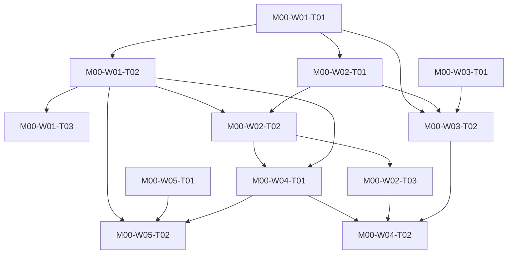

# M00 tasks

Read the linked task specification before scheduling. Dependencies are accepted-output prerequisites; labels and estimates are planning metadata.

| Task | Outcome | Direct prerequisites | Initial status | GitHub |
|---|---|---|---|---|
| [M00-W01-T01](M00-W01-T01.md) | Decide the software license and dependency admission policy | none | ready | [#1](https://github.com/JoseLArantes/detew/issues/1) |
| [M00-W01-T02](M00-W01-T02.md) | Enact the approved license and contributor review workflow | [M00-W01-T01](../m00/M00-W01-T01.md) | blocked | [#2](https://github.com/JoseLArantes/detew/issues/2) |
| [M00-W01-T03](M00-W01-T03.md) | Publish a verified private vulnerability-reporting process | [M00-W01-T02](../m00/M00-W01-T02.md) | blocked | [#3](https://github.com/JoseLArantes/detew/issues/3) |
| [M00-W02-T01](M00-W02-T01.md) | Pin exact portable, native, and frontend build inputs | [M00-W01-T01](../m00/M00-W01-T01.md) | blocked | [#4](https://github.com/JoseLArantes/detew/issues/4) |
| [M00-W02-T02](M00-W02-T02.md) | Bootstrap the minimal Rust workspace, UI package, and generation entry point | [M00-W01-T02](../m00/M00-W01-T02.md), [M00-W02-T01](../m00/M00-W02-T01.md) | blocked | [#5](https://github.com/JoseLArantes/detew/issues/5) |
| [M00-W02-T03](M00-W02-T03.md) | Verify reproducible bootstrap from an independent clean checkout | [M00-W02-T02](../m00/M00-W02-T02.md) | blocked | [#6](https://github.com/JoseLArantes/detew/issues/6) |
| [M00-W03-T01](M00-W03-T01.md) | Specify the isolated dual-stack lab and console recovery plan | none | ready | [#7](https://github.com/JoseLArantes/detew/issues/7) |
| [M00-W03-T02](M00-W03-T02.md) | Provision the lab and capture repeatable bypass baselines | [M00-W01-T01](../m00/M00-W01-T01.md), [M00-W02-T01](../m00/M00-W02-T01.md), [M00-W03-T01](../m00/M00-W03-T01.md) | blocked | [#8](https://github.com/JoseLArantes/detew/issues/8) |
| [M00-W04-T01](M00-W04-T01.md) | Create portable/native check entry points and evidence formats | [M00-W02-T02](../m00/M00-W02-T02.md), [M00-W01-T02](../m00/M00-W01-T02.md) | blocked | [#9](https://github.com/JoseLArantes/detew/issues/9) |
| [M00-W04-T02](M00-W04-T02.md) | Validate check isolation, fixture rules, and evidence reproducibility | [M00-W04-T01](../m00/M00-W04-T01.md), [M00-W02-T03](../m00/M00-W02-T03.md), [M00-W03-T02](../m00/M00-W03-T02.md) | blocked | [#10](https://github.com/JoseLArantes/detew/issues/10) |
| [M00-W05-T01](M00-W05-T01.md) | Review the threat model and privilege/trust inventory | none | ready | [#11](https://github.com/JoseLArantes/detew/issues/11) |
| [M00-W05-T02](M00-W05-T02.md) | Create the unverified requirement ledger and reviewable contribution templates | [M00-W01-T02](../m00/M00-W01-T02.md), [M00-W05-T01](../m00/M00-W05-T01.md), [M00-W04-T01](../m00/M00-W04-T01.md) | blocked | [#12](https://github.com/JoseLArantes/detew/issues/12) |

## Dependency branches

