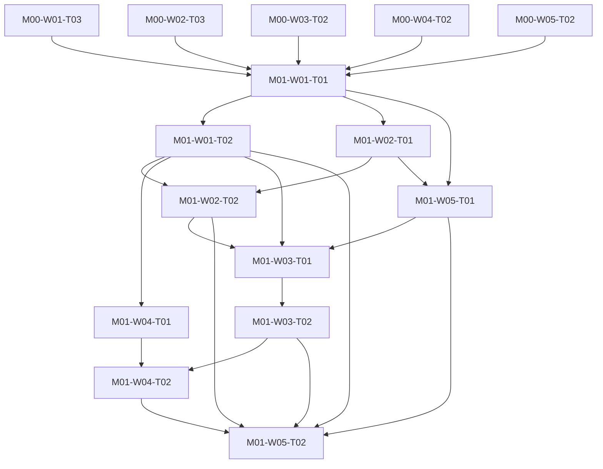

# M01 tasks

Read the linked task specification before scheduling. Dependencies are accepted-output prerequisites; labels and estimates are planning metadata.

| Task | Outcome | Direct prerequisites | Initial status | GitHub |
|---|---|---|---|---|
| [M01-W01-T01](M01-W01-T01.md) | Define authoritative wire types and explicit policy/evidence contexts | [M00-W01-T03](../m00/M00-W01-T03.md), [M00-W02-T03](../m00/M00-W02-T03.md), [M00-W03-T02](../m00/M00-W03-T02.md), [M00-W04-T02](../m00/M00-W04-T02.md), [M00-W05-T02](../m00/M00-W05-T02.md) | blocked | [#13](https://github.com/JoseLArantes/detew/issues/13) |
| [M01-W01-T02](M01-W01-T02.md) | Generate schemas/TypeScript and prove boundary round-trip parity | [M01-W01-T01](../m01/M01-W01-T01.md) | blocked | [#14](https://github.com/JoseLArantes/detew/issues/14) |
| [M01-W02-T01](M01-W02-T01.md) | Implement shared hostname, IDNA, and IP normalization | [M01-W01-T01](../m01/M01-W01-T01.md) | blocked | [#15](https://github.com/JoseLArantes/detew/issues/15) |
| [M01-W02-T02](M01-W02-T02.md) | Enforce exact/subdomain boundaries and public-suffix restrictions | [M01-W02-T01](../m01/M01-W02-T01.md), [M01-W01-T02](../m01/M01-W01-T02.md) | blocked | [#16](https://github.com/JoseLArantes/detew/issues/16) |
| [M01-W04-T01](M01-W04-T01.md) | Specify canonical artifact identity and compatibility validation | [M01-W01-T02](../m01/M01-W01-T02.md) | blocked | [#17](https://github.com/JoseLArantes/detew/issues/17) |
| [M01-W05-T01](M01-W05-T01.md) | Author independent policy expectations and replay-input contract | [M01-W01-T01](../m01/M01-W01-T01.md), [M01-W02-T01](../m01/M01-W02-T01.md) | blocked | [#18](https://github.com/JoseLArantes/detew/issues/18) |
| [M01-W03-T01](M01-W03-T01.md) | Implement canonical assignment, guardrail, and exception precedence | [M01-W01-T02](../m01/M01-W01-T02.md), [M01-W02-T02](../m01/M01-W02-T02.md), [M01-W05-T01](../m01/M01-W05-T01.md) | blocked | [#19](https://github.com/JoseLArantes/detew/issues/19) |
| [M01-W03-T02](M01-W03-T02.md) | Complete multi-label, application, and insufficient-evidence decisions | [M01-W03-T01](../m01/M01-W03-T01.md) | blocked | [#20](https://github.com/JoseLArantes/detew/issues/20) |
| [M01-W04-T02](M01-W04-T02.md) | Build deterministic initial policy compilation and context tokens | [M01-W04-T01](../m01/M01-W04-T01.md), [M01-W03-T02](../m01/M01-W03-T02.md) | blocked | [#21](https://github.com/JoseLArantes/detew/issues/21) |
| [M01-W05-T02](M01-W05-T02.md) | Deliver the portable CLI/replay harness and accept the canonical reference | [M01-W01-T02](../m01/M01-W01-T02.md), [M01-W02-T02](../m01/M01-W02-T02.md), [M01-W03-T02](../m01/M01-W03-T02.md), [M01-W04-T02](../m01/M01-W04-T02.md), [M01-W05-T01](../m01/M01-W05-T01.md) | blocked | [#22](https://github.com/JoseLArantes/detew/issues/22) |

## Dependency branches

