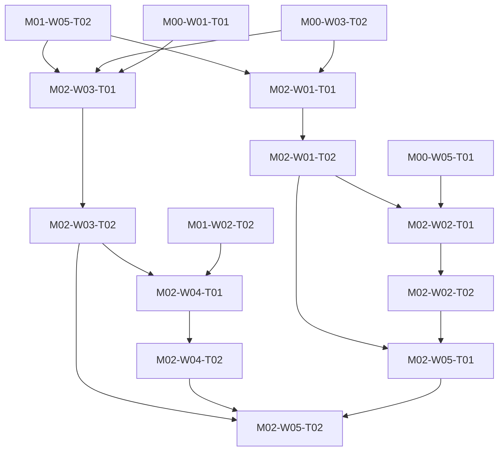

# M02 tasks

Read the linked task specification before scheduling. Dependencies are accepted-output prerequisites; labels and estimates are planning metadata.

| Task | Outcome | Direct prerequisites | Initial status | GitHub |
|---|---|---|---|---|
| [M02-W01-T01](M02-W01-T01.md) | Build the adapter conformance harness and Netmap host-stack experiment | [M01-W05-T02](../m01/M01-W05-T02.md), [M00-W03-T02](../m00/M00-W03-T02.md) | blocked | [#23](https://github.com/JoseLArantes/detew/issues/23) |
| [M02-W01-T02](M02-W01-T02.md) | Compare Divert coverage and reinjection against the same packet contract | [M02-W01-T01](../m02/M02-W01-T01.md) | blocked | [#24](https://github.com/JoseLArantes/detew/issues/24) |
| [M02-W02-T01](M02-W02-T01.md) | Measure engine/helper death, overload, and attachment failure actions | [M02-W01-T02](../m02/M02-W01-T02.md), [M00-W05-T01](../m00/M00-W05-T01.md) | blocked | [#25](https://github.com/JoseLArantes/detew/issues/25) |
| [M02-W02-T02](M02-W02-T02.md) | Prove scoped ownership, maintenance recovery, and clean detach | [M02-W02-T01](../m02/M02-W02-T01.md) | blocked | [#26](https://github.com/JoseLArantes/detew/issues/26) |
| [M02-W03-T01](M02-W03-T01.md) | Build the pinned nDPI native manifest and narrow C/Rust ownership boundary | [M01-W05-T02](../m01/M01-W05-T02.md), [M00-W03-T02](../m00/M00-W03-T02.md), [M00-W01-T01](../m00/M00-W01-T01.md) | blocked | [#27](https://github.com/JoseLArantes/detew/issues/27) |
| [M02-W03-T02](M02-W03-T02.md) | Measure native allocations and fuzz the classifier ownership/parser boundary | [M02-W03-T01](../m02/M02-W03-T01.md) | blocked | [#28](https://github.com/JoseLArantes/detew/issues/28) |
| [M02-W04-T01](M02-W04-T01.md) | Validate HTTP/TLS/QUIC hostname evidence and encrypted-visibility limits | [M02-W03-T02](../m02/M02-W03-T02.md), [M01-W02-T02](../m01/M01-W02-T02.md) | blocked | [#29](https://github.com/JoseLArantes/detew/issues/29) |
| [M02-W04-T02](M02-W04-T02.md) | Publish independent application capability cases and late-evidence behavior | [M02-W04-T01](../m02/M02-W04-T01.md) | blocked | [#30](https://github.com/JoseLArantes/detew/issues/30) |
| [M02-W05-T01](M02-W05-T01.md) | Accept or reject the production packet adapter at ARCH-G01 | [M02-W01-T02](../m02/M02-W01-T02.md), [M02-W02-T02](../m02/M02-W02-T02.md) | blocked | [#31](https://github.com/JoseLArantes/detew/issues/31) |
| [M02-W05-T02](M02-W05-T02.md) | Accept or reject classifier/catalog feasibility at ARCH-G02 | [M02-W03-T02](../m02/M02-W03-T02.md), [M02-W04-T02](../m02/M02-W04-T02.md), [M02-W05-T01](../m02/M02-W05-T01.md) | blocked | [#32](https://github.com/JoseLArantes/detew/issues/32) |

## Dependency branches

