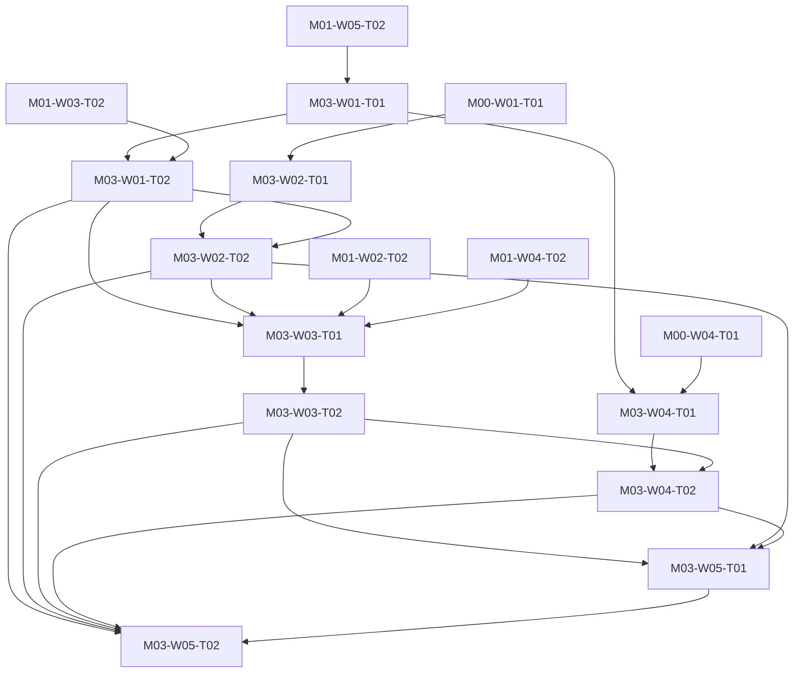

# M03 tasks

Read the linked task specification before scheduling. Dependencies are accepted-output prerequisites; labels and estimates are planning metadata.

| Task | Outcome | Direct prerequisites | Initial status | GitHub |
|---|---|---|---|---|
| [M03-W01-T01](M03-W01-T01.md) | Define the stable three-category taxonomy and bilingual boundaries | [M01-W05-T02](../m01/M01-W05-T02.md) | blocked | [#33](https://github.com/JoseLArantes/detew/issues/33) |
| [M03-W01-T02](M03-W01-T02.md) | Validate taxonomy/provider mappings and multi-label semantics | [M03-W01-T01](../m03/M03-W01-T01.md), [M01-W03-T02](../m01/M01-W03-T02.md) | blocked | [#34](https://github.com/JoseLArantes/detew/issues/34) |
| [M03-W02-T01](M03-W02-T01.md) | Audit candidate sources for redistribution, provenance, and freshness | [M00-W01-T01](../m00/M00-W01-T01.md) | blocked | [#35](https://github.com/JoseLArantes/detew/issues/35) |
| [M03-W02-T02](M03-W02-T02.md) | Approve source manifests and the maintenance/eligibility contract | [M03-W02-T01](../m03/M03-W02-T01.md), [M03-W01-T02](../m03/M03-W01-T02.md) | blocked | [#36](https://github.com/JoseLArantes/detew/issues/36) |
| [M03-W03-T01](M03-W03-T01.md) | Implement bounded normalization/import and deterministic FST compilation | [M03-W01-T02](../m03/M03-W01-T02.md), [M03-W02-T02](../m03/M03-W02-T02.md), [M01-W02-T02](../m01/M01-W02-T02.md), [M01-W04-T02](../m01/M01-W04-T02.md) | blocked | [#37](https://github.com/JoseLArantes/detew/issues/37) |
| [M03-W03-T02](M03-W03-T02.md) | Verify artifact decoding, lookup parity, and peak preparation budgets | [M03-W03-T01](../m03/M03-W03-T01.md) | blocked | [#38](https://github.com/JoseLArantes/detew/issues/38) |
| [M03-W04-T01](M03-W04-T01.md) | Freeze an independent bilingual category corpus and scoring protocol | [M03-W01-T01](../m03/M03-W01-T01.md), [M00-W04-T01](../m00/M00-W04-T01.md) | blocked | [#39](https://github.com/JoseLArantes/detew/issues/39) |
| [M03-W04-T02](M03-W04-T02.md) | Measure initial three-category quality and remediation gaps | [M03-W04-T01](../m03/M03-W04-T01.md), [M03-W03-T02](../m03/M03-W03-T02.md) | blocked | [#40](https://github.com/JoseLArantes/detew/issues/40) |
| [M03-W05-T01](M03-W05-T01.md) | Assemble the licensed baseline dataset pack and private correction contract | [M03-W03-T02](../m03/M03-W03-T02.md), [M03-W02-T02](../m03/M03-W02-T02.md), [M03-W04-T02](../m03/M03-W04-T02.md) | blocked | [#41](https://github.com/JoseLArantes/detew/issues/41) |
| [M03-W05-T02](M03-W05-T02.md) | Accept or reject category-data feasibility at ARCH-G03 | [M03-W01-T02](../m03/M03-W01-T02.md), [M03-W02-T02](../m03/M03-W02-T02.md), [M03-W03-T02](../m03/M03-W03-T02.md), [M03-W04-T02](../m03/M03-W04-T02.md), [M03-W05-T01](../m03/M03-W05-T01.md) | blocked | [#42](https://github.com/JoseLArantes/detew/issues/42) |

## Dependency branches

