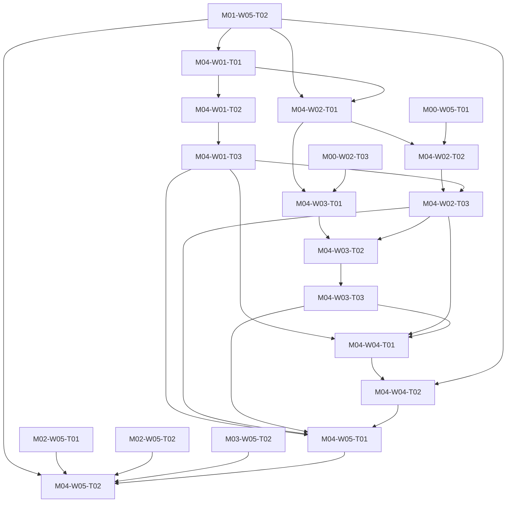

# M04 tasks

Read the linked task specification before scheduling. Dependencies are accepted-output prerequisites; labels and estimates are planning metadata.

| Task | Outcome | Direct prerequisites | Initial status | GitHub |
|---|---|---|---|---|
| [M04-W01-T01](M04-W01-T01.md) | Map native XML storage to generated domain snapshots | [M01-W05-T02](../m01/M01-W05-T02.md) | blocked | [#43](https://github.com/JoseLArantes/detew/issues/43) |
| [M04-W01-T02](M04-W01-T02.md) | Prototype locked expected-revision writes and durable reservation | [M04-W01-T01](../m04/M04-W01-T01.md) | blocked | [#44](https://github.com/JoseLArantes/detew/issues/44) |
| [M04-W01-T03](M04-W01-T03.md) | Prove restore rebasing and interrupted writer recovery | [M04-W01-T02](../m04/M04-W01-T02.md) | blocked | [#45](https://github.com/JoseLArantes/detew/issues/45) |
| [M04-W02-T01](M04-W02-T01.md) | Freeze native HTTP/IPC shapes, errors, and protected operation methods | [M01-W05-T02](../m01/M01-W05-T02.md), [M04-W01-T01](../m04/M04-W01-T01.md) | blocked | [#46](https://github.com/JoseLArantes/detew/issues/46) |
| [M04-W02-T02](M04-W02-T02.md) | Prototype fixed configd actions and authenticated bounded Unix IPC | [M04-W02-T01](../m04/M04-W02-T01.md), [M00-W05-T01](../m00/M00-W05-T01.md) | blocked | [#47](https://github.com/JoseLArantes/detew/issues/47) |
| [M04-W02-T03](M04-W02-T03.md) | Integrate native endpoints and independently test ACL/session/CSRF enforcement | [M04-W02-T02](../m04/M04-W02-T02.md), [M04-W01-T03](../m04/M04-W01-T03.md) | blocked | [#48](https://github.com/JoseLArantes/detew/issues/48) |
| [M04-W03-T01](M04-W03-T01.md) | Mount locally bundled React assets inside the native Volt shell | [M04-W02-T01](../m04/M04-W02-T01.md), [M00-W02-T03](../m00/M00-W02-T03.md) | blocked | [#49](https://github.com/JoseLArantes/detew/issues/49) |
| [M04-W03-T02](M04-W03-T02.md) | Connect typed native transport and resilient query/operation state | [M04-W03-T01](../m04/M04-W03-T01.md), [M04-W02-T03](../m04/M04-W02-T03.md) | blocked | [#50](https://github.com/JoseLArantes/detew/issues/50) |
| [M04-W03-T03](M04-W03-T03.md) | Build scoped accessible components, bilingual strings, and host theme parity | [M04-W03-T02](../m04/M04-W03-T02.md) | blocked | [#51](https://github.com/JoseLArantes/detew/issues/51) |
| [M04-W04-T01](M04-W04-T01.md) | Implement the setup/category-profile/device-assignment prototype journeys | [M04-W01-T03](../m04/M04-W01-T03.md), [M04-W02-T03](../m04/M04-W02-T03.md), [M04-W03-T03](../m04/M04-W03-T03.md) | blocked | [#52](https://github.com/JoseLArantes/detew/issues/52) |
| [M04-W04-T02](M04-W04-T02.md) | Implement decision-to-exception and failure-recovery prototype journeys | [M04-W04-T01](../m04/M04-W04-T01.md), [M01-W05-T02](../m01/M01-W05-T02.md) | blocked | [#53](https://github.com/JoseLArantes/detew/issues/53) |
| [M04-W05-T01](M04-W05-T01.md) | Review ARCH-G04 host evidence and conduct the G0 prototype usability study | [M04-W01-T03](../m04/M04-W01-T03.md), [M04-W02-T03](../m04/M04-W02-T03.md), [M04-W03-T03](../m04/M04-W03-T03.md), [M04-W04-T02](../m04/M04-W04-T02.md) | blocked | [#54](https://github.com/JoseLArantes/detew/issues/54) |
| [M04-W05-T02](M04-W05-T02.md) | Record the integrated G0 feasibility and alpha-scope decision | [M01-W05-T02](../m01/M01-W05-T02.md), [M02-W05-T01](../m02/M02-W05-T01.md), [M02-W05-T02](../m02/M02-W05-T02.md), [M03-W05-T02](../m03/M03-W05-T02.md), [M04-W05-T01](../m04/M04-W05-T01.md) | blocked | [#55](https://github.com/JoseLArantes/detew/issues/55) |

## Dependency branches

