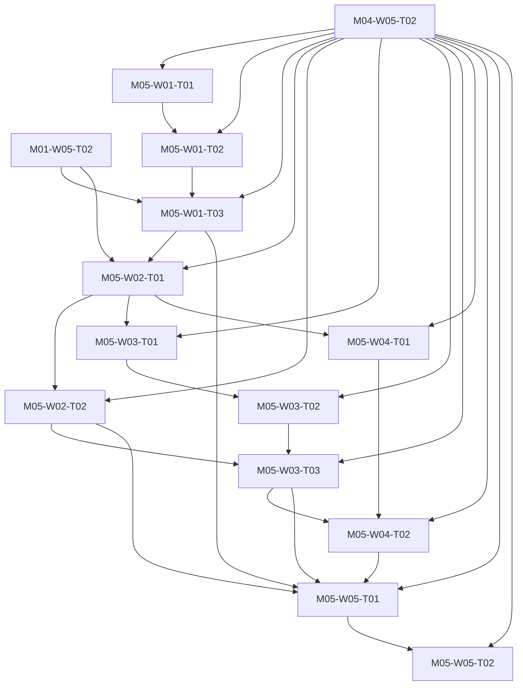

# M05 tasks

Read the linked task specification before scheduling. Dependencies are accepted-output prerequisites; labels and estimates are planning metadata.

| Task | Outcome | Direct prerequisites | Initial status | GitHub |
|---|---|---|---|---|
| [M05-W01-T01](M05-W01-T01.md) | Attach the G0-selected packet adapter with verified scope ownership | [M04-W05-T02](../m04/M04-W05-T02.md) | blocked | [#56](https://github.com/JoseLArantes/detew/issues/56) |
| [M05-W01-T02](M05-W01-T02.md) | Implement bounded bidirectional flow ownership and admission | [M04-W05-T02](../m04/M04-W05-T02.md), [M05-W01-T01](../m05/M05-W01-T01.md) | blocked | [#57](https://github.com/JoseLArantes/detew/issues/57) |
| [M05-W01-T03](M05-W01-T03.md) | Connect bounded parsing, nDPI evidence and local category lookup | [M04-W05-T02](../m04/M04-W05-T02.md), [M05-W01-T02](../m05/M05-W01-T02.md), [M01-W05-T02](../m01/M01-W05-T02.md) | blocked | [#58](https://github.com/JoseLArantes/detew/issues/58) |
| [M05-W02-T01](M05-W02-T01.md) | Run canonical policy on the alpha profile and observe/enforce path | [M04-W05-T02](../m04/M04-W05-T02.md), [M05-W01-T03](../m05/M05-W01-T03.md), [M01-W05-T02](../m01/M01-W05-T02.md) | blocked | [#59](https://github.com/JoseLArantes/detew/issues/59) |
| [M05-W02-T02](M05-W02-T02.md) | Enforce provisional limits and late classification without false visibility claims | [M04-W05-T02](../m04/M04-W05-T02.md), [M05-W02-T01](../m05/M05-W02-T01.md) | blocked | [#60](https://github.com/JoseLArantes/detew/issues/60) |
| [M05-W03-T01](M05-W03-T01.md) | Assemble serial control operations and immutable bundle preparation | [M04-W05-T02](../m04/M04-W05-T02.md), [M05-W02-T01](../m05/M05-W02-T01.md) | blocked | [#61](https://github.com/JoseLArantes/detew/issues/61) |
| [M05-W03-T02](M05-W03-T02.md) | Persist minimal verified activation recovery before alpha forwarding | [M04-W05-T02](../m04/M04-W05-T02.md), [M05-W03-T01](../m05/M05-W03-T01.md) | blocked | [#62](https://github.com/JoseLArantes/detew/issues/62) |
| [M05-W03-T03](M05-W03-T03.md) | Commit worker generations and reconsider tracked flows coherently | [M04-W05-T02](../m04/M04-W05-T02.md), [M05-W03-T02](../m05/M05-W03-T02.md), [M05-W02-T02](../m05/M05-W02-T02.md) | blocked | [#63](https://github.com/JoseLArantes/detew/issues/63) |
| [M05-W04-T01](M05-W04-T01.md) | Ingest bounded decision metadata without blocking packet processing | [M04-W05-T02](../m04/M04-W05-T02.md), [M05-W02-T01](../m05/M05-W02-T01.md) | blocked | [#64](https://github.com/JoseLArantes/detew/issues/64) |
| [M05-W04-T02](M05-W04-T02.md) | Expose a truthful alpha historical explanation through native API and drawer | [M04-W05-T02](../m04/M04-W05-T02.md), [M05-W04-T01](../m05/M05-W04-T01.md), [M05-W03-T03](../m05/M05-W03-T03.md) | blocked | [#65](https://github.com/JoseLArantes/detew/issues/65) |
| [M05-W05-T01](M05-W05-T01.md) | Package the disabled alpha and complete real setup/review/recovery wiring | [M04-W05-T02](../m04/M04-W05-T02.md), [M05-W01-T03](../m05/M05-W01-T03.md), [M05-W02-T02](../m05/M05-W02-T02.md), [M05-W03-T03](../m05/M05-W03-T03.md), [M05-W04-T02](../m05/M05-W04-T02.md) | blocked | [#66](https://github.com/JoseLArantes/detew/issues/66) |
| [M05-W05-T02](M05-W05-T02.md) | Decide G1 from repeatable real inline alpha evidence | [M04-W05-T02](../m04/M04-W05-T02.md), [M05-W05-T01](../m05/M05-W05-T01.md) | blocked | [#67](https://github.com/JoseLArantes/detew/issues/67) |

## Dependency branches

