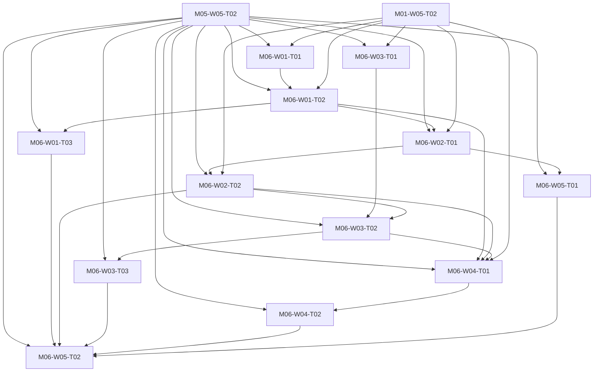

# M06 tasks

Read the linked task specification before scheduling. Dependencies are accepted-output prerequisites; labels and estimates are planning metadata.

| Task | Outcome | Direct prerequisites | Initial status | GitHub |
|---|---|---|---|---|
| [M06-W01-T01](M06-W01-T01.md) | Ingest expiring scoped inventory evidence and trusted local bindings | [M05-W05-T02](../m05/M05-W05-T02.md), [M01-W05-T02](../m01/M01-W05-T02.md) | blocked | [#68](https://github.com/JoseLArantes/detew/issues/68) |
| [M06-W01-T02](M06-W01-T02.md) | Complete group/network assignments and explicit effective-profile explanations | [M05-W05-T02](../m05/M05-W05-T02.md), [M06-W01-T01](../m06/M06-W01-T01.md), [M01-W05-T02](../m01/M01-W05-T02.md) | blocked | [#69](https://github.com/JoseLArantes/detew/issues/69) |
| [M06-W01-T03](M06-W01-T03.md) | Prove attribution and assignment safety across address churn | [M05-W05-T02](../m05/M05-W05-T02.md), [M06-W01-T02](../m06/M06-W01-T02.md) | blocked | [#70](https://github.com/JoseLArantes/detew/issues/70) |
| [M06-W02-T01](M06-W02-T01.md) | Complete exception ordering, mandatory guardrails and multi-label controls | [M05-W05-T02](../m05/M05-W05-T02.md), [M06-W01-T02](../m06/M06-W01-T02.md), [M01-W05-T02](../m01/M01-W05-T02.md) | blocked | [#71](https://github.com/JoseLArantes/detew/issues/71) |
| [M06-W02-T02](M06-W02-T02.md) | Complete scheduled block overlays and narrow temporary override intent | [M05-W05-T02](../m05/M05-W05-T02.md), [M06-W02-T01](../m06/M06-W02-T01.md), [M01-W05-T02](../m01/M01-W05-T02.md) | blocked | [#72](https://github.com/JoseLArantes/detew/issues/72) |
| [M06-W03-T01](M06-W03-T01.md) | Run engine-local calendar schedules and clock-health fallback | [M05-W05-T02](../m05/M05-W05-T02.md), [M01-W05-T02](../m01/M01-W05-T02.md) | blocked | [#73](https://github.com/JoseLArantes/detew/issues/73) |
| [M06-W03-T02](M06-W03-T02.md) | Enforce expiring allows and override deadlines across jumps and reboot | [M05-W05-T02](../m05/M05-W05-T02.md), [M06-W03-T01](../m06/M06-W03-T01.md), [M06-W02-T02](../m06/M06-W02-T02.md) | blocked | [#74](https://github.com/JoseLArantes/detew/issues/74) |
| [M06-W03-T03](M06-W03-T03.md) | Validate the complete schedule and expiry parity corpus | [M05-W05-T02](../m05/M05-W05-T02.md), [M06-W03-T02](../m06/M06-W03-T02.md) | blocked | [#75](https://github.com/JoseLArantes/detew/issues/75) |
| [M06-W04-T01](M06-W04-T01.md) | Unify context invalidation and engine-local eligibility deadlines | [M05-W05-T02](../m05/M05-W05-T02.md), [M06-W01-T02](../m06/M06-W01-T02.md), [M06-W02-T02](../m06/M06-W02-T02.md), [M06-W03-T02](../m06/M06-W03-T02.md), [M01-W05-T02](../m01/M01-W05-T02.md) | blocked | [#76](https://github.com/JoseLArantes/detew/issues/76) |
| [M06-W04-T02](M06-W04-T02.md) | Prove active/idle flow reconsideration and blocked-state pressure safety | [M05-W05-T02](../m05/M05-W05-T02.md), [M06-W04-T01](../m06/M06-W04-T01.md) | blocked | [#77](https://github.com/JoseLArantes/detew/issues/77) |
| [M06-W05-T01](M06-W05-T01.md) | Complete separate fallback settings and capability-scoped supporting controls | [M05-W05-T02](../m05/M05-W05-T02.md), [M06-W02-T01](../m06/M06-W02-T01.md) | blocked | [#78](https://github.com/JoseLArantes/detew/issues/78) |
| [M06-W05-T02](M06-W05-T02.md) | Accept complete V1 policy, device and time conformance | [M05-W05-T02](../m05/M05-W05-T02.md), [M06-W01-T03](../m06/M06-W01-T03.md), [M06-W02-T02](../m06/M06-W02-T02.md), [M06-W03-T03](../m06/M06-W03-T03.md), [M06-W04-T02](../m06/M06-W04-T02.md), [M06-W05-T01](../m06/M06-W05-T01.md) | blocked | [#79](https://github.com/JoseLArantes/detew/issues/79) |

## Dependency branches

