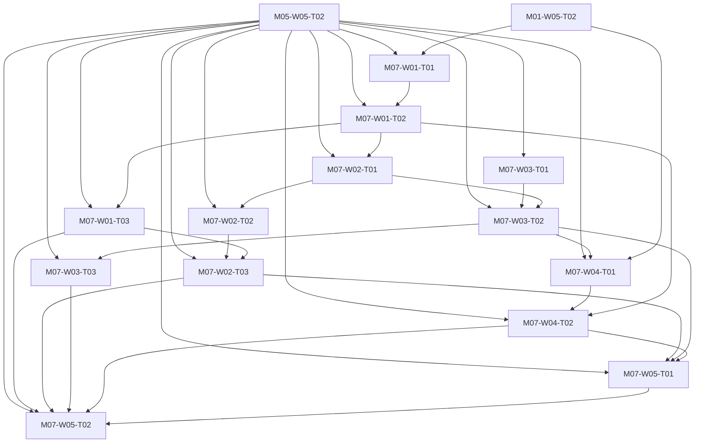

# M07 tasks

Read the linked task specification before scheduling. Dependencies are accepted-output prerequisites; labels and estimates are planning metadata.

| Task | Outcome | Direct prerequisites | Initial status | GitHub |
|---|---|---|---|---|
| [M07-W01-T01](M07-W01-T01.md) | Complete native validation, preview, save and operation APIs | [M05-W05-T02](../m05/M05-W05-T02.md), [M01-W05-T02](../m01/M01-W05-T02.md) | blocked | [#80](https://github.com/JoseLArantes/detew/issues/80) |
| [M07-W01-T02](M07-W01-T02.md) | Enforce one locked native writer and durable revision reservation everywhere | [M05-W05-T02](../m05/M05-W05-T02.md), [M07-W01-T01](../m07/M07-W01-T01.md) | blocked | [#81](https://github.com/JoseLArantes/detew/issues/81) |
| [M07-W01-T03](M07-W01-T03.md) | Rebase restore/import intent and verify concurrent recovery lineages | [M05-W05-T02](../m05/M05-W05-T02.md), [M07-W01-T02](../m07/M07-W01-T02.md) | blocked | [#82](https://github.com/JoseLArantes/detew/issues/82) |
| [M07-W02-T01](M07-W02-T01.md) | Complete durable artifact and journal writes with recoverable stages | [M05-W05-T02](../m05/M05-W05-T02.md), [M07-W01-T02](../m07/M07-W01-T02.md) | blocked | [#83](https://github.com/JoseLArantes/detew/issues/83) |
| [M07-W02-T02](M07-W02-T02.md) | Recover stalled/mixed workers and controller/engine restarts truthfully | [M05-W05-T02](../m05/M05-W05-T02.md), [M07-W02-T01](../m07/M07-W02-T01.md) | blocked | [#84](https://github.com/JoseLArantes/detew/issues/84) |
| [M07-W02-T03](M07-W02-T03.md) | Implement compatible rollback as a fresh validated activation | [M05-W05-T02](../m05/M05-W05-T02.md), [M07-W02-T02](../m07/M07-W02-T02.md), [M07-W01-T03](../m07/M07-W01-T03.md) | blocked | [#85](https://github.com/JoseLArantes/detew/issues/85) |
| [M07-W03-T01](M07-W03-T01.md) | Build bounded source fetching, import and artifact admission | [M05-W05-T02](../m05/M05-W05-T02.md) | blocked | [#86](https://github.com/JoseLArantes/detew/issues/86) |
| [M07-W03-T02](M07-W03-T02.md) | Quarantine anomalous diffs and activate deterministic category bundles | [M05-W05-T02](../m05/M05-W05-T02.md), [M07-W03-T01](../m07/M07-W03-T01.md), [M07-W02-T01](../m07/M07-W02-T01.md) | blocked | [#87](https://github.com/JoseLArantes/detew/issues/87) |
| [M07-W03-T03](M07-W03-T03.md) | Audit hostile update inputs and offline update independence | [M05-W05-T02](../m05/M05-W05-T02.md), [M07-W03-T02](../m07/M07-W03-T02.md) | blocked | [#88](https://github.com/JoseLArantes/detew/issues/88) |
| [M07-W04-T01](M07-W04-T01.md) | Complete source freshness, warning, expiry and offline eligibility | [M05-W05-T02](../m05/M05-W05-T02.md), [M07-W03-T02](../m07/M07-W03-T02.md), [M01-W05-T02](../m01/M01-W05-T02.md) | blocked | [#89](https://github.com/JoseLArantes/detew/issues/89) |
| [M07-W04-T02](M07-W04-T02.md) | Activate private corrections/custom lists and preserve export provenance | [M05-W05-T02](../m05/M05-W05-T02.md), [M07-W04-T01](../m07/M07-W04-T01.md), [M07-W01-T02](../m07/M07-W01-T02.md) | blocked | [#90](https://github.com/JoseLArantes/detew/issues/90) |
| [M07-W05-T01](M07-W05-T01.md) | Bound artifact retention and isolate hook/classifier maintenance | [M05-W05-T02](../m05/M05-W05-T02.md), [M07-W02-T03](../m07/M07-W02-T03.md), [M07-W03-T02](../m07/M07-W03-T02.md), [M07-W04-T02](../m07/M07-W04-T02.md) | blocked | [#91](https://github.com/JoseLArantes/detew/issues/91) |
| [M07-W05-T02](M07-W05-T02.md) | Accept the complete durable policy and data lifecycle | [M05-W05-T02](../m05/M05-W05-T02.md), [M07-W01-T03](../m07/M07-W01-T03.md), [M07-W02-T03](../m07/M07-W02-T03.md), [M07-W03-T03](../m07/M07-W03-T03.md), [M07-W04-T02](../m07/M07-W04-T02.md), [M07-W05-T01](../m07/M07-W05-T01.md) | blocked | [#92](https://github.com/JoseLArantes/detew/issues/92) |

## Dependency branches

