# M08 tasks

Read the linked task specification before scheduling. Dependencies are accepted-output prerequisites; labels and estimates are planning metadata.

| Task | Outcome | Direct prerequisites | Initial status | GitHub |
|---|---|---|---|---|
| [M08-W01-T01](M08-W01-T01.md) | Establish the Detew component/state catalog and five-surface shell | [M04-W05-T02](../m04/M04-W05-T02.md) | blocked | [#93](https://github.com/JoseLArantes/detew/issues/93) |
| [M08-W01-T02](M08-W01-T02.md) | Complete resumable readiness-to-enforcement setup with real checks | [M04-W05-T02](../m04/M04-W05-T02.md), [M08-W01-T01](../m08/M08-W01-T01.md), [M05-W05-T02](../m05/M05-W05-T02.md) | blocked | [#94](https://github.com/JoseLArantes/detew/issues/94) |
| [M08-W01-T03](M08-W01-T03.md) | Complete actionable Overview, Devices and operational Settings views | [M04-W05-T02](../m04/M04-W05-T02.md), [M08-W01-T01](../m08/M08-W01-T01.md), [M05-W05-T02](../m05/M05-W05-T02.md), [M06-W01-T02](../m06/M06-W01-T02.md), [M07-W04-T01](../m07/M07-W04-T01.md) | blocked | [#95](https://github.com/JoseLArantes/detew/issues/95) |
| [M08-W02-T01](M08-W02-T01.md) | Complete policy editors with local drafts and canonical server preview | [M04-W05-T02](../m04/M04-W05-T02.md), [M08-W01-T01](../m08/M08-W01-T01.md), [M05-W05-T02](../m05/M05-W05-T02.md), [M06-W02-T02](../m06/M06-W02-T02.md), [M06-W05-T01](../m06/M06-W05-T01.md) | blocked | [#96](https://github.com/JoseLArantes/detew/issues/96) |
| [M08-W02-T02](M08-W02-T02.md) | Complete diff/review/apply progress, conflicts and operation reconnect | [M04-W05-T02](../m04/M04-W05-T02.md), [M08-W02-T01](../m08/M08-W02-T01.md), [M07-W01-T03](../m07/M07-W01-T03.md), [M07-W02-T02](../m07/M07-W02-T02.md) | blocked | [#97](https://github.com/JoseLArantes/detew/issues/97) |
| [M08-W02-T03](M08-W02-T03.md) | Complete assignment, temporary override and dependency-aware rollback journeys | [M04-W05-T02](../m04/M04-W05-T02.md), [M08-W02-T02](../m08/M08-W02-T02.md), [M06-W01-T03](../m06/M06-W01-T03.md), [M06-W03-T02](../m06/M06-W03-T02.md), [M07-W02-T03](../m07/M07-W02-T03.md) | blocked | [#98](https://github.com/JoseLArantes/detew/issues/98) |
| [M08-W03-T01](M08-W03-T01.md) | Complete stable paginated activity search and truthful attempt aggregation | [M04-W05-T02](../m04/M04-W05-T02.md), [M08-W01-T01](../m08/M08-W01-T01.md), [M05-W04-T02](../m05/M05-W04-T02.md) | blocked | [#99](https://github.com/JoseLArantes/detew/issues/99) |
| [M08-W03-T02](M08-W03-T02.md) | Complete historical decision drawer and safe narrow exception recovery | [M04-W05-T02](../m04/M04-W05-T02.md), [M08-W03-T01](../m08/M08-W03-T01.md), [M08-W02-T01](../m08/M08-W02-T01.md) | blocked | [#100](https://github.com/JoseLArantes/detew/issues/100) |
| [M08-W03-T03](M08-W03-T03.md) | Complete the canonical destination/context tester with explicit assumptions | [M04-W05-T02](../m04/M04-W05-T02.md), [M08-W03-T02](../m08/M08-W03-T02.md), [M07-W04-T02](../m07/M07-W04-T02.md), [M06-W04-T02](../m06/M06-W04-T02.md), [M01-W05-T02](../m01/M01-W05-T02.md) | blocked | [#101](https://github.com/JoseLArantes/detew/issues/101) |
| [M08-W04-T01](M08-W04-T01.md) | Complete collection controls, bounded deletion and configuration/history export | [M04-W05-T02](../m04/M04-W05-T02.md), [M08-W03-T01](../m08/M08-W03-T01.md), [M07-W01-T03](../m07/M07-W01-T03.md) | blocked | [#102](https://github.com/JoseLArantes/detew/issues/102) |
| [M08-W04-T02](M08-W04-T02.md) | Prepare redacted diagnostics and taxonomy contributions without automatic sharing | [M04-W05-T02](../m04/M04-W05-T02.md), [M08-W04-T01](../m08/M08-W04-T01.md), [M07-W04-T02](../m07/M07-W04-T02.md) | blocked | [#103](https://github.com/JoseLArantes/detew/issues/103) |
| [M08-W05-T01](M08-W05-T01.md) | Validate host UI accessibility, localization, responsive scale and exceptional states | [M04-W05-T02](../m04/M04-W05-T02.md), [M08-W01-T02](../m08/M08-W01-T02.md), [M08-W01-T03](../m08/M08-W01-T03.md), [M08-W02-T03](../m08/M08-W02-T03.md), [M08-W03-T03](../m08/M08-W03-T03.md), [M08-W04-T02](../m08/M08-W04-T02.md) | blocked | [#104](https://github.com/JoseLArantes/detew/issues/104) |
| [M08-W05-T02](M08-W05-T02.md) | Accept the integrated V1 experience and local activity workflows | [M04-W05-T02](../m04/M04-W05-T02.md), [M08-W05-T01](../m08/M08-W05-T01.md), [M06-W05-T02](../m06/M06-W05-T02.md), [M07-W05-T02](../m07/M07-W05-T02.md) | blocked | [#105](https://github.com/JoseLArantes/detew/issues/105) |

## Dependency branches

```mermaid
flowchart TD
    M01_W05_T02["M01-W05-T02"]
    M04_W05_T02["M04-W05-T02"]
    M05_W04_T02["M05-W04-T02"]
    M05_W05_T02["M05-W05-T02"]
    M06_W01_T02["M06-W01-T02"]
    M06_W01_T03["M06-W01-T03"]
    M06_W02_T02["M06-W02-T02"]
    M06_W03_T02["M06-W03-T02"]
    M06_W04_T02["M06-W04-T02"]
    M06_W05_T01["M06-W05-T01"]
    M06_W05_T02["M06-W05-T02"]
    M07_W01_T03["M07-W01-T03"]
    M07_W02_T02["M07-W02-T02"]
    M07_W02_T03["M07-W02-T03"]
    M07_W04_T01["M07-W04-T01"]
    M07_W04_T02["M07-W04-T02"]
    M07_W05_T02["M07-W05-T02"]
    M08_W01_T01["M08-W01-T01"]
    M08_W01_T02["M08-W01-T02"]
    M08_W01_T03["M08-W01-T03"]
    M08_W02_T01["M08-W02-T01"]
    M08_W02_T02["M08-W02-T02"]
    M08_W02_T03["M08-W02-T03"]
    M08_W03_T01["M08-W03-T01"]
    M08_W03_T02["M08-W03-T02"]
    M08_W03_T03["M08-W03-T03"]
    M08_W04_T01["M08-W04-T01"]
    M08_W04_T02["M08-W04-T02"]
    M08_W05_T01["M08-W05-T01"]
    M08_W05_T02["M08-W05-T02"]
    M04_W05_T02 --> M08_W01_T01
    M04_W05_T02 --> M08_W01_T02
    M08_W01_T01 --> M08_W01_T02
    M05_W05_T02 --> M08_W01_T02
    M04_W05_T02 --> M08_W01_T03
    M08_W01_T01 --> M08_W01_T03
    M05_W05_T02 --> M08_W01_T03
    M06_W01_T02 --> M08_W01_T03
    M07_W04_T01 --> M08_W01_T03
    M04_W05_T02 --> M08_W02_T01
    M08_W01_T01 --> M08_W02_T01
    M05_W05_T02 --> M08_W02_T01
    M06_W02_T02 --> M08_W02_T01
    M06_W05_T01 --> M08_W02_T01
    M04_W05_T02 --> M08_W02_T02
    M08_W02_T01 --> M08_W02_T02
    M07_W01_T03 --> M08_W02_T02
    M07_W02_T02 --> M08_W02_T02
    M04_W05_T02 --> M08_W02_T03
    M08_W02_T02 --> M08_W02_T03
    M06_W01_T03 --> M08_W02_T03
    M06_W03_T02 --> M08_W02_T03
    M07_W02_T03 --> M08_W02_T03
    M04_W05_T02 --> M08_W03_T01
    M08_W01_T01 --> M08_W03_T01
    M05_W04_T02 --> M08_W03_T01
    M04_W05_T02 --> M08_W03_T02
    M08_W03_T01 --> M08_W03_T02
    M08_W02_T01 --> M08_W03_T02
    M04_W05_T02 --> M08_W03_T03
    M08_W03_T02 --> M08_W03_T03
    M07_W04_T02 --> M08_W03_T03
    M06_W04_T02 --> M08_W03_T03
    M01_W05_T02 --> M08_W03_T03
    M04_W05_T02 --> M08_W04_T01
    M08_W03_T01 --> M08_W04_T01
    M07_W01_T03 --> M08_W04_T01
    M04_W05_T02 --> M08_W04_T02
    M08_W04_T01 --> M08_W04_T02
    M07_W04_T02 --> M08_W04_T02
    M04_W05_T02 --> M08_W05_T01
    M08_W01_T02 --> M08_W05_T01
    M08_W01_T03 --> M08_W05_T01
    M08_W02_T03 --> M08_W05_T01
    M08_W03_T03 --> M08_W05_T01
    M08_W04_T02 --> M08_W05_T01
    M04_W05_T02 --> M08_W05_T02
    M08_W05_T01 --> M08_W05_T02
    M06_W05_T02 --> M08_W05_T02
    M07_W05_T02 --> M08_W05_T02
```

