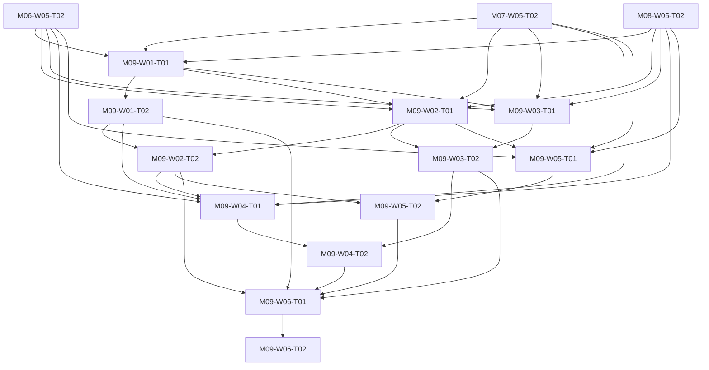

# M09 tasks

Read the linked task specification before scheduling. Dependencies are accepted-output prerequisites; labels and estimates are planning metadata.

| Task | Outcome | Direct prerequisites | Initial status | GitHub |
|---|---|---|---|---|
| [M09-W01-T01](M09-W01-T01.md) | Build disabled-by-default native package and service lifecycle | [M06-W05-T02](../m06/M06-W05-T02.md), [M07-W05-T02](../m07/M07-W05-T02.md), [M08-W05-T02](../m08/M08-W05-T02.md) | blocked | [#106](https://github.com/JoseLArantes/detew/issues/106) |
| [M09-W01-T02](M09-W01-T02.md) | Verify upgrade removal and management recovery from packages | [M09-W01-T01](../m09/M09-W01-T01.md) | blocked | [#107](https://github.com/JoseLArantes/detew/issues/107) |
| [M09-W02-T01](M09-W02-T01.md) | Validate complete packet visibility and enforcement matrix | [M06-W05-T02](../m06/M06-W05-T02.md), [M07-W05-T02](../m07/M07-W05-T02.md), [M08-W05-T02](../m08/M08-W05-T02.md), [M09-W01-T01](../m09/M09-W01-T01.md) | blocked | [#108](https://github.com/JoseLArantes/detew/issues/108) |
| [M09-W02-T02](M09-W02-T02.md) | Inject runtime lifecycle and reporting failures under load | [M09-W02-T01](../m09/M09-W02-T01.md), [M09-W01-T02](../m09/M09-W01-T02.md) | blocked | [#109](https://github.com/JoseLArantes/detew/issues/109) |
| [M09-W03-T01](M09-W03-T01.md) | Audit final privilege APIs IPC and privacy boundaries | [M06-W05-T02](../m06/M06-W05-T02.md), [M07-W05-T02](../m07/M07-W05-T02.md), [M08-W05-T02](../m08/M08-W05-T02.md), [M09-W01-T01](../m09/M09-W01-T01.md) | blocked | [#110](https://github.com/JoseLArantes/detew/issues/110) |
| [M09-W03-T02](M09-W03-T02.md) | Run hostile-input native fuzz and correctness campaigns | [M09-W03-T01](../m09/M09-W03-T01.md), [M09-W02-T01](../m09/M09-W02-T01.md) | blocked | [#111](https://github.com/JoseLArantes/detew/issues/111) |
| [M09-W04-T01](M09-W04-T01.md) | Freeze and measure reference performance capacity and activation | [M06-W05-T02](../m06/M06-W05-T02.md), [M07-W05-T02](../m07/M07-W05-T02.md), [M08-W05-T02](../m08/M08-W05-T02.md), [M09-W01-T02](../m09/M09-W01-T02.md), [M09-W02-T02](../m09/M09-W02-T02.md) | blocked | [#112](https://github.com/JoseLArantes/detew/issues/112) |
| [M09-W04-T02](M09-W04-T02.md) | Complete 72-hour soak and freeze measured capacity defaults | [M09-W04-T01](../m09/M09-W04-T01.md), [M09-W03-T02](../m09/M09-W03-T02.md) | blocked | [#113](https://github.com/JoseLArantes/detew/issues/113) |
| [M09-W05-T01](M09-W05-T01.md) | Validate final three-category corpus with independent holdouts | [M06-W05-T02](../m06/M06-W05-T02.md), [M07-W05-T02](../m07/M07-W05-T02.md), [M08-W05-T02](../m08/M08-W05-T02.md), [M09-W02-T01](../m09/M09-W02-T01.md) | blocked | [#114](https://github.com/JoseLArantes/detew/issues/114) |
| [M09-W05-T02](M09-W05-T02.md) | Publish exact application catalog and observed quality results | [M09-W05-T01](../m09/M09-W05-T01.md), [M09-W02-T02](../m09/M09-W02-T02.md) | blocked | [#115](https://github.com/JoseLArantes/detew/issues/115) |
| [M09-W06-T01](M09-W06-T01.md) | Prepare pilot guide support matrix and packaged evidence ledger | [M09-W01-T02](../m09/M09-W01-T02.md), [M09-W02-T02](../m09/M09-W02-T02.md), [M09-W03-T02](../m09/M09-W03-T02.md), [M09-W04-T02](../m09/M09-W04-T02.md), [M09-W05-T02](../m09/M09-W05-T02.md) | blocked | [#116](https://github.com/JoseLArantes/detew/issues/116) |
| [M09-W06-T02](M09-W06-T02.md) | Decide pilot technical readiness and ARCH-G05 acceptance | [M09-W06-T01](../m09/M09-W06-T01.md) | blocked | [#117](https://github.com/JoseLArantes/detew/issues/117) |

## Dependency branches

