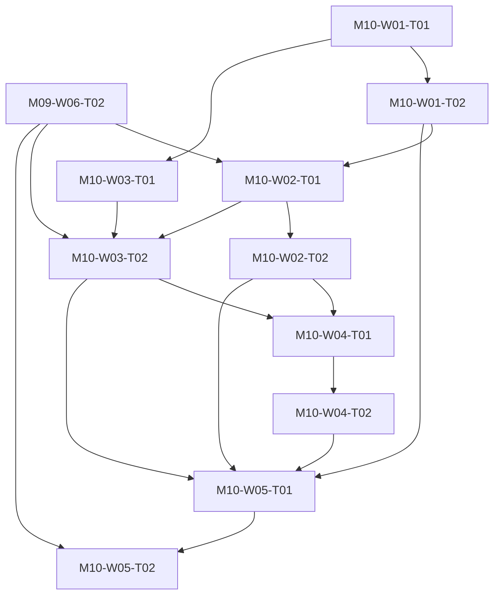

# M10 tasks

Read the linked task specification before scheduling. Dependencies are accepted-output prerequisites; labels and estimates are planning metadata.

| Task | Outcome | Direct prerequisites | Initial status | GitHub |
|---|---|---|---|---|
| [M10-W01-T01](M10-W01-T01.md) | Design administrator interview pilot and ethics protocol | none | ready | [#118](https://github.com/JoseLArantes/detew/issues/118) |
| [M10-W01-T02](M10-W01-T02.md) | Complete interviews and enroll independent pilot sites | [M10-W01-T01](../m10/M10-W01-T01.md) | blocked | [#119](https://github.com/JoseLArantes/detew/issues/119) |
| [M10-W02-T01](M10-W02-T01.md) | Execute independent installation and filtering pilots | [M10-W01-T02](../m10/M10-W01-T02.md), [M09-W06-T02](../m09/M09-W06-T02.md) | blocked | [#120](https://github.com/JoseLArantes/detew/issues/120) |
| [M10-W02-T02](M10-W02-T02.md) | Exercise independent upgrade offline restore and removal recovery | [M10-W02-T01](../m10/M10-W02-T01.md) | blocked | [#121](https://github.com/JoseLArantes/detew/issues/121) |
| [M10-W03-T01](M10-W03-T01.md) | Define independent timed usability and comprehension study | [M10-W01-T01](../m10/M10-W01-T01.md) | blocked | [#122](https://github.com/JoseLArantes/detew/issues/122) |
| [M10-W03-T02](M10-W03-T02.md) | Run timed non-developer usability and state comprehension acceptance | [M10-W03-T01](../m10/M10-W03-T01.md), [M09-W06-T02](../m09/M09-W06-T02.md), [M10-W02-T01](../m10/M10-W02-T01.md) | blocked | [#123](https://github.com/JoseLArantes/detew/issues/123) |
| [M10-W04-T01](M10-W04-T01.md) | Triage pilot findings into prioritized requirement-linked repairs | [M10-W02-T02](../m10/M10-W02-T02.md), [M10-W03-T02](../m10/M10-W03-T02.md) | blocked | [#124](https://github.com/JoseLArantes/detew/issues/124) |
| [M10-W04-T02](M10-W04-T02.md) | Deliver pilot repairs and rerun affected acceptance evidence | [M10-W04-T01](../m10/M10-W04-T01.md) | blocked | [#125](https://github.com/JoseLArantes/detew/issues/125) |
| [M10-W05-T01](M10-W05-T01.md) | Assemble redacted pilot beta and product-value evidence report | [M10-W01-T02](../m10/M10-W01-T02.md), [M10-W02-T02](../m10/M10-W02-T02.md), [M10-W03-T02](../m10/M10-W03-T02.md), [M10-W04-T02](../m10/M10-W04-T02.md) | blocked | [#126](https://github.com/JoseLArantes/detew/issues/126) |
| [M10-W05-T02](M10-W05-T02.md) | Record G2 beta acceptance or direction reassessment | [M10-W05-T01](../m10/M10-W05-T01.md), [M09-W06-T02](../m09/M09-W06-T02.md) | blocked | [#127](https://github.com/JoseLArantes/detew/issues/127) |

## Dependency branches

