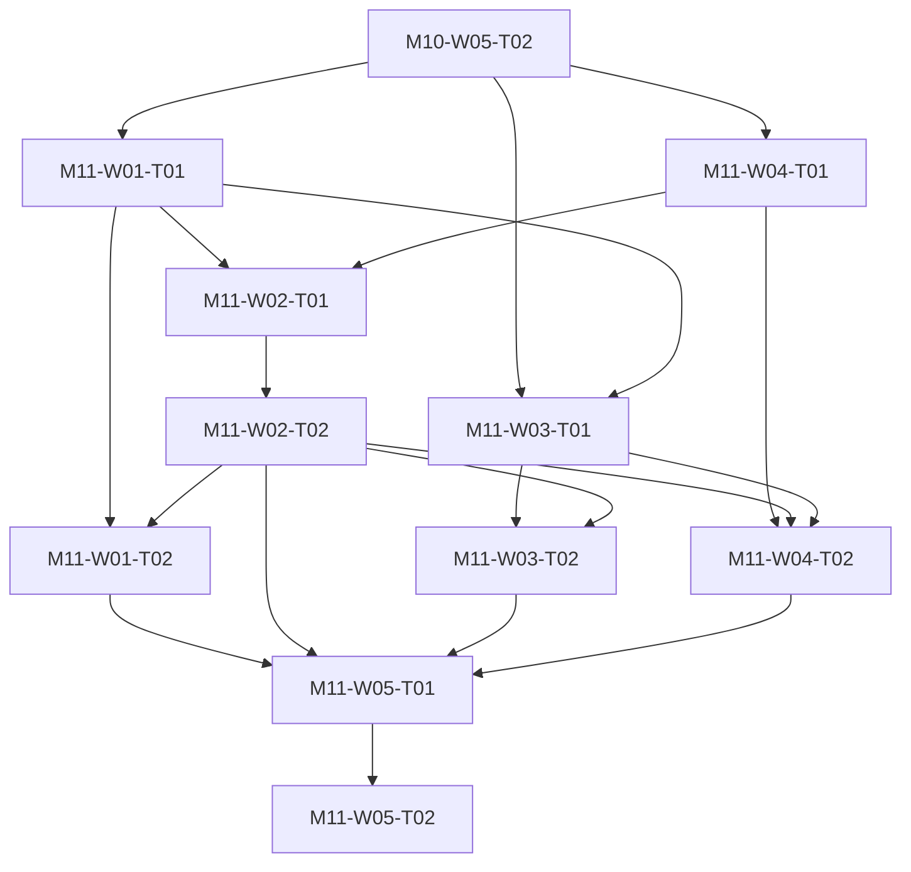

# M11 tasks

Read the linked task specification before scheduling. Dependencies are accepted-output prerequisites; labels and estimates are planning metadata.

| Task | Outcome | Direct prerequisites | Initial status | GitHub |
|---|---|---|---|---|
| [M11-W01-T01](M11-W01-T01.md) | Audit final source revision and close release-blocker readiness | [M10-W05-T02](../m10/M10-W05-T02.md) | blocked | [#128](https://github.com/JoseLArantes/detew/issues/128) |
| [M11-W03-T01](M11-W03-T01.md) | Complete public user admin contributor API and data documentation | [M10-W05-T02](../m10/M10-W05-T02.md), [M11-W01-T01](../m11/M11-W01-T01.md) | blocked | [#129](https://github.com/JoseLArantes/detew/issues/129) |
| [M11-W04-T01](M11-W04-T01.md) | Assign real release security signing and data maintenance owners | [M10-W05-T02](../m10/M10-W05-T02.md) | blocked | [#130](https://github.com/JoseLArantes/detew/issues/130) |
| [M11-W02-T01](M11-W02-T01.md) | Build and sign final native software and data release artifacts | [M11-W01-T01](../m11/M11-W01-T01.md), [M11-W04-T01](../m11/M11-W04-T01.md) | blocked | [#131](https://github.com/JoseLArantes/detew/issues/131) |
| [M11-W02-T02](M11-W02-T02.md) | Independently verify actual signed package lifecycle and provenance | [M11-W02-T01](../m11/M11-W02-T01.md) | blocked | [#132](https://github.com/JoseLArantes/detew/issues/132) |
| [M11-W01-T02](M11-W01-T02.md) | Audit final verified artifacts and requirement evidence closure | [M11-W01-T01](../m11/M11-W01-T01.md), [M11-W02-T02](../m11/M11-W02-T02.md) | blocked | [#133](https://github.com/JoseLArantes/detew/issues/133) |
| [M11-W03-T02](M11-W03-T02.md) | Validate public release guidance against final artifacts | [M11-W03-T01](../m11/M11-W03-T01.md), [M11-W02-T02](../m11/M11-W02-T02.md) | blocked | [#134](https://github.com/JoseLArantes/detew/issues/134) |
| [M11-W04-T02](M11-W04-T02.md) | Rehearse urgent update and ongoing data maintenance workflows | [M11-W04-T01](../m11/M11-W04-T01.md), [M11-W02-T02](../m11/M11-W02-T02.md), [M11-W03-T01](../m11/M11-W03-T01.md) | blocked | [#135](https://github.com/JoseLArantes/detew/issues/135) |
| [M11-W05-T01](M11-W05-T01.md) | Assemble final release report notes and public requirement evidence | [M11-W01-T02](../m11/M11-W01-T02.md), [M11-W02-T02](../m11/M11-W02-T02.md), [M11-W03-T02](../m11/M11-W03-T02.md), [M11-W04-T02](../m11/M11-W04-T02.md) | blocked | [#136](https://github.com/JoseLArantes/detew/issues/136) |
| [M11-W05-T02](M11-W05-T02.md) | Record G3 final V1 release acceptance and supported stage | [M11-W05-T01](../m11/M11-W05-T01.md) | blocked | [#137](https://github.com/JoseLArantes/detew/issues/137) |

## Dependency branches

