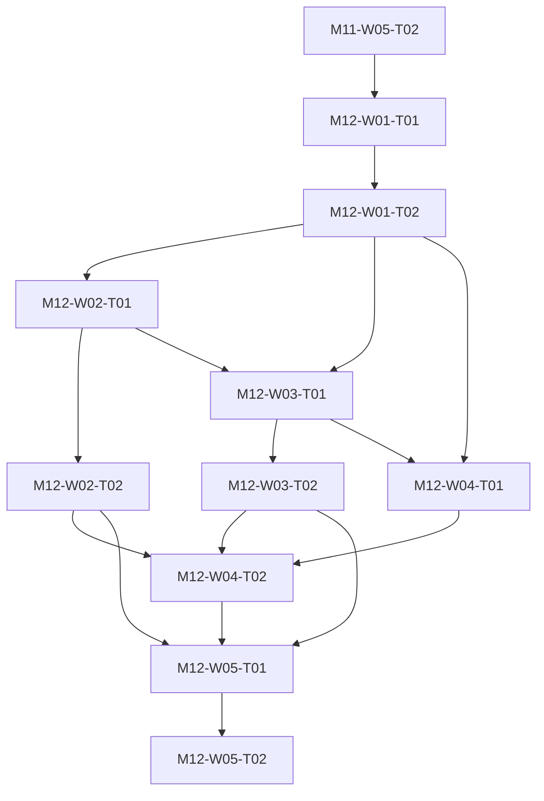

# M12 tasks

Read the linked task specification before scheduling. Dependencies are accepted-output prerequisites; labels and estimates are planning metadata.

| Task | Outcome | Direct prerequisites | Initial status | GitHub |
|---|---|---|---|---|
| [M12-W01-T01](M12-W01-T01.md) | Approve managed TLS scope and compare FreeBSD proxy designs | [M11-W05-T02](../m11/M11-W05-T02.md) | deferred | [#138](https://github.com/JoseLArantes/detew/issues/138) |
| [M12-W01-T02](M12-W01-T02.md) | Prove selected TLS architecture and record design admission | [M12-W01-T01](../m12/M12-W01-T01.md) | deferred | [#139](https://github.com/JoseLArantes/detew/issues/139) |
| [M12-W02-T01](M12-W02-T01.md) | Implement protected CA keys and explicit device trust enrollment | [M12-W01-T02](../m12/M12-W01-T02.md) | deferred | [#140](https://github.com/JoseLArantes/detew/issues/140) |
| [M12-W02-T02](M12-W02-T02.md) | Complete CA rotation revocation backup and client trust removal | [M12-W02-T01](../m12/M12-W02-T01.md) | deferred | [#141](https://github.com/JoseLArantes/detew/issues/141) |
| [M12-W03-T01](M12-W03-T01.md) | Implement upstream validation exclusions and strict inspection behavior | [M12-W01-T02](../m12/M12-W01-T02.md), [M12-W02-T01](../m12/M12-W02-T01.md) | deferred | [#142](https://github.com/JoseLArantes/detew/issues/142) |
| [M12-W03-T02](M12-W03-T02.md) | Conform TLS QUIC ECH pinned and unsupported protocol outcomes | [M12-W03-T01](../m12/M12-W03-T01.md) | deferred | [#143](https://github.com/JoseLArantes/detew/issues/143) |
| [M12-W04-T01](M12-W04-T01.md) | Implement canonical request URL policy and multiplexed actions | [M12-W01-T02](../m12/M12-W01-T02.md), [M12-W03-T01](../m12/M12-W03-T01.md) | deferred | [#144](https://github.com/JoseLArantes/detew/issues/144) |
| [M12-W04-T02](M12-W04-T02.md) | Deliver explicit managed TLS enrollment scope and explanation UI | [M12-W02-T02](../m12/M12-W02-T02.md), [M12-W03-T02](../m12/M12-W03-T02.md), [M12-W04-T01](../m12/M12-W04-T01.md) | deferred | [#145](https://github.com/JoseLArantes/detew/issues/145) |
| [M12-W05-T01](M12-W05-T01.md) | Run independent TLS module security trust privacy and capacity review | [M12-W02-T02](../m12/M12-W02-T02.md), [M12-W03-T02](../m12/M12-W03-T02.md), [M12-W04-T02](../m12/M12-W04-T02.md) | deferred | [#146](https://github.com/JoseLArantes/detew/issues/146) |
| [M12-W05-T02](M12-W05-T02.md) | Record final ARCH-G06 and G4 optional TLS module acceptance | [M12-W05-T01](../m12/M12-W05-T01.md) | deferred | [#147](https://github.com/JoseLArantes/detew/issues/147) |

## Dependency branches

