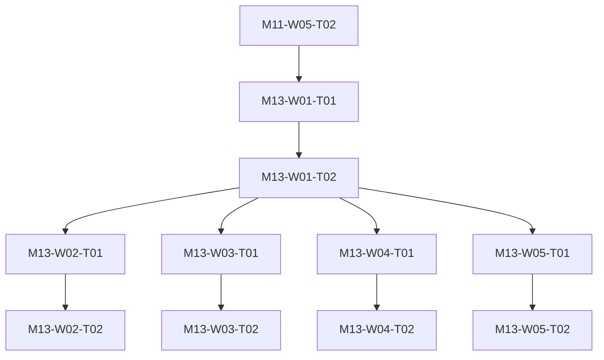

# M13 tasks

Read the linked task specification before scheduling. Dependencies are accepted-output prerequisites; labels and estimates are planning metadata.

| Task | Outcome | Direct prerequisites | Initial status | GitHub |
|---|---|---|---|---|
| [M13-W01-T01](M13-W01-T01.md) | Select one evidence-backed ecosystem child scope | [M11-W05-T02](../m11/M11-W05-T02.md) | deferred | [#148](https://github.com/JoseLArantes/detew/issues/148) |
| [M13-W01-T02](M13-W01-T02.md) | Specify selected module contracts child plan and G5 obligations | [M13-W01-T01](../m13/M13-W01-T01.md) | deferred | [#149](https://github.com/JoseLArantes/detew/issues/149) |
| [M13-W02-T01](M13-W02-T01.md) | Specify applicable provider identity or exporter conformance | [M13-W01-T02](../m13/M13-W01-T02.md) | deferred | [#150](https://github.com/JoseLArantes/detew/issues/150) |
| [M13-W02-T02](M13-W02-T02.md) | Deliver and independently conform the selected connector | [M13-W02-T01](../m13/M13-W02-T01.md) | deferred | [#151](https://github.com/JoseLArantes/detew/issues/151) |
| [M13-W03-T01](M13-W03-T01.md) | Specify applicable new-platform adapter and support conformance | [M13-W01-T02](../m13/M13-W01-T02.md) | deferred | [#152](https://github.com/JoseLArantes/detew/issues/152) |
| [M13-W03-T02](M13-W03-T02.md) | Deliver selected platform integration with native support proof | [M13-W03-T01](../m13/M13-W03-T01.md) | deferred | [#153](https://github.com/JoseLArantes/detew/issues/153) |
| [M13-W04-T01](M13-W04-T01.md) | Specify applicable fleet or redundancy state and failure contract | [M13-W01-T02](../m13/M13-W01-T02.md) | deferred | [#154](https://github.com/JoseLArantes/detew/issues/154) |
| [M13-W04-T02](M13-W04-T02.md) | Deliver selected fleet or redundancy behavior and observed conformance | [M13-W04-T01](../m13/M13-W04-T01.md) | deferred | [#155](https://github.com/JoseLArantes/detew/issues/155) |
| [M13-W05-T01](M13-W05-T01.md) | Assemble selected child conformance release and maintenance evidence | [M13-W01-T02](../m13/M13-W01-T02.md) | deferred | [#156](https://github.com/JoseLArantes/detew/issues/156) |
| [M13-W05-T02](M13-W05-T02.md) | Record scope-specific G5 acceptance and preserve dormant candidates | [M13-W05-T01](../m13/M13-W05-T01.md) | deferred | [#157](https://github.com/JoseLArantes/detew/issues/157) |

## Dependency branches

